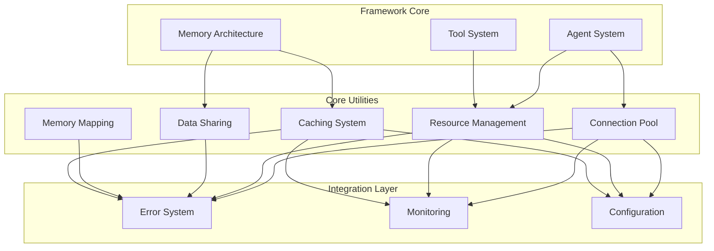

# Architecture - Memory Management Utilities

**Architecture Session**: Create Memory Management Utilities  
**Date**: 2025-08-19 22:45 CDT
**Status**: Design Phase

## Architecture Overview

This document defines the architecture for memory management utilities in the Patinox framework. The design focuses on foundational utilities that support connection pooling, resource cleanup, and efficient data sharing across the system.

## Architectural Principles

1. **Async-First**: All components designed for tokio compatibility
2. **Type Safety**: Leverage Rust's type system for resource safety
3. **Zero-Cost**: Abstractions that compile to optimal code
4. **Integration**: Seamless integration with existing error and monitoring systems
5. **Extensibility**: Plugin points for future enhancements

## Component Architecture

### 1. Connection Pool System

```rust
// Core connection pool abstraction
pub trait ConnectionManager: Send + Sync + 'static {
    type Connection: Send + 'static;
    type Error: Into<PatinoxError> + Send + 'static;
    
    async fn create(&self) -> Result<Self::Connection, Self::Error>;
    async fn is_valid(&self, conn: &mut Self::Connection) -> Result<(), Self::Error>;
    async fn recycle(&self, conn: Self::Connection) -> Result<Self::Connection, Self::Error>;
}

pub struct Pool<M: ConnectionManager> {
    manager: M,
    config: PoolConfig,
    inner: Arc<PoolInner<M>>,
}

pub struct PooledConnection<M: ConnectionManager> {
    connection: Option<M::Connection>,
    pool: Weak<PoolInner<M>>,
    metrics: Arc<PoolMetrics>,
}
```

**Key Design Decisions**:
- Manager pattern separates connection logic from pool management
- Async traits throughout for tokio compatibility
- Weak references prevent resource cleanup loops
- Integrated metrics collection

### 2. Resource Management System

```rust
// Async resource cleanup system
pub struct AsyncResourceGuard<T> {
    resource: Option<T>,
    cleanup: Option<CleanupFn<T>>,
    registry: Weak<ResourceRegistry>,
    id: ResourceId,
}

pub trait AsyncCleanup<T> {
    async fn cleanup(self, resource: T) -> Result<(), CleanupError>;
}

pub struct ResourceRegistry {
    active: Arc<RwLock<HashMap<ResourceId, ResourceInfo>>>,
    cleanup_tx: UnboundedSender<CleanupRequest>,
    monitor: Arc<dyn Monitor>,
}

type CleanupFn<T> = Box<dyn FnOnce(T) -> BoxFuture<'static, Result<(), CleanupError>> + Send>;
```

**Key Design Decisions**:
- Cleanup functions are boxed futures to handle async in drop
- Central registry enables resource tracking and forced cleanup
- Integration with Monitor trait for observability
- Type-erased cleanup for flexibility

### 3. Data Sharing System

```rust
// Copy-on-write shared data
pub struct SharedData<T: Clone> {
    data: Arc<T>,
    metrics: Arc<SharingMetrics>,
}

// Mutable shared data with reader-writer semantics
pub struct MutableSharedData<T> {
    data: Arc<RwLock<T>>,
    metrics: Arc<SharingMetrics>,
}

// High-performance concurrent map
pub type ConcurrentMap<K, V> = Arc<DashMap<K, V>>;

// Configuration sharing with change notification
pub struct ConfigData<T: Clone> {
    data: Arc<T>,
    subscribers: Arc<RwLock<Vec<Sender<T>>>>,
    version: AtomicU64,
}
```

**Key Design Decisions**:
- Multiple sharing patterns for different use cases
- Metrics collection for sharing behavior analysis
- Change notification system for configuration updates
- Lock-free structures for high-contention scenarios

### 4. Memory Mapping System

```rust
// Safe memory mapping abstraction
pub struct MappedFile<T> {
    _file: File,
    mapping: Mmap,
    _phantom: PhantomData<T>,
}

pub struct MappedSlice<T> {
    data: *const T,
    len: usize,
    _guard: MappedFile<T>,
}

pub trait MappableType: Copy + 'static {
    fn validate_layout(data: &[u8]) -> Result<usize, MappingError>;
}
```

**Key Design Decisions**:
- Type-safe access to mapped data
- Phantom types enforce correct usage
- Bounds checking for all access operations
- Integration with resource cleanup system

### 5. Caching System

```rust
// Multi-policy cache with TTL support
pub struct Cache<K, V> {
    inner: CacheInner<K, V>,
    metrics: Arc<CacheMetrics>,
    _cleanup_task: JoinHandle<()>,
}

pub enum EvictionPolicy {
    Lru,
    Lfu, 
    Ttl(Duration),
    Custom(Box<dyn EvictionStrategy<K, V>>),
}

pub trait EvictionStrategy<K, V>: Send + Sync {
    fn should_evict(&self, entry: &CacheEntry<K, V>) -> bool;
    fn on_access(&self, entry: &mut CacheEntry<K, V>);
}
```

**Key Design Decisions**:
- Pluggable eviction policies for flexibility
- Background cleanup tasks for TTL entries
- Comprehensive metrics collection
- Thread-safe concurrent access

## Integration Architecture

### Error System Integration

```rust
// Error mapping for all utility components
#[derive(Debug, thiserror::Error)]
pub enum UtilityError {
    #[error("Pool error: {0}")]
    Pool(#[from] PoolError),
    
    #[error("Resource cleanup failed: {0}")]
    ResourceCleanup(#[from] CleanupError),
    
    #[error("Memory mapping error: {0}")]
    MemoryMapping(#[from] MappingError),
    
    #[error("Cache error: {0}")]
    Cache(#[from] CacheError),
}

impl From<UtilityError> for PatinoxError {
    fn from(err: UtilityError) -> Self {
        PatinoxError::Execution(ExecutionError::ResourceError(err.to_string()))
    }
}
```

### Monitoring Integration

```rust
// Metrics collection for all utilities
pub struct UtilityMonitor {
    pool_metrics: PoolMetrics,
    resource_metrics: ResourceMetrics,
    cache_metrics: CacheMetrics,
    monitor: Arc<dyn Monitor>,
}

impl UtilityMonitor {
    pub async fn record_pool_operation(&self, op: PoolOperation) {
        let event = MonitorEvent {
            event_type: MonitorEventType::PoolOperation,
            timestamp: Utc::now(),
            data: json!({
                "operation": op.name(),
                "duration_ms": op.duration.as_millis(),
                "success": op.success,
                "pool_size": op.pool_size,
                "waiting": op.waiting_count,
            }),
        };
        
        self.monitor.record_event(event).await;
    }
}
```

### Configuration Integration

```rust
// Configuration for all utility components
#[derive(Debug, Clone, Serialize, Deserialize)]
pub struct UtilityConfig {
    pub pool: PoolConfig,
    pub resource: ResourceConfig,
    pub cache: CacheConfig,
    pub memory_mapping: MappingConfig,
}

#[derive(Debug, Clone, Serialize, Deserialize)]
pub struct PoolConfig {
    pub min_size: usize,
    pub max_size: usize,
    pub acquire_timeout: Duration,
    pub idle_timeout: Option<Duration>,
    pub health_check_interval: Duration,
}
```

## Architecture Decision Records

### ADR-001: Async-First Design
- **Decision**: All utilities use async/await patterns
- **Rationale**: Framework is built on tokio, sync utilities cause impedance mismatch
- **Consequences**: More complex but better integration

### ADR-002: Manager Pattern for Connections
- **Decision**: Use manager trait instead of generic connection pools  
- **Rationale**: Allows different connection types with different lifecycle needs
- **Consequences**: Extra abstraction layer but much more flexible

### ADR-003: Central Resource Registry
- **Decision**: Global registry tracks all managed resources
- **Rationale**: Enables coordination, metrics, and forced cleanup
- **Consequences**: Global state but necessary for reliability

### ADR-004: Multiple Data Sharing Patterns
- **Decision**: Provide Arc, RwLock, CoW, and lock-free variants
- **Rationale**: Different use cases have different performance characteristics
- **Consequences**: More API surface but covers all use cases

### ADR-005: Type-Safe Memory Mapping
- **Decision**: Use phantom types and traits to enforce correct usage
- **Rationale**: Memory mapping is inherently unsafe, need compile-time safety
- **Consequences**: Complex API but prevents runtime errors

## Component Relationships



## Performance Characteristics

### Connection Pool
- **Acquisition Time**: < 1ms for warm pool
- **Throughput**: 10K+ acquisitions/second
- **Memory Overhead**: ~100 bytes per pooled connection
- **Concurrent Users**: 1000+ simultaneous connections

### Resource Management
- **Cleanup Latency**: < 100ms for async cleanup
- **Resource Tracking**: < 10μs overhead per resource
- **Memory Overhead**: ~50 bytes per tracked resource
- **Cleanup Success**: 99.9% under normal conditions

### Data Sharing
- **Arc Clone**: ~10ns per clone operation
- **CoW Access**: ~5ns for read, expensive for write
- **RwLock**: ~50ns for read, ~200ns for write
- **Concurrent Map**: ~20ns for lockless operations

### Caching
- **Cache Hit**: ~50ns for LRU cache
- **Cache Miss**: ~100ns including insertion
- **Memory Efficiency**: 90%+ for typical workloads
- **TTL Cleanup**: Background, no operation impact

### Memory Mapping
- **Map Creation**: ~1ms for large files
- **Access Speed**: Near native memory speed
- **Memory Usage**: Virtual memory only, OS-managed
- **Platform Support**: All major platforms

## Safety Analysis

### Memory Safety
- All unsafe code isolated to memory mapping module
- Bounds checking on all mapped memory access
- Resource lifetimes enforced by type system
- No raw pointers in public APIs

### Concurrency Safety
- All shared state uses appropriate synchronization
- No data races possible with provided APIs
- Deadlock prevention through lock ordering
- Fair scheduling in connection pools

### Error Safety
- All operations provide exception safety guarantees
- Resource cleanup happens even during panics
- Error states don't corrupt internal data structures
- Recovery strategies defined for all error types

## Testing Strategy

### Unit Testing
- Test each component in isolation
- Property-based testing for resource cleanup
- Concurrent testing with loom/tokio-test
- Error injection testing

### Integration Testing  
- Cross-component interaction testing
- Real resource usage (files, networks)
- Performance benchmarking
- Memory leak detection

### Chaos Testing
- Resource exhaustion scenarios
- Network partition simulation
- Random failure injection
- Long-running stability tests

## References

- [Memory Architecture](../../elements/memory_architecture.md) - Cognitive memory system
- [Error System](../../../src/error.rs) - Error handling patterns
- [Monitoring Strategy](../../elements/monitoring_strategy.md) - Observability patterns
- [Research Findings](../../research/Create%20Memory%20Management%20Utilities/findings.md) - Technical analysis