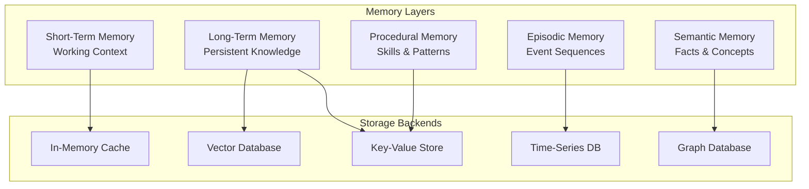

# Memory Architecture

## Purpose
This document defines the comprehensive memory system for Patinox agents, including short-term, long-term, episodic, and semantic memory layers. It outlines storage strategies, retrieval mechanisms, and integration with the broader agent architecture.

## Classification
- **Domain:** Technical Architecture
- **Stability:** Semi-stable
- **Abstraction:** Structural
- **Confidence:** Evolving

## Content

### Memory System Overview

The Patinox memory system implements a multi-layered approach inspired by cognitive architectures, optimized for Rust's ownership model and async patterns.



### Core Memory Traits

```rust
use async_trait::async_trait;

/// Base trait for all memory types
#[async_trait]
pub trait Memory: Send + Sync {
    type Key;
    type Value;
    type Query;
    type Result;
    
    /// Store information in memory
    async fn store(&self, key: Self::Key, value: Self::Value) -> Result<()>;
    
    /// Retrieve information from memory
    async fn retrieve(&self, query: Self::Query) -> Result<Self::Result>;
    
    /// Update existing memory
    async fn update(&self, key: Self::Key, updater: impl FnOnce(&mut Self::Value)) -> Result<()>;
    
    /// Remove information from memory
    async fn forget(&self, key: Self::Key) -> Result<()>;
    
    /// Query memory with complex criteria
    async fn query(&self, criteria: Self::Query) -> Result<Vec<Self::Result>>;
    
    /// Get memory statistics
    async fn stats(&self) -> MemoryStats;
}

/// Statistics for memory usage
#[derive(Debug, Clone)]
pub struct MemoryStats {
    pub total_entries: usize,
    pub memory_bytes: usize,
    pub hit_rate: f64,
    pub miss_rate: f64,
    pub avg_retrieval_time_ms: f64,
    pub last_compaction: Option<DateTime<Utc>>,
}
```

### Short-Term Memory (Working Memory)

Short-term memory maintains the active context for ongoing agent tasks.

```rust
/// Short-term memory for active context
pub struct ShortTermMemory {
    /// Current working set
    working_set: Arc<RwLock<WorkingSet>>,
    /// Context window management
    window_manager: ContextWindowManager,
    /// Attention mechanism
    attention: AttentionMechanism,
    /// Decay policy
    decay_policy: DecayPolicy,
}

/// Working set of active memories
#[derive(Clone)]
pub struct WorkingSet {
    /// Active items with relevance scores
    items: BTreeMap<MemoryId, (MemoryItem, RelevanceScore)>,
    /// Maximum capacity
    capacity: usize,
    /// Current focus
    focus: Option<MemoryId>,
    /// Access patterns
    access_log: VecDeque<AccessRecord>,
}

impl ShortTermMemory {
    /// Add item to working memory
    pub async fn add(&self, item: MemoryItem) -> Result<MemoryId> {
        let mut working_set = self.working_set.write().await;
        
        // Calculate relevance based on current context
        let relevance = self.attention.calculate_relevance(&item, &working_set).await?;
        
        // Manage capacity with intelligent eviction
        if working_set.items.len() >= working_set.capacity {
            self.evict_least_relevant(&mut working_set).await?;
        }
        
        let id = MemoryId::generate();
        working_set.items.insert(id.clone(), (item, relevance));
        
        // Update attention focus
        self.attention.update_focus(&working_set).await;
        
        Ok(id)
    }
    
    /// Retrieve items by relevance to query
    pub async fn retrieve_relevant(&self, query: &Query, top_k: usize) -> Result<Vec<MemoryItem>> {
        let working_set = self.working_set.read().await;
        
        let mut scored_items: Vec<_> = working_set.items.iter()
            .map(|(id, (item, score))| {
                let query_relevance = self.attention.score_against_query(item, query);
                (item.clone(), score * query_relevance)
            })
            .collect();
        
        scored_items.sort_by(|a, b| b.1.partial_cmp(&a.1).unwrap());
        
        Ok(scored_items.into_iter()
            .take(top_k)
            .map(|(item, _)| item)
            .collect())
    }
    
    /// Apply decay to reduce relevance over time
    pub async fn apply_decay(&self) {
        let mut working_set = self.working_set.write().await;
        
        for (_, (_, score)) in working_set.items.iter_mut() {
            *score = self.decay_policy.apply(*score);
        }
        
        // Remove items below threshold
        working_set.items.retain(|_, (_, score)| *score > self.decay_policy.threshold);
    }
}

/// Context window management for token limits
pub struct ContextWindowManager {
    max_tokens: usize,
    current_tokens: AtomicUsize,
    compression_strategy: CompressionStrategy,
}

impl ContextWindowManager {
    /// Fit items into context window
    pub async fn fit_to_window(&self, items: Vec<MemoryItem>) -> Result<Vec<MemoryItem>> {
        let mut fitted = Vec::new();
        let mut token_count = 0;
        
        for item in items {
            let item_tokens = self.count_tokens(&item)?;
            
            if token_count + item_tokens > self.max_tokens {
                // Try compression
                if let Some(compressed) = self.compression_strategy.compress(&item).await? {
                    let compressed_tokens = self.count_tokens(&compressed)?;
                    if token_count + compressed_tokens <= self.max_tokens {
                        fitted.push(compressed);
                        token_count += compressed_tokens;
                    }
                }
                break;
            }
            
            fitted.push(item);
            token_count += item_tokens;
        }
        
        self.current_tokens.store(token_count, Ordering::Relaxed);
        Ok(fitted)
    }
}
```

### Long-Term Memory

Long-term memory provides persistent storage with vector similarity search.

```rust
/// Long-term memory with vector storage
pub struct LongTermMemory {
    /// Vector database for semantic search
    vector_store: Box<dyn VectorStore>,
    /// Key-value store for exact lookups
    kv_store: Box<dyn KeyValueStore>,
    /// Indexing strategy
    indexer: MemoryIndexer,
    /// Consolidation policy
    consolidation: ConsolidationPolicy,
}

/// Vector store trait for different backends
#[async_trait]
pub trait VectorStore: Send + Sync {
    async fn insert(&self, id: String, vector: Vec<f32>, metadata: Value) -> Result<()>;
    async fn search(&self, vector: Vec<f32>, top_k: usize, filter: Option<Filter>) -> Result<Vec<SearchResult>>;
    async fn update(&self, id: String, vector: Option<Vec<f32>>, metadata: Option<Value>) -> Result<()>;
    async fn delete(&self, id: String) -> Result<()>;
    async fn create_index(&self, config: IndexConfig) -> Result<()>;
}

/// Memory indexer for efficient retrieval
pub struct MemoryIndexer {
    /// Embedding model for vectorization
    embedder: Box<dyn Embedder>,
    /// Index configuration
    config: IndexConfig,
    /// Batch processing queue
    batch_queue: Arc<Mutex<Vec<PendingIndex>>>,
}

impl MemoryIndexer {
    /// Index a memory item
    pub async fn index(&self, item: &MemoryItem) -> Result<IndexedMemory> {
        // Generate embeddings
        let text_embedding = self.embedder.embed(&item.content).await?;
        
        // Extract structured metadata
        let metadata = self.extract_metadata(item)?;
        
        // Create searchable representation
        let indexed = IndexedMemory {
            id: item.id.clone(),
            embedding: text_embedding,
            metadata,
            timestamp: item.timestamp,
            importance: self.calculate_importance(item),
        };
        
        Ok(indexed)
    }
    
    /// Batch index multiple items
    pub async fn batch_index(&self, items: Vec<MemoryItem>) -> Result<Vec<IndexedMemory>> {
        let mut batch_queue = self.batch_queue.lock().await;
        
        for item in items {
            batch_queue.push(PendingIndex::new(item));
        }
        
        // Process batch when threshold reached
        if batch_queue.len() >= self.config.batch_size {
            self.process_batch(&mut batch_queue).await
        } else {
            Ok(Vec::new())
        }
    }
}
```

### Episodic Memory

Episodic memory stores sequences of events and experiences.

```rust
/// Episodic memory for event sequences
pub struct EpisodicMemory {
    /// Time-series storage for events
    event_store: Box<dyn TimeSeriesStore>,
    /// Episode detection
    episode_detector: EpisodeDetector,
    /// Temporal indexing
    temporal_index: TemporalIndex,
    /// Replay mechanism
    replay_engine: ReplayEngine,
}

/// Episode representing a sequence of related events
#[derive(Clone, Debug)]
pub struct Episode {
    pub id: EpisodeId,
    pub start_time: DateTime<Utc>,
    pub end_time: Option<DateTime<Utc>>,
    pub events: Vec<Event>,
    pub summary: Option<String>,
    pub emotional_valence: f32,
    pub importance: f32,
}

impl EpisodicMemory {
    /// Record an event
    pub async fn record_event(&self, event: Event) -> Result<()> {
        // Store in time-series database
        self.event_store.insert(event.clone()).await?;
        
        // Update temporal index
        self.temporal_index.index_event(&event).await?;
        
        // Detect episode boundaries
        if let Some(episode) = self.episode_detector.detect_episode(&event).await? {
            self.consolidate_episode(episode).await?;
        }
        
        Ok(())
    }
    
    /// Retrieve episodes by time range
    pub async fn retrieve_episodes(
        &self,
        start: DateTime<Utc>,
        end: DateTime<Utc>,
    ) -> Result<Vec<Episode>> {
        let events = self.event_store.range_query(start, end).await?;
        self.episode_detector.segment_into_episodes(events).await
    }
    
    /// Replay an episode for learning
    pub async fn replay_episode(&self, episode_id: EpisodeId) -> Result<ReplayStream> {
        let episode = self.get_episode(episode_id).await?;
        self.replay_engine.create_replay_stream(episode).await
    }
    
    /// Find similar episodes
    pub async fn find_similar_episodes(&self, episode: &Episode, top_k: usize) -> Result<Vec<Episode>> {
        let embedding = self.episode_embedder.embed(episode).await?;
        let results = self.vector_store.search(embedding, top_k, None).await?;
        
        let mut episodes = Vec::new();
        for result in results {
            if let Some(episode) = self.get_episode(result.id).await? {
                episodes.push(episode);
            }
        }
        
        Ok(episodes)
    }
}

/// Replay engine for episode replay
pub struct ReplayEngine {
    /// Replay speed control
    speed_controller: SpeedController,
    /// Event transformer for replay
    transformer: EventTransformer,
}

impl ReplayEngine {
    /// Create a replay stream
    pub async fn create_replay_stream(&self, episode: Episode) -> Result<ReplayStream> {
        let events = self.transformer.prepare_for_replay(episode.events).await?;
        
        Ok(ReplayStream {
            events,
            speed: self.speed_controller.default_speed(),
            position: 0,
        })
    }
}
```

### Semantic Memory

Semantic memory stores facts, concepts, and general knowledge.

```rust
/// Semantic memory for facts and concepts
pub struct SemanticMemory {
    /// Graph database for concept relationships
    graph_store: Box<dyn GraphStore>,
    /// Concept extraction
    concept_extractor: ConceptExtractor,
    /// Relationship inference
    relationship_engine: RelationshipEngine,
    /// Knowledge consolidation
    knowledge_consolidator: KnowledgeConsolidator,
}

/// Concept in semantic memory
#[derive(Clone, Debug)]
pub struct Concept {
    pub id: ConceptId,
    pub name: String,
    pub description: String,
    pub category: Category,
    pub attributes: HashMap<String, Value>,
    pub confidence: f32,
    pub sources: Vec<SourceReference>,
}

/// Relationship between concepts
#[derive(Clone, Debug)]
pub struct Relationship {
    pub from: ConceptId,
    pub to: ConceptId,
    pub relation_type: RelationType,
    pub strength: f32,
    pub bidirectional: bool,
    pub properties: HashMap<String, Value>,
}

impl SemanticMemory {
    /// Store a new concept
    pub async fn store_concept(&self, concept: Concept) -> Result<()> {
        // Store in graph database
        self.graph_store.create_node(concept.clone()).await?;
        
        // Infer relationships with existing concepts
        let relationships = self.relationship_engine
            .infer_relationships(&concept)
            .await?;
        
        for relationship in relationships {
            self.graph_store.create_edge(relationship).await?;
        }
        
        // Trigger knowledge consolidation if needed
        self.knowledge_consolidator.check_and_consolidate().await?;
        
        Ok(())
    }
    
    /// Query concepts by relationship
    pub async fn query_by_relationship(
        &self,
        start: ConceptId,
        relation: RelationType,
        depth: usize,
    ) -> Result<Vec<Concept>> {
        self.graph_store.traverse(start, relation, depth).await
    }
    
    /// Find concept path
    pub async fn find_path(
        &self,
        from: ConceptId,
        to: ConceptId,
    ) -> Result<Option<Vec<Concept>>> {
        self.graph_store.shortest_path(from, to).await
    }
    
    /// Extract concepts from text
    pub async fn extract_and_store(&self, text: &str) -> Result<Vec<Concept>> {
        let concepts = self.concept_extractor.extract(text).await?;
        
        for concept in &concepts {
            self.store_concept(concept.clone()).await?;
        }
        
        Ok(concepts)
    }
}
```

### Procedural Memory

Procedural memory stores learned skills and action patterns.

```rust
/// Procedural memory for skills and patterns
pub struct ProceduralMemory {
    /// Skill storage
    skill_store: Box<dyn SkillStore>,
    /// Pattern recognition
    pattern_recognizer: PatternRecognizer,
    /// Skill composition
    skill_composer: SkillComposer,
    /// Performance tracker
    performance_tracker: PerformanceTracker,
}

/// Learned skill or procedure
#[derive(Clone, Debug)]
pub struct Skill {
    pub id: SkillId,
    pub name: String,
    pub trigger_conditions: Vec<Condition>,
    pub action_sequence: Vec<Action>,
    pub success_rate: f32,
    pub execution_count: u64,
    pub avg_execution_time: Duration,
    pub prerequisites: Vec<SkillId>,
}

impl ProceduralMemory {
    /// Learn a new skill from demonstration
    pub async fn learn_from_demonstration(&self, demonstration: Demonstration) -> Result<Skill> {
        // Extract action patterns
        let patterns = self.pattern_recognizer
            .extract_patterns(&demonstration)
            .await?;
        
        // Compose into skill
        let skill = self.skill_composer
            .compose_skill(patterns, demonstration.metadata)
            .await?;
        
        // Store skill
        self.skill_store.store(skill.clone()).await?;
        
        Ok(skill)
    }
    
    /// Execute a learned skill
    pub async fn execute_skill(&self, skill_id: SkillId, context: Context) -> Result<ExecutionResult> {
        let skill = self.skill_store.get(skill_id).await?;
        
        // Check prerequisites
        for prereq in &skill.prerequisites {
            if !self.is_skill_available(prereq, &context).await? {
                return Err(Error::PrerequisiteNotMet(prereq.clone()));
            }
        }
        
        // Execute action sequence
        let start = Instant::now();
        let result = self.execute_action_sequence(&skill.action_sequence, context).await?;
        let duration = start.elapsed();
        
        // Update performance metrics
        self.performance_tracker.record_execution(
            skill_id,
            result.success,
            duration,
        ).await?;
        
        Ok(result)
    }
    
    /// Compose multiple skills into a new skill
    pub async fn compose_skills(&self, skill_ids: Vec<SkillId>, name: String) -> Result<Skill> {
        let skills = self.skill_store.get_multiple(skill_ids).await?;
        
        let composed = self.skill_composer
            .compose_from_skills(skills, name)
            .await?;
        
        self.skill_store.store(composed.clone()).await?;
        
        Ok(composed)
    }
}
```

### Memory Consolidation

Memory consolidation transfers information between memory layers.

```rust
/// Memory consolidation system
pub struct MemoryConsolidator {
    /// Consolidation policies
    policies: Vec<Box<dyn ConsolidationPolicy>>,
    /// Transfer queue
    transfer_queue: Arc<Mutex<TransferQueue>>,
    /// Consolidation scheduler
    scheduler: ConsolidationScheduler,
}

#[async_trait]
pub trait ConsolidationPolicy: Send + Sync {
    /// Determine if memory should be consolidated
    async fn should_consolidate(&self, memory: &MemoryItem) -> bool;
    
    /// Perform consolidation
    async fn consolidate(&self, memory: MemoryItem, target: MemoryLayer) -> Result<()>;
    
    /// Priority for this policy
    fn priority(&self) -> Priority;
}

impl MemoryConsolidator {
    /// Run consolidation cycle
    pub async fn consolidate_cycle(&self) -> Result<ConsolidationReport> {
        let mut report = ConsolidationReport::new();
        
        // Process each memory layer
        for policy in &self.policies {
            let items = self.get_candidates_for_policy(policy).await?;
            
            for item in items {
                if policy.should_consolidate(&item).await {
                    let target = self.determine_target_layer(&item)?;
                    policy.consolidate(item.clone(), target).await?;
                    report.record_transfer(item.id, target);
                }
            }
        }
        
        // Cleanup transferred items
        self.cleanup_transferred(&report).await?;
        
        Ok(report)
    }
    
    /// Schedule automatic consolidation
    pub async fn start_automatic_consolidation(&self, interval: Duration) {
        let consolidator = self.clone();
        
        tokio::spawn(async move {
            let mut interval = tokio::time::interval(interval);
            
            loop {
                interval.tick().await;
                
                if let Err(e) = consolidator.consolidate_cycle().await {
                    tracing::error!("Consolidation cycle failed: {}", e);
                }
            }
        });
    }
}
```

### Memory Retrieval Strategies

Different strategies for retrieving memories based on context.

```rust
/// Memory retrieval coordinator
pub struct MemoryRetriever {
    /// Retrieval strategies
    strategies: HashMap<RetrievalStrategy, Box<dyn RetrievalExecutor>>,
    /// Strategy selector
    selector: StrategySelector,
    /// Result ranker
    ranker: ResultRanker,
}

#[derive(Clone, Debug, Hash, Eq, PartialEq)]
pub enum RetrievalStrategy {
    /// Recency-weighted retrieval
    Recency,
    /// Relevance-based retrieval
    Relevance,
    /// Frequency-based retrieval
    Frequency,
    /// Hybrid combining multiple strategies
    Hybrid(Vec<RetrievalStrategy>),
    /// Context-aware adaptive retrieval
    Adaptive,
}

impl MemoryRetriever {
    /// Retrieve memories using best strategy
    pub async fn retrieve(
        &self,
        query: Query,
        context: Context,
        limit: usize,
    ) -> Result<Vec<MemoryItem>> {
        // Select appropriate strategy
        let strategy = self.selector.select_strategy(&query, &context).await?;
        
        // Execute retrieval
        let executor = self.strategies.get(&strategy)
            .ok_or(Error::StrategyNotFound(strategy))?;
        
        let results = executor.execute(query, context, limit * 2).await?;
        
        // Rank and filter results
        let ranked = self.ranker.rank(results, &query).await?;
        
        Ok(ranked.into_iter().take(limit).collect())
    }
    
    /// Multi-modal retrieval across all memory types
    pub async fn multi_modal_retrieve(&self, query: MultiModalQuery) -> Result<MemoryResult> {
        let futures = vec![
            self.retrieve_from_stm(query.clone()),
            self.retrieve_from_ltm(query.clone()),
            self.retrieve_from_episodic(query.clone()),
            self.retrieve_from_semantic(query.clone()),
        ];
        
        let results = futures::future::join_all(futures).await;
        
        // Merge and deduplicate results
        self.merge_results(results).await
    }
}
```

### Memory Metrics and Monitoring

Observability for memory system performance.

```rust
/// Memory system metrics
pub struct MemoryMetrics {
    /// Operation counters
    operations: MetricsRegistry,
    /// Performance histograms
    performance: HistogramRegistry,
    /// Memory usage gauges
    usage: GaugeRegistry,
}

impl MemoryMetrics {
    /// Record memory operation
    pub fn record_operation(&self, op: MemoryOperation) {
        self.operations.increment(&format!("memory.{}.count", op.type_name()));
        
        self.performance.record(
            &format!("memory.{}.duration_ms", op.type_name()),
            op.duration.as_millis() as f64,
        );
        
        if let Some(size) = op.size_bytes {
            self.usage.set(
                &format!("memory.{}.bytes", op.layer),
                size as f64,
            );
        }
    }
    
    /// Get memory health status
    pub fn health_status(&self) -> MemoryHealth {
        MemoryHealth {
            stm_usage: self.usage.get("memory.stm.bytes"),
            ltm_usage: self.usage.get("memory.ltm.bytes"),
            hit_rate: self.calculate_hit_rate(),
            avg_retrieval_time: self.performance.mean("memory.retrieve.duration_ms"),
            errors_per_minute: self.operations.rate("memory.errors"),
        }
    }
}
```

### Integration with Agent Architecture

```rust
/// Memory-enabled agent
pub struct MemoryAgent {
    /// Base agent functionality
    agent: Agent,
    /// Memory system
    memory: IntegratedMemorySystem,
    /// Memory-augmented reasoning
    reasoning: MemoryAugmentedReasoning,
}

impl MemoryAgent {
    /// Process with memory context
    pub async fn process_with_memory(&self, input: Input) -> Result<Output> {
        // Retrieve relevant memories
        let memories = self.memory.retrieve_relevant(&input).await?;
        
        // Augment input with memory context
        let augmented = self.reasoning.augment_with_memories(input, memories).await?;
        
        // Process with agent
        let output = self.agent.process(augmented).await?;
        
        // Store new memories from interaction
        self.memory.store_from_interaction(&input, &output).await?;
        
        Ok(output)
    }
}
```

## Best Practices

1. **Memory Hygiene**: Regular consolidation and cleanup
2. **Indexing Strategy**: Choose appropriate indexes for query patterns
3. **Capacity Management**: Set appropriate limits for each memory layer
4. **Privacy**: Implement data retention and deletion policies
5. **Performance**: Use batching for bulk operations
6. **Consistency**: Handle eventual consistency in distributed setups
7. **Monitoring**: Track memory metrics for optimization

## Configuration Example

```toml
[memory]
# Short-term memory configuration
[memory.stm]
capacity = 100
decay_rate = 0.1
decay_interval = "5m"
attention_window = 10

# Long-term memory configuration
[memory.ltm]
vector_dimensions = 1536
index_type = "hnsw"
ef_construction = 200
m = 16

# Episodic memory configuration
[memory.episodic]
retention_days = 90
episode_threshold = 0.7
max_episode_length = 1000

# Semantic memory configuration
[memory.semantic]
min_confidence = 0.6
max_graph_depth = 5
relationship_threshold = 0.5

# Consolidation configuration
[memory.consolidation]
enabled = true
interval = "1h"
batch_size = 100
```

## Relationships
- **Parent Nodes:** [elements/architecture_overview.md]
- **Child Nodes:** None
- **Related Nodes:** 
  - [elements/agent_reasoning_paradigms.md] - augments - Reasoning with memory
  - [elements/technology_stack.md] - uses - Vector databases and storage
  - [elements/caching_strategy.md] - optimizes - Memory access patterns
  - [elements/configuration_strategy.md] - configures - Memory parameters

## Navigation Guidance
- **Access Context:** Reference when implementing agent memory capabilities
- **Common Next Steps:** Review caching strategy or session management
- **Related Tasks:** Memory implementation, retrieval optimization, consolidation
- **Update Patterns:** Update when adding new memory types or strategies

## Metadata
- **Created:** 2025-01-18
- **Last Updated:** 2025-01-18
- **Updated By:** Development Team

## Change History
- 2025-01-18: Initial comprehensive memory architecture design