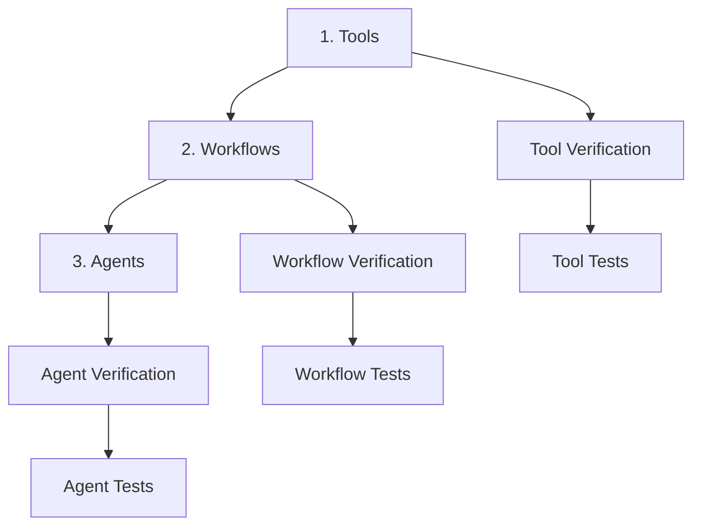

# Progressive Telemetry Strategy

## Purpose
This document addresses the critical challenge of debugging agent systems where multiple moving parts make it difficult to isolate failures. It proposes a progressive development approach with telemetry designed for both human and LLM consumption.

## Classification
- **Domain:** Technical Architecture
- **Stability:** Proposed
- **Abstraction:** Detailed
- **Confidence:** High (based on production experience)

## Content

### Core Problem Statement

In agent development, the common failure modes are:
1. **Tool Implementation Failures**: The underlying tool is broken
2. **Data Format Failures**: LLM provides data in wrong format
3. **Tool Call Failures**: LLM incorrectly formats the tool call itself
4. **Workflow Sequencing Failures**: Steps execute in wrong order
5. **Context Window Failures**: Telemetry too large for LLM analysis

Without proper isolation, debugging becomes a game of guessing which layer failed.

### Progressive Development Approach



#### Phase 1: Tool Development
Build and verify tools work in isolation before any LLM integration:

```rust
pub trait VerifiableTool {
    // Core functionality
    async fn execute(&self, input: ToolInput) -> Result<ToolOutput, ToolError>;
    
    // Verification interface for testing
    fn verify_input(&self, input: &ToolInput) -> ValidationResult;
    fn verify_output(&self, output: &ToolOutput) -> ValidationResult;
    
    // Test mode execution with detailed diagnostics
    async fn execute_debug(&self, input: ToolInput) -> DebugResult {
        let input_validation = self.verify_input(&input);
        if !input_validation.is_valid() {
            return DebugResult::InvalidInput(input_validation);
        }
        
        let execution_trace = ExecutionTrace::new();
        let result = self.execute_with_trace(input, &execution_trace).await;
        
        DebugResult {
            result,
            trace: execution_trace,
            input_validation,
            output_validation: result.as_ref().ok().map(|o| self.verify_output(o)),
        }
    }
}
```

#### Phase 2: Workflow Development
Test workflows with hard-coded paths before adding LLM decision-making:

```rust
pub struct WorkflowTestHarness {
    workflow: Workflow,
    trace_recorder: TraceRecorder,
}

impl WorkflowTestHarness {
    // Execute with deterministic path for testing
    pub async fn execute_path(&mut self, path: Vec<Step>) -> TestResult {
        for step in path {
            let step_result = self.workflow.execute_step(step).await;
            self.trace_recorder.record_step(&step, &step_result);
            
            if let Err(e) = step_result {
                return TestResult::FailedAt {
                    step: step.name(),
                    error: e,
                    trace: self.trace_recorder.get_trace(),
                };
            }
        }
        
        TestResult::Success(self.trace_recorder.get_trace())
    }
}
```

#### Phase 3: Agent Integration
Only after tools and workflows are verified, add LLM components:

```rust
pub struct AgentDebugger {
    agent: Agent,
    tool_verifier: ToolVerifier,
    workflow_verifier: WorkflowVerifier,
}

impl AgentDebugger {
    pub async fn execute_with_diagnostics(&self, prompt: String) -> DiagnosticResult {
        // Capture LLM's tool call attempt
        let llm_response = self.agent.generate_tool_call(prompt).await;
        
        // Verify tool call format independently
        let call_validation = self.verify_tool_call_format(&llm_response);
        
        // Verify data format independently  
        let data_validation = self.verify_data_format(&llm_response);
        
        // Execute with full diagnostics
        let execution = if call_validation.is_valid() && data_validation.is_valid() {
            self.agent.execute(llm_response).await
        } else {
            Err(ValidationError { call_validation, data_validation })
        };
        
        DiagnosticResult {
            llm_response,
            call_validation,
            data_validation,
            execution,
        }
    }
}
```

### LLM-Consumable Telemetry

Traditional telemetry formats (JSON logs, OpenTelemetry spans) quickly exceed context windows. We need a dual-format approach:

#### Compact Trace Format for LLMs

```rust
pub struct CompactTrace {
    summary: String,  // One-line summary
    key_events: Vec<KeyEvent>,  // Max 10 most important events
    error_chain: Option<ErrorChain>,  // Simplified error representation
}

impl CompactTrace {
    pub fn to_llm_format(&self) -> String {
        format!(
            "## Execution Summary\n{}\n\n## Key Events\n{}\n\n## Errors\n{}",
            self.summary,
            self.format_key_events(),
            self.format_errors()
        )
    }
    
    fn format_key_events(&self) -> String {
        self.key_events.iter()
            .map(|e| format!("- {} @ {}ms: {}", e.event_type, e.timestamp_ms, e.description))
            .collect::<Vec<_>>()
            .join("\n")
    }
}
```

#### Progressive Detail Levels

```rust
pub enum DetailLevel {
    Summary,     // < 500 tokens - Just success/failure
    Key,         // < 2000 tokens - Major decision points
    Diagnostic,  // < 8000 tokens - Detailed diagnostics
    Full,        // Unlimited - Complete trace
}

pub trait TelemetryFormatter {
    fn format(&self, level: DetailLevel) -> String;
    
    // Smart truncation that preserves error context
    fn format_for_context_window(&self, max_tokens: usize) -> String {
        // Prioritize: errors > warnings > key events > details
        let mut output = String::new();
        let mut token_count = 0;
        
        // Always include errors
        if let Some(errors) = self.get_errors() {
            output.push_str(&errors);
            token_count += estimate_tokens(&errors);
        }
        
        // Add warnings if space
        if token_count < max_tokens / 2 {
            if let Some(warnings) = self.get_warnings() {
                output.push_str(&warnings);
                token_count += estimate_tokens(&warnings);
            }
        }
        
        // Add key events if space
        if token_count < max_tokens * 3/4 {
            output.push_str(&self.get_key_events(max_tokens - token_count));
        }
        
        output
    }
}
```

### Hierarchical Telemetry Storage

Store telemetry in a hierarchy that allows selective loading:

```rust
pub struct TelemetryStore {
    // In-memory ring buffer for recent events
    recent: RingBuffer<CompactTrace>,
    
    // Disk storage with indexing
    persistent: PersistentStore,
    
    // Summary statistics
    stats: TelemetryStats,
}

impl TelemetryStore {
    // Get overview without loading details
    pub async fn get_session_summary(&self, session_id: SessionId) -> SessionSummary {
        SessionSummary {
            total_executions: self.stats.get_count(session_id),
            success_rate: self.stats.get_success_rate(session_id),
            common_errors: self.stats.get_top_errors(session_id, 5),
            performance: self.stats.get_performance_summary(session_id),
        }
    }
    
    // Load specific execution for debugging
    pub async fn get_execution_trace(&self, exec_id: ExecutionId, level: DetailLevel) -> String {
        match level {
            DetailLevel::Summary => self.persistent.get_summary(exec_id).await,
            DetailLevel::Key => self.persistent.get_key_events(exec_id).await,
            DetailLevel::Diagnostic => self.persistent.get_diagnostics(exec_id).await,
            DetailLevel::Full => self.persistent.get_full_trace(exec_id).await,
        }
    }
    
    // Smart query for LLM analysis
    pub async fn query_for_llm(&self, query: DebugQuery, max_tokens: usize) -> String {
        let relevant_execs = self.find_relevant_executions(query).await;
        let mut output = String::new();
        let mut tokens_used = 0;
        
        for exec in relevant_execs {
            let remaining = max_tokens - tokens_used;
            if remaining < 500 { break; }
            
            let trace = self.get_execution_trace(exec.id, DetailLevel::Key).await;
            let formatted = self.format_for_context_window(&trace, remaining);
            
            output.push_str(&formatted);
            tokens_used += estimate_tokens(&formatted);
        }
        
        output
    }
}
```

### Failure Isolation Patterns

#### Tool Isolation Testing
```rust
#[cfg(test)]
mod tool_tests {
    #[test]
    async fn test_tool_in_isolation() {
        let tool = MyTool::new();
        
        // Test with known good input
        let result = tool.execute(known_good_input()).await;
        assert!(result.is_ok());
        
        // Test with edge cases
        let edge_result = tool.execute(edge_case_input()).await;
        assert!(edge_result.is_ok());
        
        // Test error handling
        let error_result = tool.execute(invalid_input()).await;
        assert!(matches!(error_result, Err(ToolError::InvalidInput(_))));
    }
}
```

#### Workflow Isolation Testing
```rust
#[cfg(test)]
mod workflow_tests {
    #[test]
    async fn test_workflow_without_llm() {
        let workflow = MyWorkflow::new();
        let harness = WorkflowTestHarness::new(workflow);
        
        // Define deterministic path
        let path = vec![
            Step::ValidateInput,
            Step::ProcessData,
            Step::GenerateOutput,
        ];
        
        let result = harness.execute_path(path).await;
        assert!(matches!(result, TestResult::Success(_)));
        
        // Verify trace shows expected sequence
        let trace = result.unwrap_trace();
        assert_eq!(trace.steps.len(), 3);
    }
}
```

### Interactive Debugging Interface

```rust
pub struct DebugConsole {
    store: TelemetryStore,
    analyzer: TraceAnalyzer,
}

impl DebugConsole {
    pub async fn diagnose_failure(&self, exec_id: ExecutionId) -> Diagnosis {
        let trace = self.store.get_execution_trace(exec_id, DetailLevel::Diagnostic).await;
        
        Diagnosis {
            failure_point: self.analyzer.identify_failure_point(&trace),
            likely_cause: self.analyzer.determine_likely_cause(&trace),
            similar_failures: self.find_similar_failures(&trace).await,
            suggested_fix: self.analyzer.suggest_fix(&trace),
            reproduction_steps: self.analyzer.extract_reproduction_steps(&trace),
        }
    }
    
    pub async fn compare_executions(&self, exec1: ExecutionId, exec2: ExecutionId) -> Comparison {
        let trace1 = self.store.get_execution_trace(exec1, DetailLevel::Key).await;
        let trace2 = self.store.get_execution_trace(exec2, DetailLevel::Key).await;
        
        self.analyzer.compare_traces(trace1, trace2)
    }
}
```

### Configuration for Progressive Development

```toml
[development]
# Start with tools only
mode = "tools"  # tools -> workflows -> agents

[telemetry]
# Different configs for different phases
[telemetry.tools]
capture_all = true
detailed_errors = true
performance_profiling = true

[telemetry.workflows]
capture_decisions = true
trace_state_changes = true
record_side_effects = true

[telemetry.agents]
capture_llm_calls = true
record_prompt_responses = true
track_token_usage = true

# LLM-friendly output
[telemetry.llm_format]
max_tokens = 4000
prioritize_errors = true
include_suggestions = true
format = "markdown"
```

## Relationships
- **Parent Nodes:** [elements/monitoring_strategy.md]
- **Child Nodes:** None
- **Related Nodes:** 
  - [elements/monitoring_strategy.md] - extends - Adds progressive development approach
  - [elements/failure_recovery_strategies.md] - supports - Better failure diagnosis
  - [elements/development_workflow.md] - defines - Development progression

## Navigation Guidance
- **Access Context:** Reference when building tools, workflows, or debugging
- **Common Next Steps:** Implement tool verification, set up telemetry
- **Related Tasks:** Tool development, debugging, performance analysis
- **Update Patterns:** Update as we discover new failure modes

## Metadata
- **Created:** 2025-01-18
- **Last Updated:** 2025-01-18
- **Updated By:** Development Team

## Change History
- 2025-01-18: Initial strategy addressing debugging challenges in agent development