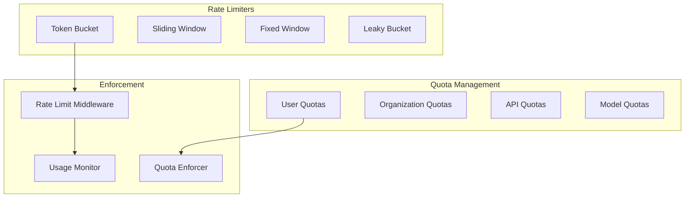

# Rate Limiting and Quotas

## Purpose
This document defines the resource management system for Patinox, including rate limiting, quota management, token budgeting, and priority-based allocation strategies.

## Classification
- **Domain:** Technical Architecture
- **Stability:** Semi-stable
- **Abstraction:** Structural
- **Confidence:** Established

## Content

### Rate Limiting Overview



### Core Rate Limiting Types

```rust
use async_trait::async_trait;

/// Rate limiter trait
#[async_trait]
pub trait RateLimiter: Send + Sync {
    /// Check if request is allowed
    async fn check(&self, key: &str) -> Result<RateLimitDecision>;
    
    /// Record request
    async fn record(&self, key: &str, cost: Cost) -> Result<()>;
    
    /// Get current usage
    async fn usage(&self, key: &str) -> Result<Usage>;
    
    /// Reset limiter
    async fn reset(&self, key: &str) -> Result<()>;
}

/// Rate limit decision
#[derive(Debug, Clone)]
pub struct RateLimitDecision {
    pub allowed: bool,
    pub limit: u64,
    pub remaining: u64,
    pub reset_at: DateTime<Utc>,
    pub retry_after: Option<Duration>,
}

/// Token bucket rate limiter
pub struct TokenBucketLimiter {
    buckets: Arc<RwLock<HashMap<String, TokenBucket>>>,
    config: TokenBucketConfig,
}

pub struct TokenBucket {
    tokens: f64,
    max_tokens: f64,
    refill_rate: f64,
    last_refill: Instant,
}

impl TokenBucketLimiter {
    pub async fn check_and_consume(&self, key: &str, tokens: f64) -> Result<bool> {
        let mut buckets = self.buckets.write().await;
        
        let bucket = buckets.entry(key.to_string())
            .or_insert_with(|| TokenBucket::new(self.config.clone()));
        
        bucket.refill();
        
        if bucket.tokens >= tokens {
            bucket.tokens -= tokens;
            Ok(true)
        } else {
            Ok(false)
        }
    }
}
```

### Quota Management System

```rust
/// Quota manager for resource allocation
pub struct QuotaManager {
    /// Storage backend
    store: Box<dyn QuotaStore>,
    /// Quota policies
    policies: HashMap<QuotaType, Box<dyn QuotaPolicy>>,
    /// Usage tracker
    tracker: UsageTracker,
    /// Alert system
    alerts: AlertSystem,
}

/// Quota definition
#[derive(Clone, Debug)]
pub struct Quota {
    pub id: QuotaId,
    pub owner: QuotaOwner,
    pub quota_type: QuotaType,
    pub limits: QuotaLimits,
    pub period: QuotaPeriod,
    pub priority: Priority,
}

#[derive(Clone, Debug)]
pub struct QuotaLimits {
    pub requests: Option<u64>,
    pub tokens: Option<u64>,
    pub cost: Option<f64>,
    pub concurrent: Option<u32>,
    pub custom: HashMap<String, Value>,
}

impl QuotaManager {
    /// Check if operation is within quota
    pub async fn check_quota(&self, request: QuotaRequest) -> Result<QuotaDecision> {
        let quota = self.store.get_quota(&request.owner).await?;
        let usage = self.tracker.get_usage(&request.owner, &quota.period).await?;
        
        let decision = self.evaluate_quota(&quota, &usage, &request)?;
        
        if decision.allowed {
            self.tracker.record_usage(&request).await?;
        }
        
        // Check for alerts
        if usage.percentage() > 0.8 {
            self.alerts.send_quota_warning(&request.owner, usage.percentage()).await?;
        }
        
        Ok(decision)
    }
    
    /// Allocate quota to user/organization
    pub async fn allocate_quota(&self, allocation: QuotaAllocation) -> Result<()> {
        let quota = Quota {
            id: QuotaId::generate(),
            owner: allocation.owner,
            quota_type: allocation.quota_type,
            limits: allocation.limits,
            period: allocation.period,
            priority: allocation.priority,
        };
        
        self.store.create_quota(quota).await
    }
}
```

### Token Budgeting

```rust
/// Token budget manager for LLM usage
pub struct TokenBudgetManager {
    /// Budget allocations
    budgets: Arc<RwLock<HashMap<BudgetId, TokenBudget>>>,
    /// Cost calculator
    calculator: TokenCostCalculator,
    /// Budget policies
    policies: Vec<Box<dyn BudgetPolicy>>,
}

#[derive(Clone, Debug)]
pub struct TokenBudget {
    pub id: BudgetId,
    pub owner: String,
    pub total_tokens: u64,
    pub used_tokens: u64,
    pub reserved_tokens: u64,
    pub period: BudgetPeriod,
    pub model_limits: HashMap<ModelId, u64>,
}

impl TokenBudgetManager {
    /// Reserve tokens for operation
    pub async fn reserve(&self, request: TokenReservation) -> Result<ReservationId> {
        let mut budgets = self.budgets.write().await;
        
        let budget = budgets.get_mut(&request.budget_id)
            .ok_or(Error::BudgetNotFound)?;
        
        let available = budget.total_tokens - budget.used_tokens - budget.reserved_tokens;
        
        if request.tokens > available {
            return Err(Error::InsufficientBudget {
                requested: request.tokens,
                available,
            });
        }
        
        budget.reserved_tokens += request.tokens;
        
        let reservation = ReservationId::generate();
        self.store_reservation(reservation.clone(), request).await?;
        
        Ok(reservation)
    }
    
    /// Consume reserved tokens
    pub async fn consume(&self, reservation_id: ReservationId, actual: u64) -> Result<()> {
        let reservation = self.get_reservation(reservation_id).await?;
        
        let mut budgets = self.budgets.write().await;
        let budget = budgets.get_mut(&reservation.budget_id)
            .ok_or(Error::BudgetNotFound)?;
        
        budget.reserved_tokens -= reservation.tokens;
        budget.used_tokens += actual;
        
        // Refund unused tokens
        if actual < reservation.tokens {
            let refund = reservation.tokens - actual;
            tracing::info!("Refunding {} unused tokens", refund);
        }
        
        Ok(())
    }
}
```

### Priority-Based Allocation

```rust
/// Priority-based resource allocator
pub struct PriorityAllocator {
    /// Priority queues
    queues: HashMap<Priority, PriorityQueue<Request>>,
    /// Allocation strategy
    strategy: AllocationStrategy,
    /// Fairness policy
    fairness: FairnessPolicy,
}

#[derive(Clone, Debug, Ord, PartialOrd, Eq, PartialEq)]
pub enum Priority {
    Critical = 0,
    High = 1,
    Normal = 2,
    Low = 3,
    Background = 4,
}

impl PriorityAllocator {
    /// Allocate resources based on priority
    pub async fn allocate(&self, request: AllocationRequest) -> Result<Allocation> {
        let priority = self.determine_priority(&request)?;
        
        match self.strategy {
            AllocationStrategy::Strict => {
                self.strict_priority_allocation(request, priority).await
            }
            AllocationStrategy::Weighted => {
                self.weighted_allocation(request, priority).await
            }
            AllocationStrategy::Fair => {
                self.fair_allocation(request, priority).await
            }
        }
    }
    
    /// Weighted fair allocation
    async fn weighted_allocation(
        &self,
        request: AllocationRequest,
        priority: Priority,
    ) -> Result<Allocation> {
        let weight = match priority {
            Priority::Critical => 1.0,
            Priority::High => 0.75,
            Priority::Normal => 0.5,
            Priority::Low => 0.25,
            Priority::Background => 0.1,
        };
        
        let allocated = (request.requested as f64 * weight) as u64;
        
        Ok(Allocation {
            granted: allocated,
            priority,
            expires_at: Utc::now() + Duration::from_secs(300),
        })
    }
}
```

### Distributed Rate Limiting

```rust
/// Distributed rate limiter using Redis
pub struct DistributedRateLimiter {
    redis: redis::Client,
    local_cache: Arc<RwLock<HashMap<String, CachedLimit>>>,
    sync_interval: Duration,
}

impl DistributedRateLimiter {
    /// Check rate limit with distributed coordination
    pub async fn check_distributed(&self, key: &str) -> Result<RateLimitDecision> {
        // Try local cache first
        if let Some(cached) = self.check_local_cache(key).await? {
            return Ok(cached);
        }
        
        // Fall back to Redis
        let mut conn = self.redis.get_async_connection().await?;
        
        let script = r#"
            local key = KEYS[1]
            local limit = tonumber(ARGV[1])
            local window = tonumber(ARGV[2])
            local current = redis.call('GET', key)
            
            if current == false then
                redis.call('SET', key, 1, 'EX', window)
                return {1, limit - 1}
            elseif tonumber(current) < limit then
                local new_val = redis.call('INCR', key)
                return {1, limit - new_val}
            else
                local ttl = redis.call('TTL', key)
                return {0, ttl}
            end
        "#;
        
        let result: Vec<i64> = redis::Script::new(script)
            .key(key)
            .arg(self.config.limit)
            .arg(self.config.window.as_secs())
            .invoke_async(&mut conn)
            .await?;
        
        let decision = RateLimitDecision {
            allowed: result[0] == 1,
            limit: self.config.limit,
            remaining: result[1] as u64,
            reset_at: Utc::now() + Duration::from_secs(result[1] as u64),
            retry_after: if result[0] == 0 {
                Some(Duration::from_secs(result[1] as u64))
            } else {
                None
            },
        };
        
        // Update local cache
        self.update_local_cache(key, &decision).await?;
        
        Ok(decision)
    }
}
```

### Cost Tracking

```rust
/// Cost tracker for resource usage
pub struct CostTracker {
    /// Cost models
    models: HashMap<ModelId, CostModel>,
    /// Usage aggregator
    aggregator: UsageAggregator,
    /// Billing integrator
    billing: BillingIntegrator,
}

#[derive(Clone, Debug)]
pub struct CostModel {
    pub model_id: ModelId,
    pub input_cost_per_1k: f64,
    pub output_cost_per_1k: f64,
    pub fixed_cost: f64,
    pub currency: Currency,
}

impl CostTracker {
    /// Calculate cost for usage
    pub fn calculate_cost(&self, usage: TokenUsage) -> Result<Cost> {
        let model = self.models.get(&usage.model_id)
            .ok_or(Error::UnknownModel)?;
        
        let input_cost = (usage.input_tokens as f64 / 1000.0) * model.input_cost_per_1k;
        let output_cost = (usage.output_tokens as f64 / 1000.0) * model.output_cost_per_1k;
        
        Ok(Cost {
            amount: input_cost + output_cost + model.fixed_cost,
            currency: model.currency.clone(),
            breakdown: CostBreakdown {
                input: input_cost,
                output: output_cost,
                fixed: model.fixed_cost,
            },
        })
    }
    
    /// Track usage and costs
    pub async fn track(&self, usage: Usage) -> Result<()> {
        let cost = self.calculate_cost(usage.tokens)?;
        
        self.aggregator.add(usage.owner.clone(), cost.clone()).await?;
        
        if self.should_bill(&usage.owner).await? {
            self.billing.record_usage(usage.owner, cost).await?;
        }
        
        Ok(())
    }
}
```

## Best Practices

1. **Graceful Degradation**: Handle rate limit exceeded gracefully
2. **Caching**: Cache rate limit decisions locally when possible
3. **Monitoring**: Track rate limit hits and quota usage
4. **Fairness**: Implement fair allocation strategies
5. **Alerting**: Alert before quotas are exhausted
6. **Documentation**: Clearly document rate limits and quotas
7. **Testing**: Test rate limiting under load

## Configuration Example

```toml
[rate_limiting]
# Default rate limits
default_requests_per_second = 10
default_burst_size = 20

# Token bucket configuration
[rate_limiting.token_bucket]
refill_rate = 10.0
max_tokens = 100.0

# Quota configuration
[rate_limiting.quotas]
default_daily_tokens = 1000000
default_monthly_cost = 100.0
alert_threshold = 0.8

# Priority allocation
[rate_limiting.priority]
strategy = "weighted"
critical_weight = 1.0
high_weight = 0.75
normal_weight = 0.5
low_weight = 0.25
```

## Relationships
- **Parent Nodes:** [elements/architecture_overview.md]
- **Child Nodes:** None
- **Related Nodes:** 
  - [elements/monitoring_strategy.md] - monitors - Usage and limits
  - [elements/configuration_strategy.md] - configures - Rate limit settings
  - [planning/unaddressed-questions/README.md] - addresses - Cost management gap

## Navigation Guidance
- **Access Context:** Reference when implementing resource management
- **Common Next Steps:** Review monitoring or configuration strategy
- **Related Tasks:** Rate limiting, quota management, cost tracking
- **Update Patterns:** Update when adding new rate limiting strategies

## Metadata
- **Created:** 2025-01-18
- **Last Updated:** 2025-01-18
- **Updated By:** Development Team

## Change History
- 2025-01-18: Initial rate limiting and quota system design