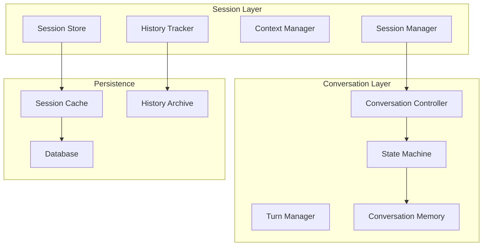

# Session and Conversation Management

## Purpose
This document defines the stateful conversation handling system for Patinox, including session state management, conversation history, context carry-over, and multi-turn interaction patterns.

## Classification
- **Domain:** Technical Architecture
- **Stability:** Semi-stable
- **Abstraction:** Structural
- **Confidence:** Evolving

## Content

### Session Management Overview



### Core Session Types

```rust
use async_trait::async_trait;

/// Session representing a user interaction context
#[derive(Clone, Debug)]
pub struct Session {
    pub id: SessionId,
    pub user_id: Option<UserId>,
    pub created_at: DateTime<Utc>,
    pub updated_at: DateTime<Utc>,
    pub metadata: SessionMetadata,
    pub state: SessionState,
    pub context: SessionContext,
    pub configuration: SessionConfig,
}

/// Session state machine
#[derive(Clone, Debug)]
pub enum SessionState {
    Created,
    Active { started_at: DateTime<Utc> },
    Paused { paused_at: DateTime<Utc>, reason: String },
    Resumed { resumed_at: DateTime<Utc> },
    Completed { completed_at: DateTime<Utc> },
    Failed { failed_at: DateTime<Utc>, error: String },
    Expired { expired_at: DateTime<Utc> },
}

/// Session context carrying conversation state
#[derive(Clone, Debug)]
pub struct SessionContext {
    pub variables: HashMap<String, Value>,
    pub conversation_history: ConversationHistory,
    pub active_tools: Vec<ToolId>,
    pub memory_snapshot: MemorySnapshot,
    pub preferences: UserPreferences,
}

/// Conversation within a session
#[derive(Clone, Debug)]
pub struct Conversation {
    pub id: ConversationId,
    pub session_id: SessionId,
    pub turns: Vec<ConversationTurn>,
    pub context_window: ContextWindow,
    pub state: ConversationState,
    pub metadata: ConversationMetadata,
}

/// Single turn in a conversation
#[derive(Clone, Debug)]
pub struct ConversationTurn {
    pub id: TurnId,
    pub index: usize,
    pub timestamp: DateTime<Utc>,
    pub role: TurnRole,
    pub content: TurnContent,
    pub tokens: TokenCount,
    pub latency: Option<Duration>,
    pub feedback: Option<TurnFeedback>,
}
```

### Session Manager

```rust
/// Main session management system
pub struct SessionManager {
    /// Session storage
    store: Box<dyn SessionStore>,
    /// Active sessions cache
    active_sessions: Arc<RwLock<HashMap<SessionId, Arc<Session>>>>,
    /// Session lifecycle handlers
    lifecycle_handlers: Vec<Box<dyn SessionLifecycleHandler>>,
    /// Expiration policy
    expiration_policy: ExpirationPolicy,
    /// Persistence strategy
    persistence_strategy: PersistenceStrategy,
}

impl SessionManager {
    /// Create a new session
    pub async fn create_session(&self, config: SessionConfig) -> Result<Session> {
        let session = Session {
            id: SessionId::generate(),
            user_id: config.user_id.clone(),
            created_at: Utc::now(),
            updated_at: Utc::now(),
            metadata: SessionMetadata::from_config(&config),
            state: SessionState::Created,
            context: SessionContext::new(),
            configuration: config,
        };
        
        // Store session
        self.store.create(session.clone()).await?;
        
        // Cache active session
        self.active_sessions.write().await
            .insert(session.id.clone(), Arc::new(session.clone()));
        
        // Trigger lifecycle handlers
        for handler in &self.lifecycle_handlers {
            handler.on_session_created(&session).await?;
        }
        
        Ok(session)
    }
    
    /// Resume an existing session
    pub async fn resume_session(&self, session_id: SessionId) -> Result<Session> {
        // Check cache first
        if let Some(session) = self.active_sessions.read().await.get(&session_id) {
            return Ok((**session).clone());
        }
        
        // Load from store
        let mut session = self.store.get(session_id).await?;
        
        // Update state
        session.state = SessionState::Resumed {
            resumed_at: Utc::now(),
        };
        session.updated_at = Utc::now();
        
        // Update store
        self.store.update(session.clone()).await?;
        
        // Cache session
        self.active_sessions.write().await
            .insert(session.id.clone(), Arc::new(session.clone()));
        
        Ok(session)
    }
    
    /// Update session context
    pub async fn update_context(
        &self,
        session_id: SessionId,
        updater: impl FnOnce(&mut SessionContext),
    ) -> Result<()> {
        let mut sessions = self.active_sessions.write().await;
        
        let session = sessions.get_mut(&session_id)
            .ok_or(Error::SessionNotFound(session_id))?;
        
        let mut updated_session = (**session).clone();
        updater(&mut updated_session.context);
        updated_session.updated_at = Utc::now();
        
        // Update store
        self.store.update(updated_session.clone()).await?;
        
        // Update cache
        *session = Arc::new(updated_session);
        
        Ok(())
    }
    
    /// Handle session expiration
    pub async fn cleanup_expired_sessions(&self) -> Result<usize> {
        let now = Utc::now();
        let mut expired_count = 0;
        
        let sessions = self.active_sessions.read().await.clone();
        
        for (id, session) in sessions {
            if self.expiration_policy.is_expired(&session, now) {
                self.expire_session(id).await?;
                expired_count += 1;
            }
        }
        
        Ok(expired_count)
    }
}
```

### Conversation Controller

```rust
/// Controller for managing conversations
pub struct ConversationController {
    /// Conversation storage
    store: Box<dyn ConversationStore>,
    /// Turn manager
    turn_manager: TurnManager,
    /// Context window manager
    window_manager: ContextWindowManager,
    /// State machine
    state_machine: ConversationStateMachine,
}

impl ConversationController {
    /// Start a new conversation
    pub async fn start_conversation(
        &self,
        session_id: SessionId,
        initial_message: Option<String>,
    ) -> Result<Conversation> {
        let conversation = Conversation {
            id: ConversationId::generate(),
            session_id,
            turns: Vec::new(),
            context_window: ContextWindow::new(),
            state: ConversationState::Started,
            metadata: ConversationMetadata::new(),
        };
        
        // Store conversation
        self.store.create(conversation.clone()).await?;
        
        // Add initial turn if provided
        if let Some(message) = initial_message {
            self.add_turn(
                conversation.id.clone(),
                TurnRole::User,
                TurnContent::Text(message),
            ).await?;
        }
        
        Ok(conversation)
    }
    
    /// Add a turn to conversation
    pub async fn add_turn(
        &self,
        conversation_id: ConversationId,
        role: TurnRole,
        content: TurnContent,
    ) -> Result<ConversationTurn> {
        let mut conversation = self.store.get(conversation_id.clone()).await?;
        
        let turn = ConversationTurn {
            id: TurnId::generate(),
            index: conversation.turns.len(),
            timestamp: Utc::now(),
            role,
            content: content.clone(),
            tokens: self.count_tokens(&content)?,
            latency: None,
            feedback: None,
        };
        
        // Add to conversation
        conversation.turns.push(turn.clone());
        
        // Update context window
        self.window_manager.update_window(&mut conversation.context_window, &turn)?;
        
        // Update state
        conversation.state = self.state_machine.transition(conversation.state, TurnAdded)?;
        
        // Store updated conversation
        self.store.update(conversation).await?;
        
        Ok(turn)
    }
    
    /// Get conversation context for next turn
    pub async fn get_context(
        &self,
        conversation_id: ConversationId,
    ) -> Result<ConversationContext> {
        let conversation = self.store.get(conversation_id).await?;
        
        // Build context from conversation history
        let context = ConversationContext {
            recent_turns: self.window_manager.get_relevant_turns(&conversation)?,
            summary: self.generate_summary(&conversation).await?,
            active_topics: self.extract_topics(&conversation)?,
            user_preferences: self.get_user_preferences(&conversation).await?,
        };
        
        Ok(context)
    }
}
```

### Context Window Management

```rust
/// Manages conversation context window
pub struct ContextWindowManager {
    /// Maximum tokens in window
    max_tokens: usize,
    /// Compression strategy
    compression: CompressionStrategy,
    /// Relevance scorer
    relevance_scorer: RelevanceScorer,
}

impl ContextWindowManager {
    /// Update context window with new turn
    pub fn update_window(
        &self,
        window: &mut ContextWindow,
        turn: &ConversationTurn,
    ) -> Result<()> {
        // Add new turn
        window.add_turn(turn.clone());
        
        // Check if compression needed
        if window.total_tokens() > self.max_tokens {
            self.compress_window(window)?;
        }
        
        Ok(())
    }
    
    /// Compress window to fit token limit
    pub fn compress_window(&self, window: &mut ContextWindow) -> Result<()> {
        match self.compression {
            CompressionStrategy::Summarize => {
                let summary = self.summarize_old_turns(window)?;
                window.add_summary(summary);
                window.remove_summarized_turns();
            }
            CompressionStrategy::SelectiveRemoval => {
                let scores = self.relevance_scorer.score_turns(&window.turns)?;
                window.remove_low_relevance_turns(scores, self.max_tokens)?;
            }
            CompressionStrategy::Hybrid => {
                // Combine both strategies
                self.hybrid_compression(window)?;
            }
        }
        
        Ok(())
    }
}
```

### Conversation State Machine

```rust
/// State machine for conversation flow
pub struct ConversationStateMachine {
    /// State transitions
    transitions: HashMap<(ConversationState, Event), ConversationState>,
    /// State handlers
    handlers: HashMap<ConversationState, Box<dyn StateHandler>>,
}

#[derive(Clone, Debug, Hash, Eq, PartialEq)]
pub enum ConversationState {
    Started,
    WaitingForUser,
    Processing,
    WaitingForTool,
    GeneratingResponse,
    Completed,
    Failed,
}

impl ConversationStateMachine {
    /// Transition to new state
    pub fn transition(
        &self,
        current: ConversationState,
        event: Event,
    ) -> Result<ConversationState> {
        let key = (current.clone(), event);
        
        self.transitions.get(&key)
            .cloned()
            .ok_or(Error::InvalidTransition(current, event))
    }
    
    /// Execute state handler
    pub async fn handle_state(
        &self,
        state: ConversationState,
        context: StateContext,
    ) -> Result<()> {
        if let Some(handler) = self.handlers.get(&state) {
            handler.handle(context).await?;
        }
        
        Ok(())
    }
}
```

### Session Persistence

```rust
/// Session storage interface
#[async_trait]
pub trait SessionStore: Send + Sync {
    async fn create(&self, session: Session) -> Result<()>;
    async fn get(&self, id: SessionId) -> Result<Session>;
    async fn update(&self, session: Session) -> Result<()>;
    async fn delete(&self, id: SessionId) -> Result<()>;
    async fn list_active(&self) -> Result<Vec<Session>>;
    async fn search(&self, criteria: SearchCriteria) -> Result<Vec<Session>>;
}

/// Redis-based session store
pub struct RedisSessionStore {
    client: redis::Client,
    serializer: SessionSerializer,
}

impl RedisSessionStore {
    async fn get_connection(&self) -> Result<redis::aio::Connection> {
        Ok(self.client.get_async_connection().await?)
    }
}

#[async_trait]
impl SessionStore for RedisSessionStore {
    async fn create(&self, session: Session) -> Result<()> {
        let mut conn = self.get_connection().await?;
        
        let key = format!("session:{}", session.id);
        let value = self.serializer.serialize(&session)?;
        let ttl = session.configuration.ttl.as_secs();
        
        redis::cmd("SET")
            .arg(&key)
            .arg(value)
            .arg("EX")
            .arg(ttl)
            .query_async(&mut conn)
            .await?;
        
        // Add to active sessions set
        redis::cmd("SADD")
            .arg("sessions:active")
            .arg(&session.id.to_string())
            .query_async(&mut conn)
            .await?;
        
        Ok(())
    }
    
    async fn get(&self, id: SessionId) -> Result<Session> {
        let mut conn = self.get_connection().await?;
        
        let key = format!("session:{}", id);
        let value: Vec<u8> = redis::cmd("GET")
            .arg(&key)
            .query_async(&mut conn)
            .await?;
        
        self.serializer.deserialize(&value)
    }
}
```

### Conversation History

```rust
/// Conversation history management
pub struct ConversationHistory {
    /// Historical turns
    turns: VecDeque<ConversationTurn>,
    /// Summaries of older conversations
    summaries: Vec<ConversationSummary>,
    /// Maximum history size
    max_size: usize,
    /// Archival strategy
    archival: ArchivalStrategy,
}

impl ConversationHistory {
    /// Add turn to history
    pub fn add_turn(&mut self, turn: ConversationTurn) {
        self.turns.push_back(turn);
        
        if self.turns.len() > self.max_size {
            self.archive_old_turns();
        }
    }
    
    /// Archive old turns
    fn archive_old_turns(&mut self) {
        let to_archive = self.turns.len() - self.max_size;
        let archived_turns: Vec<_> = self.turns.drain(..to_archive).collect();
        
        let summary = self.summarize_turns(archived_turns);
        self.summaries.push(summary);
    }
    
    /// Get relevant history for context
    pub fn get_relevant_history(&self, query: &str) -> Vec<ConversationTurn> {
        // Score turns by relevance to query
        let mut scored_turns: Vec<_> = self.turns.iter()
            .map(|turn| {
                let score = self.calculate_relevance(turn, query);
                (turn.clone(), score)
            })
            .collect();
        
        scored_turns.sort_by(|a, b| b.1.partial_cmp(&a.1).unwrap());
        
        scored_turns.into_iter()
            .take(10)
            .map(|(turn, _)| turn)
            .collect()
    }
}
```

### Multi-Turn Patterns

```rust
/// Multi-turn interaction patterns
pub enum InteractionPattern {
    /// Simple question-answer
    QA,
    /// Multi-step task completion
    TaskOriented { steps: Vec<TaskStep> },
    /// Open-ended conversation
    Conversational,
    /// Clarification dialogue
    Clarification { max_rounds: usize },
    /// Collaborative problem solving
    Collaborative,
}

/// Handler for multi-turn patterns
pub struct PatternHandler {
    patterns: HashMap<InteractionPattern, Box<dyn TurnHandler>>,
}

impl PatternHandler {
    pub async fn handle_turn(
        &self,
        pattern: &InteractionPattern,
        turn: ConversationTurn,
        context: ConversationContext,
    ) -> Result<Response> {
        let handler = self.patterns.get(pattern)
            .ok_or(Error::UnknownPattern)?;
        
        handler.handle(turn, context).await
    }
}
```

## Best Practices

1. **Session Lifecycle**: Properly manage session creation, updates, and expiration
2. **Context Window**: Maintain relevant context within token limits
3. **State Management**: Use state machines for complex conversation flows
4. **Persistence**: Choose appropriate storage for session data
5. **History Management**: Archive old conversations efficiently
6. **Memory Usage**: Limit in-memory session cache size
7. **Concurrency**: Handle concurrent session updates safely

## Configuration Example

```toml
[session]
# Session configuration
default_ttl = "24h"
max_active_sessions = 10000
cleanup_interval = "5m"

# Context window
[session.context_window]
max_tokens = 4096
compression_strategy = "hybrid"
relevance_threshold = 0.7

# Persistence
[session.persistence]
backend = "redis"
connection_pool_size = 10
archive_after_days = 30

# Conversation
[session.conversation]
max_turns_in_memory = 50
summarization_threshold = 20
```

## Relationships
- **Parent Nodes:** [elements/architecture_overview.md]
- **Child Nodes:** None
- **Related Nodes:** 
  - [elements/memory_architecture.md] - uses - Memory for context
  - [elements/distributed_conversation_coordination.md] - coordinates - Multi-agent conversations
  - [elements/websocket_hub_architecture.md] - enables - Real-time sessions
  - [elements/caching_strategy.md] - caches - Session data

## Navigation Guidance
- **Access Context:** Reference when implementing stateful conversations
- **Common Next Steps:** Review streaming architecture or memory integration
- **Related Tasks:** Session management, conversation tracking, context handling
- **Update Patterns:** Update when adding new conversation patterns

## Metadata
- **Created:** 2025-01-18
- **Last Updated:** 2025-01-18
- **Updated By:** Development Team

## Change History
- 2025-01-18: Initial session and conversation management design