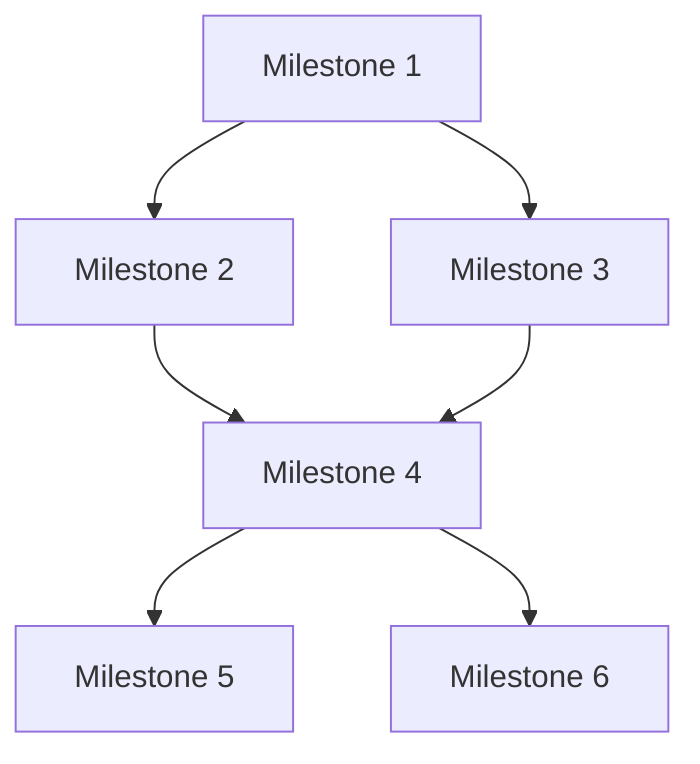

# Project Milestones

## Purpose
This document provides detailed information about project milestones, including acceptance criteria, dependencies, and tracking.

## Classification
- **Domain:** Planning
- **Stability:** Dynamic
- **Abstraction:** Detailed
- **Confidence:** Evolving

## Content

### Milestone Overview

[Provide a high-level overview of the project milestones and their relationships]

### Milestone Details

#### Milestone 1: [Milestone 1 Name]

- **Target Date:** [Date]
- **Status:** [Not Started/In Progress/Completed]
- **Owner:** [Name or Role]
- **Description:** [Detailed description of the milestone]

**Objectives:**
- [Objective 1]
- [Objective 2]
- [Objective 3]

**Deliverables:**
- [Deliverable 1]
- [Deliverable 2]
- [Deliverable 3]

**Acceptance Criteria:**
- [Criterion 1]
- [Criterion 2]
- [Criterion 3]

**Dependencies:**
- **Incoming:** [Dependencies that this milestone relies on]
- **Outgoing:** [Dependencies that rely on this milestone]

**Resources Required:**
- [Resource 1]
- [Resource 2]
- [Resource 3]

**Risks:**
- [Risk 1]
- [Risk 2]
- [Risk 3]

**Progress Tracking:**
- [Key metric 1]: [Status]
- [Key metric 2]: [Status]
- [Key metric 3]: [Status]

#### Milestone 2: [Milestone 2 Name]

- **Target Date:** [Date]
- **Status:** [Not Started/In Progress/Completed]
- **Owner:** [Name or Role]
- **Description:** [Detailed description of the milestone]

**Objectives:**
- [Objective 1]
- [Objective 2]
- [Objective 3]

**Deliverables:**
- [Deliverable 1]
- [Deliverable 2]
- [Deliverable 3]

**Acceptance Criteria:**
- [Criterion 1]
- [Criterion 2]
- [Criterion 3]

**Dependencies:**
- **Incoming:** [Dependencies that this milestone relies on]
- **Outgoing:** [Dependencies that rely on this milestone]

**Resources Required:**
- [Resource 1]
- [Resource 2]
- [Resource 3]

**Risks:**
- [Risk 1]
- [Risk 2]
- [Risk 3]

**Progress Tracking:**
- Error system implementation: ✅ 100% Complete
- Core traits definition: ✅ 100% Complete
- Test coverage: ✅ 100% Complete (85+ tests)

#### Milestone 2: Provider Ecosystem

- **Target Date:** 2025-09-30
- **Status:** ✅ Completed
- **Owner:** Provider Integration Team
- **Description:** Implement comprehensive LLM provider support with consistent interfaces

**Objectives:**
- Support all major LLM providers with unified interface
- Implement streaming support for real-time interactions
- Create robust error handling for network operations
- Establish comprehensive test coverage with mocking

**Deliverables:**
- ✅ OpenAI provider with full API support
- ✅ Anthropic provider with Claude integration
- ✅ OpenRouter provider for model diversity
- ✅ Ollama provider for local model support
- ✅ LMStudio provider for development workflows
- ✅ Streaming support across all providers
- ✅ Comprehensive mock testing infrastructure

**Acceptance Criteria:**
- ✅ All providers implement consistent interface
- ✅ Streaming works reliably across all providers
- ✅ Error handling covers all network failure scenarios
- ✅ Mock tests provide 100% coverage of provider interactions
- ✅ Real integration tests validate against live APIs

#### Milestone 3: Validation Infrastructure

- **Target Date:** 2025-12-01
- **Status:** 🔄 In Progress
- **Owner:** Validation Team
- **Description:** Implement comprehensive validation system for agent safety and quality

**Objectives:**
- Create anti-jailbreak validation for prompt injection prevention
- Implement hallucination detection for response verification
- Build request validation for input sanitization
- Integrate with Tower middleware for composable validation

**Deliverables:**
- 🔄 Anti-jailbreak validator with LLM-based detection
- 🔄 Hallucination detector with multiple verification strategies
- 🔄 Request validator for input sanitization
- 📅 Tower middleware integration for composable validation
- 📅 Circuit breaker patterns for failure handling

**Acceptance Criteria:**
- All validators integrate seamlessly with core trait system
- Tower middleware provides composable validation layers
- Validation failures provide clear recovery strategies
- Performance impact remains minimal (<5ms overhead)
- Comprehensive test coverage with edge cases

#### Milestone 4: Tower Integration

- **Target Date:** 2026-01-15
- **Status:** 📅 Planned
- **Owner:** Middleware Team
- **Description:** Full integration with Tower ecosystem for production-ready middleware

#### Milestone 5: Monitoring System

- **Target Date:** 2026-03-01
- **Status:** 📅 Planned
- **Owner:** Observability Team
- **Description:** Comprehensive monitoring and observability system

#### Milestone 6: Evolution Engine

- **Target Date:** 2026-05-01
- **Status:** 📅 Planned
- **Owner:** Meta-Learning Team
- **Description:** Self-improvement system through telemetry analysis

### Milestone Tracking

| Milestone | Target Date | Status | % Complete | Owner | Key Blockers |
|-----------|------------|--------|------------|-------|----------|
| Foundation Complete | 2025-08-25 | ✅ Completed | 100% | Core Team | None |
| Provider Ecosystem | 2025-09-30 | ✅ Completed | 100% | Provider Team | None |
| Validation Infrastructure | 2025-12-01 | 🔄 In Progress | 60% | Validation Team | Tower integration design |
| Tower Integration | 2026-01-15 | 📅 Planned | 0% | Middleware Team | Validation milestone |
| Monitoring System | 2026-03-01 | 📅 Planned | 0% | Observability Team | Tower integration |
| Evolution Engine | 2026-05-01 | 📅 Planned | 0% | Meta-Learning Team | Monitoring system |

### Milestone Review Process

[Describe the process for reviewing milestone completion and approving progression to the next milestone]

### Milestone Adjustment Process

[Describe the process for adjusting milestone targets, scope, or timelines if needed]

## Relationships
- **Parent Nodes:** [planning/roadmap.md]
- **Child Nodes:** None
- **Related Nodes:** 
  - [foundation/project_definition.md] - derives-from - Milestones implement project goals
  - [processes/creation.md] - executes - Creation processes work toward milestones

## Navigation Guidance
- **Access Context:** Use this document when planning work, tracking progress, or evaluating milestone completion
- **Common Next Steps:** After reviewing milestones, typically explore specific deliverables or dependencies
- **Related Tasks:** Sprint planning, progress reporting, resource allocation
- **Update Patterns:** This document should be updated bi-weekly or when milestone status changes

## Metadata
- **Created:** 2025-01-17
- **Last Updated:** 2025-09-18
- **Updated By:** Context Network Content Curator

## Change History
- 2025-01-17: Initial creation of milestones template
- 2025-09-18: Populated with actual project milestones reflecting current reality
