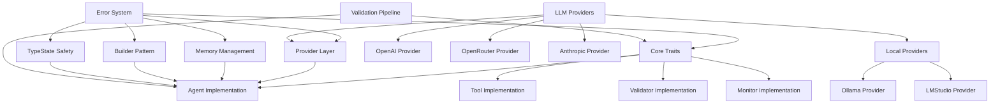

# Patinox Component Dependencies

## Purpose
This document maps the dependencies between different components of the Patinox framework, helping to understand how changes in one component might impact others.

## Classification
- **Domain:** Structure
- **Stability:** Semi-stable
- **Abstraction:** Structural
- **Confidence:** Established

## Content

### Dependency Overview

The Patinox framework follows a layered architecture with core traits at the foundation, utility modules providing common functionality, and provider implementations depending on these abstractions.

### Critical Dependencies

#### Error System → All Components
- **Dependency Type:** Foundation dependency
- **Description:** All Patinox components depend on the centralized error system (`PatinoxError`) for consistent error handling
- **Impact of Changes:** Changes to error types affect all modules; error variants must remain backward compatible
- **Stability:** Stable - Error system is foundational and carefully versioned

#### Core Traits → Agent Implementation
- **Dependency Type:** Interface dependency
- **Description:** Agent implementations must conform to the `Agent`, `Tool`, `Validator`, and `Monitor` trait contracts
- **Impact of Changes:** Trait changes require updates to all implementations; trait objects depend on method signatures
- **Stability:** Semi-stable - Traits evolve but with careful attention to object safety

#### Provider Layer → Agent Implementation
- **Dependency Type:** Service dependency
- **Description:** Agents depend on the provider abstraction layer for LLM communication via `ModelProvider` trait
- **Impact of Changes:** Provider interface changes affect agent execution logic; provider failures impact agent functionality
- **Stability:** Stable - Provider interface is designed for extensibility

#### Memory Management → Agent Lifecycle
- **Dependency Type:** Resource dependency
- **Description:** Agents use `ResourceRegistry` and `AsyncResourceGuard` for safe resource cleanup and memory management
- **Impact of Changes:** Changes to resource management affect agent startup/shutdown procedures
- **Stability:** Stable - Memory safety is a core requirement

#### Builder Pattern → Configuration
- **Dependency Type:** Construction dependency
- **Description:** Agent configuration depends on builder patterns (`AgentBuilder`, `TypeSafeAgentBuilder`) for type-safe construction
- **Impact of Changes:** Builder API changes affect how agents are configured and created
- **Stability:** Semi-stable - Builder APIs evolve with new configuration options

### Dependency Types

#### Trait Dependencies
Components implement core traits (`Agent`, `Tool`, `Validator`, `Monitor`) and depend on their contracts. These dependencies are enforced at compile time through Rust's type system.

#### Service Dependencies
Agents depend on external services through provider abstractions. The framework supports multiple LLM providers (OpenAI, Anthropic, OpenRouter, local models) through a unified interface.

#### Resource Dependencies
Components depend on shared resources like HTTP clients, async runtime, and memory pools. These are managed through the resource registry system for safe cleanup.

#### Configuration Dependencies
Agent behavior depends on configuration cascading from global → agent → request levels. Configuration changes can affect runtime behavior and capability availability.

#### Compilation Dependencies
External crates provide essential functionality:
- `tokio` for async runtime
- `serde` for serialization
- `reqwest` for HTTP clients
- `async-trait` for async trait objects
- `tower` for middleware pipeline
- `thiserror`/`anyhow` for error handling

### Dependency Management

#### Dependency Analysis
Dependencies are analyzed through:
- Cargo.toml workspace structure showing crate relationships
- Trait bounds and generic constraints in source code
- Import/use statements showing module dependencies
- Integration tests validating dependency contracts

#### Dependency Documentation
Dependencies are documented through:
- Context network connections (this document)
- Rust doc comments explaining trait relationships
- Integration examples showing proper usage patterns
- Architecture diagrams showing component interactions

#### Dependency Validation
Dependency correctness is ensured through:
- Rust compiler's borrow checker and type system
- Trait object safety tests for runtime polymorphism
- Integration tests covering cross-component interactions
- Property-based tests with proptest for edge cases

#### Dependency Change Management
Changes to dependencies are managed through:
- Semantic versioning for public APIs
- Deprecation warnings before breaking changes
- Migration guides for major version updates
- Backwards compatibility tests for trait implementations

### Dependency Risks

#### High-Risk Dependencies
- **LLM Provider APIs**: External service dependencies can fail or change without notice
- **Async Runtime (tokio)**: Core async functionality depends on tokio's stability and performance
- **HTTP Client (reqwest)**: Network operations are vulnerable to connectivity issues
- **Serialization (serde)**: Data format changes could break persistence or API compatibility
- **Error Propagation**: Changes to error types can cascade through entire system

#### Dependency Risk Mitigation
- **Provider Abstraction**: Unified interface allows switching between providers without code changes
- **Fallback Strategies**: Multiple provider support enables automatic failover
- **Resource Management**: Proper cleanup prevents resource leaks from failed operations
- **Error Boundary**: Centralized error handling contains failures within components
- **Version Pinning**: Cargo.lock pins exact versions for reproducible builds
- **Integration Testing**: Comprehensive tests catch breaking changes early

### Dependency Metrics

#### Dependency Count
- **Direct Dependencies**: 15+ crates listed in Cargo.toml workspace dependencies
- **Trait Dependencies**: 4 core traits (Agent, Tool, Validator, Monitor) with multiple implementations
- **Module Dependencies**: 8 major modules (traits, provider, error, memory, builder, typestate, validation)

#### Dependency Stability
- **Core Traits**: High stability - fundamental interfaces rarely change
- **Provider Layer**: Medium stability - new providers added, existing interfaces stable
- **Error System**: High stability - error types are carefully versioned
- **External Crates**: Varied - some stable (serde, tokio), others evolving (async-openai)

#### Dependency Cycle Detection
- **Cargo Check**: Rust compiler prevents circular dependencies at compile time
- **Module Structure**: Clear layering prevents cycles (traits → implementations → integrations)
- **Trait Object Safety**: Tests ensure no self-referential dependencies in trait objects
- **Resource Cleanup**: RAII patterns prevent circular resource dependencies

## Relationships
- **Parent Nodes:** [foundation/structure.md] - details - Dependencies between structural elements
- **Child Nodes:** None
- **Related Nodes:**
  - [connections/interfaces.md] - complements - Interface definitions complement dependency mapping
  - [elements/architecture_overview.md] - coordinates - Architecture dependencies managed here
  - [elements/*] - documents - Dependencies between individual elements
  - [planning/roadmap.md] - informs - Dependency analysis informs roadmap planning

## Navigation Guidance
- **Access Context:** Use this document when analyzing the impact of changes or understanding project structure
- **Common Next Steps:** After reviewing dependencies, typically explore specific elements or interfaces
- **Related Tasks:** Impact analysis, change planning, architecture review
- **Update Patterns:** This document should be updated when new dependencies are introduced or existing ones change

## Metadata
- **Created:** 2025-05-16
- **Last Updated:** 2025-09-18
- **Updated By:** Context Network Content Specialist

## Change History
- 2025-05-16: Created from cross-domain/dependencies.md with more generic terminology
- 2025-09-18: Updated with actual Patinox framework component dependencies and relationships
