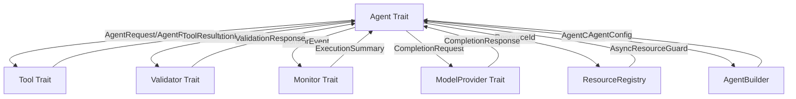

# Patinox Component Interfaces

## Purpose
This document defines the interfaces between different components of the Patinox framework, specifying how they interact and exchange information through Rust traits and type-safe abstractions.

## Classification
- **Domain:** Structure
- **Stability:** Semi-stable
- **Abstraction:** Structural
- **Confidence:** Established

## Content

### Interface Overview

Patinox defines four core traits that establish contracts between components, with additional supporting interfaces for configuration, resource management, and provider abstraction.



### Key Interfaces

#### Agent Trait Interface

**Purpose:**
Defines the core contract that all AI agents must implement, providing lifecycle management and request execution capabilities.

**Interface Type:**
Async trait with lifecycle control, request processing, and health monitoring

**Exchange Format:**
- Input: `AgentRequest` with UUID, message, tool calls, context
- Output: `AgentResponse` with processed message, tool results, usage metrics

**Responsibilities:**
- **Agent Implementation**: Maintain state, process requests, manage tools, report health
- **Framework**: Provide error handling, resource management, monitoring hooks

**Interface Contract:**
```rust
#[async_trait]
pub trait Agent: Send + Sync {
    fn id(&self) -> Uuid;
    fn state(&self) -> AgentState;
    fn config(&self) -> &AgentConfig;
    async fn start(&mut self) -> Result<(), PatinoxError>;
    async fn stop(&mut self) -> Result<(), PatinoxError>;
    async fn execute(&mut self, request: AgentRequest) -> Result<AgentResponse, PatinoxError>;
    fn available_tools(&self) -> Vec<String>;
    async fn health(&self) -> HealthStatus;
}
```

**Stability:**
Semi-stable - Core methods are stable, may add new optional methods with default implementations

#### Tool Trait Interface

**Purpose:**
Defines the contract for executable tools that agents can invoke to perform specific tasks.

**Interface Type:**
Async execution interface with parameter validation and metadata

**Exchange Format:**
- Input: `ToolParams` with call ID, JSON parameters, context
- Output: `ToolResult` with success status, data, error information

**Responsibilities:**
- **Tool Implementation**: Validate parameters, execute functionality, return structured results
- **Agent**: Provide valid parameters, handle tool results, manage tool lifecycle

**Interface Contract:**
```rust
#[async_trait]
pub trait Tool: Send + Sync {
    fn name(&self) -> &str;
    fn description(&self) -> &str;
    fn parameters_schema(&self) -> serde_json::Value;
    async fn execute(&self, params: ToolParams) -> Result<ToolResult, PatinoxError>;
    fn metadata(&self) -> ToolMetadata;
}
```

**Stability:**
Stable - Tool interface is foundational and unlikely to change

#### Validator Trait Interface

**Purpose:**
Provides safety and compliance checking at various stages of agent execution pipeline.

**Interface Type:**
Synchronous validation interface with stage-specific filtering

**Exchange Format:**
- Input: `ValidationRequest` with content, stage, context
- Output: `ValidationResponse` with approval status, reason, modifications

**Responsibilities:**
- **Validator Implementation**: Check content safety, apply business rules, suggest modifications
- **Agent Pipeline**: Route validation requests, apply validator decisions, handle rejections

**Interface Contract:**
```rust
#[async_trait]
pub trait Validator: Send + Sync {
    fn name(&self) -> &str;
    fn config(&self) -> &ValidatorConfig;
    fn should_validate(&self, request: &ValidationRequest) -> bool;
    async fn validate(&self, request: ValidationRequest) -> Result<ValidationResponse, PatinoxError>;
}
```

**Stability:**
Stable - Validation interface is core to safety and unlikely to change

#### Monitor Trait Interface

**Purpose:**
Collects telemetry, performance metrics, and execution traces for observability and improvement.

**Interface Type:**
Async event collection interface with querying capabilities

**Exchange Format:**
- Input: `MonitorEvent` with execution context, timestamp, event data
- Output: Event storage confirmation, query results

**Responsibilities:**
- **Monitor Implementation**: Store events, aggregate metrics, provide query interface
- **Agent Framework**: Generate events, provide execution context, consume metrics

**Interface Contract:**
```rust
#[async_trait]
pub trait Monitor: Send + Sync {
    fn name(&self) -> &str;
    async fn start_monitoring(&self, execution_id: Uuid, agent_id: Uuid) -> Result<(), PatinoxError>;
    async fn record_event(&self, event: MonitorEvent) -> Result<(), PatinoxError>;
    async fn complete_monitoring(&self, execution_id: Uuid, summary: ExecutionSummary) -> Result<(), PatinoxError>;
    async fn query_events(&self, query: MonitorQuery) -> Result<Vec<MonitorEvent>, PatinoxError>;
    fn config(&self) -> &MonitorConfig;
}
```

**Stability:**
Semi-stable - May add new event types and query capabilities

### Interface Types

#### Async Trait Interfaces
Core component contracts defined as async traits for safe concurrent execution:
- `Agent`, `Tool`, `Validator`, `Monitor` traits
- All async methods return `Result<T, PatinoxError>` for consistent error handling
- Trait objects are Send + Sync for thread safety

#### Configuration Interfaces
Type-safe configuration and builder patterns:
- `AgentConfig`, `ValidatorConfig`, `MonitorConfig` structs
- `AgentBuilder` for fluent configuration construction
- `TypeSafeAgentBuilder` with compile-time state validation

#### Provider Abstraction Interfaces
Unified LLM provider interface for multiple backends:
- `ModelProvider` trait for completion, streaming, embeddings
- `CompletionRequest`/`CompletionResponse` for standard interactions
- `ModelCapabilities` for capability-aware routing

#### Resource Management Interfaces
Safe resource lifecycle management:
- `ResourceRegistry` for centralized resource tracking
- `AsyncResourceGuard` for RAII-style cleanup
- `CleanupPriority` for controlled shutdown ordering

### Interface Management

#### Interface Definition
Interfaces are defined through:
- Rust traits with comprehensive documentation and examples
- Associated types and bounds for type safety
- Default implementations where appropriate for extensibility
- Test-driven development with mock implementations

#### Interface Documentation
Interfaces are documented through:
- Comprehensive rustdoc comments with examples
- Context network documentation (this file)
- Integration tests demonstrating proper usage
- Error handling patterns and best practices

#### Interface Validation
Interface correctness is ensured through:
- Rust compiler's trait system and type checking
- Object safety tests for trait objects
- Integration tests covering all trait methods
- Property-based testing for edge cases
- Mock implementations in test suites

#### Interface Change Management
Interface evolution is managed through:
- Semantic versioning for breaking changes
- Default implementations for new methods
- Deprecation warnings before removal
- Migration guides for major version updates
- Backwards compatibility tests

### Interface Versioning

#### Version Compatibility
- **Patch versions**: Bug fixes, no interface changes
- **Minor versions**: New optional methods with default implementations
- **Major versions**: Breaking changes to trait signatures or semantics
- **Trait object compatibility**: Maintained within major versions

#### Deprecation Process
1. Mark methods with `#[deprecated]` attribute and reason
2. Provide migration path in documentation
3. Keep deprecated methods for one minor version cycle
4. Remove in next major version with clear migration guide

#### Migration Strategies
- **Additive changes**: Use default implementations to maintain compatibility
- **Breaking changes**: Provide adapter traits and migration macros
- **Trait evolution**: Create new traits and deprecate old ones gradually
- **Version-specific implementations**: Support multiple trait versions during transition

### Interface Monitoring

#### Health Metrics
- **Trait object creation success rate**: Monitor trait object instantiation failures
- **Error propagation patterns**: Track which interfaces generate most errors
- **Resource cleanup effectiveness**: Monitor resource leak detection
- **Provider availability**: Track LLM provider interface health

#### Performance Metrics
- **Agent execution latency**: Time from request to response
- **Tool invocation overhead**: Interface call performance
- **Validation pipeline speed**: Validator chain execution time
- **Monitor event processing**: Telemetry collection performance

#### Usage Metrics
- **Trait method invocation frequency**: Which interface methods are used most
- **Provider selection patterns**: Which LLM providers are chosen
- **Error handling effectiveness**: Recovery success rates
- **Configuration pattern adoption**: Builder pattern usage statistics

## Relationships
- **Parent Nodes:** [foundation/structure.md] - specifies - Interfaces between structural elements
- **Child Nodes:** None
- **Related Nodes:**
  - [connections/dependencies.md] - complements - Dependency mapping complements interface definitions
  - [elements/architecture_overview.md] - coordinates - Architectural interfaces managed here
  - [elements/*] - documents - Interfaces between individual elements
  - [elements/protocol_based_exposure.md] - specifies - External protocol interfaces
  - [planning/roadmap.md] - informs - Interface design informs roadmap planning

## Navigation Guidance
- **Access Context:** Use this document when designing interactions between elements or troubleshooting integration issues
- **Common Next Steps:** After reviewing interfaces, typically explore specific elements or dependencies
- **Related Tasks:** Interface design, integration planning, compatibility analysis
- **Update Patterns:** This document should be updated when new interfaces are introduced or existing ones change

## Metadata
- **Created:** 2025-05-16
- **Last Updated:** 2025-09-18
- **Updated By:** Context Network Content Specialist

## Change History
- 2025-05-16: Created from cross-domain/interfaces.md with more generic terminology
- 2025-09-18: Updated with actual Patinox framework trait interfaces and contracts
