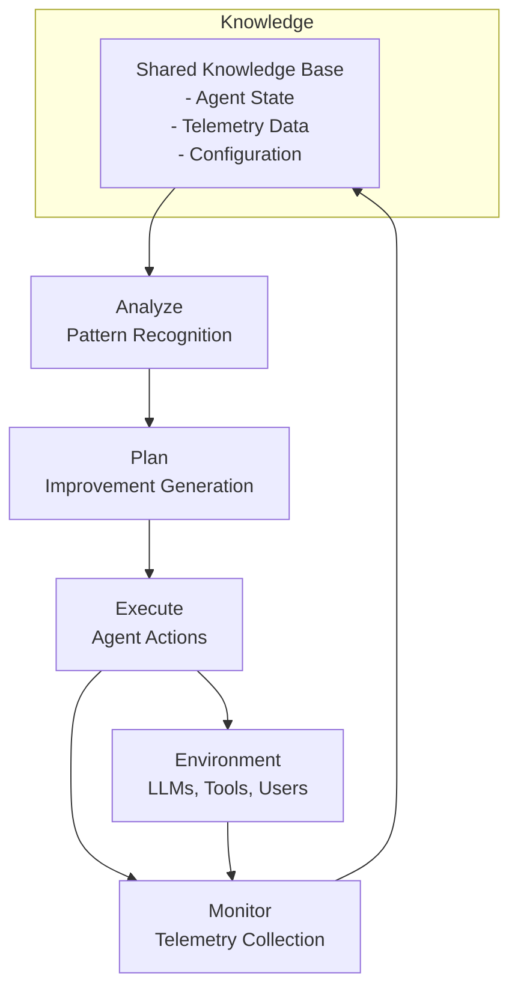
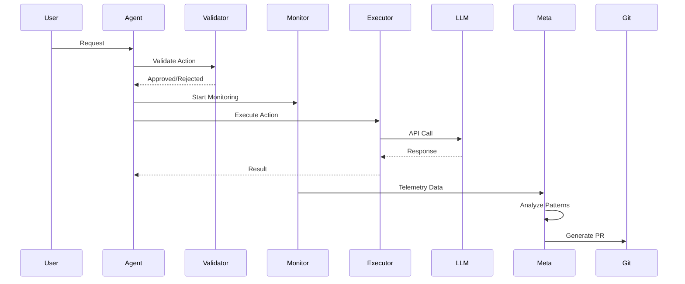
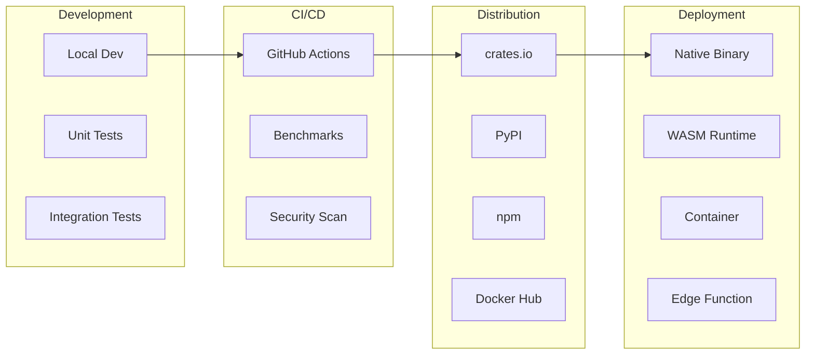

# Architecture Overview

## Purpose
This document provides a comprehensive overview of the Patinox architecture, including the MAPE-K pattern implementation, layered validation approach, and meta-layer evolution system.

## Classification
- **Domain:** Technical Architecture
- **Stability:** Semi-stable
- **Abstraction:** Structural
- **Confidence:** Established

## Content

### Architectural Pattern: MAPE-K

Patinox implements the MAPE-K (Monitor-Analyze-Plan-Execute over shared Knowledge) pattern for self-adaptive behavior:



### Core Architecture Layers

#### 1. Foundation Layer
- **Purpose**: Define core abstractions and types
- **Components**: Traits, error types, common utilities
- **Key Design**: Zero dependencies, pure Rust

#### 2. Execution Layer
- **Purpose**: Agent runtime and orchestration
- **Components**: Agent implementation, tool execution, state management
- **Key Design**: Actor model with message passing

#### 3. Validation Layer
- **Purpose**: Synchronous quality gates
- **Components**: Tower middleware stack, validators, circuit breakers
- **Key Design**: Composable middleware pattern

#### 4. Monitoring Layer
- **Purpose**: Asynchronous observation and analysis
- **Components**: Telemetry collectors, pattern analyzers, metric aggregators
- **Key Design**: Non-blocking, eventually consistent

#### 5. Meta Layer
- **Purpose**: Self-improvement through analysis
- **Components**: Telemetry analysis, improvement generation, evolution tracking
- **Key Design**: Git-based versioning of behaviors
- **Performance Impact**: 40% reduction in task completion time (per Anthropic research)

### Data Flow Architecture



### Concurrency Model

**Actor-Based Architecture**:
- Each agent is an independent actor
- Communication via message passing
- No shared mutable state
- Supervised actor hierarchies for resilience

**Async Runtime**:
- Tokio for async I/O
- Work-stealing scheduler
- Bounded channels for backpressure
- Graceful shutdown propagation

### Memory Management

**Zero-Copy Operations**:
- Direct integration with vector databases
- Memory-mapped file operations where possible
- Arc/Rc for shared immutable data
- Copy-on-write for configuration updates

**Resource Pooling**:
- Connection pools for LLM providers
- Reusable validator instances
- Cached compiled patterns
- Lazy initialization of expensive resources

### Error Handling Strategy

```rust
pub enum PatinoxError {
    Validation(ValidationError),
    Execution(ExecutionError),
    Network(NetworkError),
    Configuration(ConfigError),
}

// All errors are recoverable or explicit panics
impl PatinoxError {
    pub fn recovery_strategy(&self) -> RecoveryStrategy {
        match self {
            Self::Validation(_) => RecoveryStrategy::Retry,
            Self::Execution(_) => RecoveryStrategy::Fallback,
            Self::Network(_) => RecoveryStrategy::CircuitBreak,
            Self::Configuration(_) => RecoveryStrategy::Fail,
        }
    }
}
```

### Security Architecture

**Defense in Depth**:
1. Compile-time type safety
2. Runtime validation layer
3. Rate limiting and quotas
4. Circuit breakers for external services
5. Audit logging of all actions

**Sensitive Data Handling**:
- Never log API keys or user data
- Redact sensitive fields in telemetry
- Encrypted storage for credentials
- Secure key derivation for tokens

### Deployment Architecture



## Relationships
- **Parent Nodes:** [foundation/structure.md]
- **Child Nodes:** 
  - [elements/monitoring_strategy.md] - details - Monitoring implementation
  - [elements/rust_patterns.md] - implements - Pattern usage
  - [elements/technology_stack.md] - uses - Technology choices
  - [elements/dependency_injection_philosophy.md] - implements - DI patterns
  - [elements/protocol_based_exposure.md] - defines - Protocol interfaces
  - [elements/workflow_as_tool_abstraction.md] - enables - Workflow patterns
  - [elements/cli_agent_exposure.md] - provides - CLI interface
  - [elements/agent_conscience_pattern.md] - ensures - Quality control
- **Related Nodes:** 
  - [foundation/principles.md] - guides - Architectural decisions
  - [planning/roadmap.md] - schedules - Implementation phases
  - [elements/configuration_strategy.md] - configures - All components
  - [elements/agent_reasoning_paradigms.md] - informs - Agent behavior
  - [elements/interruptible_agent_loops.md] - enables - Execution control

## Navigation Guidance
- **Access Context:** Reference when making architectural decisions or understanding system behavior
- **Common Next Steps:** Explore specific layer implementations or technology choices
- **Related Tasks:** System design, component integration, performance optimization
- **Update Patterns:** Update when architectural patterns change or new layers are added

## Metadata
- **Created:** 2025-01-17
- **Last Updated:** 2025-01-18
- **Updated By:** Development Team

## Change History
- 2025-01-17: Initial architecture overview with MAPE-K pattern and layered design
- 2025-01-18: Added performance metrics from Anthropic research (40% task completion improvement)