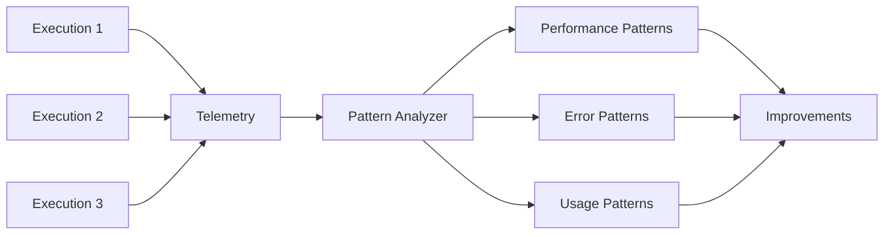
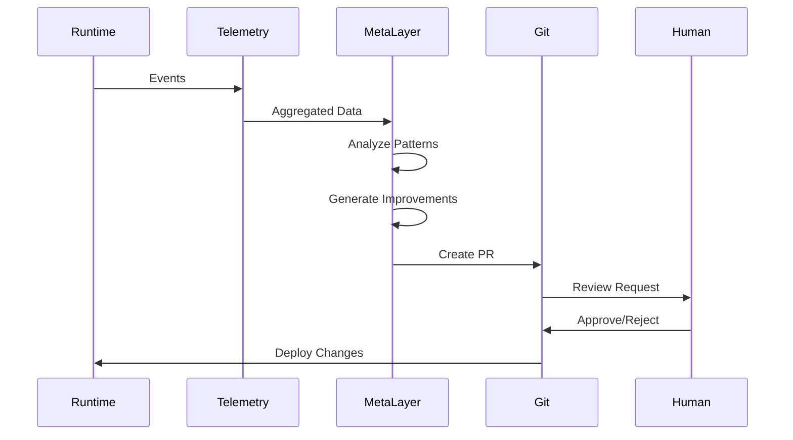

# Monitoring Strategy

## Purpose
This document details the embedded monitoring architecture, including synchronous validators, asynchronous analyzers, and the meta-layer feedback loop that enables systematic improvement.

## Classification
- **Domain:** Technical Architecture
- **Stability:** Semi-stable
- **Abstraction:** Detailed
- **Confidence:** Established

## Content

### Monitoring Philosophy

Monitoring is not an afterthought but an integral part of every execution path. The system implements dual monitoring strategies:

1. **Synchronous Validation**: Blocks execution to prevent harmful actions
2. **Asynchronous Analysis**: Observes patterns without impacting performance

### Synchronous Validation Pipeline

```rust
pub trait SyncValidator: Send + Sync {
    fn validate(&self, action: &AgentAction) -> Result<ValidationResult, ValidationError>;
    fn priority(&self) -> ValidatorPriority;
    fn can_modify(&self) -> bool;
}

pub struct ValidationPipeline {
    validators: Vec<Box<dyn SyncValidator>>,
}

impl ValidationPipeline {
    pub async fn validate(&self, action: &AgentAction) -> Result<AgentAction, ValidationError> {
        let mut current_action = action.clone();
        
        for validator in &self.validators {
            match validator.validate(&current_action)? {
                ValidationResult::Approved => continue,
                ValidationResult::Modified(new_action) if validator.can_modify() => {
                    current_action = new_action;
                }
                ValidationResult::Rejected(reason) => {
                    return Err(ValidationError::Rejected(reason));
                }
                ValidationResult::Retry(delay) => {
                    tokio::time::sleep(delay).await;
                    return self.validate(&current_action).await;
                }
            }
        }
        
        Ok(current_action)
    }
}
```

### Core Validators

#### Anti-Jailbreak Validator
- **Purpose**: Prevent prompt injection and jailbreak attempts
- **Method**: LLM-based analysis of prompts before execution
- **Action**: Reject malicious prompts, sanitize suspicious content

#### Hallucination Detector
- **Purpose**: Identify and prevent factually incorrect responses
- **Method**: Cross-reference with knowledge base and fact-checking
- **Action**: Flag uncertain responses, request clarification

#### Rate Limiter
- **Purpose**: Prevent resource exhaustion and abuse
- **Method**: Token bucket algorithm with configurable limits
- **Action**: Delay or reject requests exceeding limits

#### Circuit Breaker
- **Purpose**: Prevent cascade failures from external services
- **Method**: Track failure rates and trip on threshold
- **Action**: Fast-fail requests when circuit is open

### Asynchronous Monitoring Layer

```rust
pub trait AsyncMonitor: Send + Sync {
    fn observe(&self, event: MonitoringEvent) -> BoxFuture<'_, ()>;
    fn analyze(&self) -> BoxFuture<'_, Vec<Pattern>>;
    fn report(&self) -> BoxFuture<'_, MonitoringReport>;
}

pub struct MonitoringLayer {
    monitors: Arc<RwLock<Vec<Box<dyn AsyncMonitor>>>>,
    telemetry_sink: Arc<TelemetrySink>,
}

impl MonitoringLayer {
    pub fn spawn_monitoring(&self, event: MonitoringEvent) {
        let monitors = self.monitors.clone();
        let telemetry = self.telemetry_sink.clone();
        
        tokio::spawn(async move {
            // Non-blocking observation
            let monitors_read = monitors.read().await;
            for monitor in monitors_read.iter() {
                monitor.observe(event.clone()).await;
            }
            
            // Send to telemetry pipeline
            telemetry.record(event).await;
        });
    }
}
```

### Pattern Analysis

The monitoring layer identifies patterns across executions:



### Telemetry Collection

**Structured Events**:
```rust
#[derive(Serialize, Deserialize)]
pub struct TelemetryEvent {
    pub timestamp: SystemTime,
    pub trace_id: TraceId,
    pub span_id: SpanId,
    pub event_type: EventType,
    pub agent_id: AgentId,
    pub action: AgentAction,
    pub result: ActionResult,
    pub metrics: Metrics,
    pub context: HashMap<String, Value>,
}

pub struct Metrics {
    pub latency_ms: u64,
    pub tokens_used: u32,
    pub memory_bytes: usize,
    pub validator_decisions: Vec<ValidatorDecision>,
}
```

### OpenTelemetry Integration

```rust
use opentelemetry::{trace::Tracer, metrics::Meter};
use tracing_opentelemetry::OpenTelemetryLayer;

#[instrument(skip(agent), fields(agent.id = %agent.id()))]
pub async fn execute_agent_action(
    agent: &Agent,
    action: AgentAction,
) -> Result<ActionResult, Error> {
    let meter = global::meter("patinox");
    let counter = meter.u64_counter("agent.actions").init();
    let histogram = meter.f64_histogram("agent.latency").init();
    
    let start = Instant::now();
    counter.add(1, &[KeyValue::new("action_type", action.type_name())]);
    
    let result = agent.execute(action).await?;
    
    histogram.record(start.elapsed().as_secs_f64(), &[
        KeyValue::new("agent_id", agent.id().to_string()),
        KeyValue::new("success", result.is_ok()),
    ]);
    
    result
}
```

### Meta-Layer Feedback Loop

The meta-layer analyzes telemetry to identify improvement opportunities:



### Improvement Generation

```rust
pub struct ImprovementGenerator {
    analyzers: Vec<Box<dyn PatternAnalyzer>>,
    code_generator: CodeGenerator,
}

impl ImprovementGenerator {
    pub async fn analyze_telemetry(&self, window: Duration) -> Vec<Improvement> {
        let patterns = self.identify_patterns(window).await;
        let improvements = Vec::new();
        
        for pattern in patterns {
            match pattern {
                Pattern::HighLatency(details) => {
                    improvements.push(self.optimize_latency(details));
                }
                Pattern::FrequentErrors(details) => {
                    improvements.push(self.improve_error_handling(details));
                }
                Pattern::PromptInefficiency(details) => {
                    improvements.push(self.optimize_prompts(details));
                }
            }
        }
        
        improvements
    }
    
    pub async fn generate_pr(&self, improvement: Improvement) -> PullRequest {
        let code_changes = self.code_generator.generate(improvement);
        let description = self.format_pr_description(improvement);
        
        PullRequest {
            title: improvement.title(),
            description,
            changes: code_changes,
            tests: self.generate_tests(improvement),
            benchmarks: self.generate_benchmarks(improvement),
        }
    }
}
```

### Monitoring Configuration

```toml
[monitoring]
# Synchronous validators
validators = [
    { type = "anti_jailbreak", priority = 100, enabled = true },
    { type = "hallucination", priority = 90, enabled = true },
    { type = "rate_limit", priority = 50, requests_per_minute = 60 },
    { type = "circuit_breaker", priority = 40, failure_threshold = 0.5 },
]

# Asynchronous monitors
monitors = [
    { type = "performance", sample_rate = 1.0 },
    { type = "error_analysis", sample_rate = 1.0 },
    { type = "usage_patterns", sample_rate = 0.1 },
]

# Telemetry configuration
[telemetry]
endpoint = "http://localhost:4317"
service_name = "patinox"
trace_sample_rate = 0.1
metrics_interval_seconds = 60

# Meta-layer configuration
[meta_layer]
analysis_window_hours = 24
improvement_threshold = 0.2  # 20% improvement required
pr_generation_enabled = true
auto_merge_enabled = false
```

## Relationships
- **Parent Nodes:** [elements/architecture_overview.md]
- **Child Nodes:** None
- **Related Nodes:** 
  - [elements/rust_patterns.md] - uses - Pattern implementation
  - [elements/technology_stack.md] - integrates - OpenTelemetry tools
  - [foundation/principles.md] - implements - Monitoring philosophy

## Navigation Guidance
- **Access Context:** Reference when implementing validators or configuring monitoring
- **Common Next Steps:** Explore specific validator implementations or telemetry configuration
- **Related Tasks:** Validator development, telemetry analysis, improvement generation
- **Update Patterns:** Update when adding new validators or monitoring capabilities

## Metadata
- **Created:** 2025-01-17
- **Last Updated:** 2025-01-17
- **Updated By:** Development Team

## Change History
- 2025-01-17: Initial monitoring strategy with dual synchronous/asynchronous approach