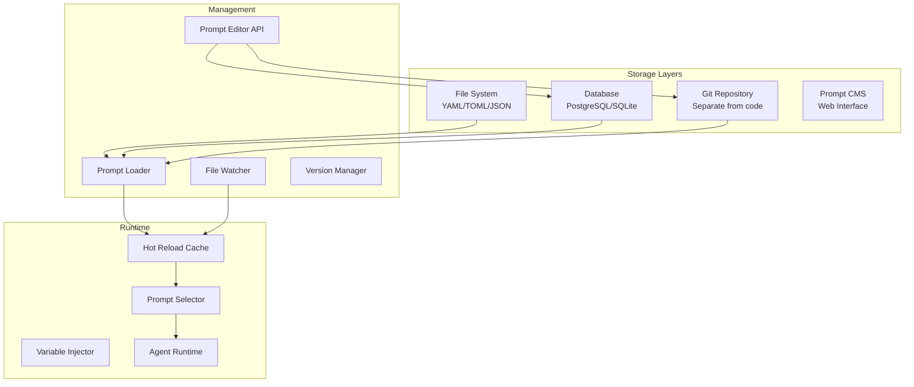

# Prompt Externalization Strategy

## Purpose
This document defines how Patinox externalizes prompts from source code, enabling runtime modification, versioning, collaborative editing, and automated improvement without code changes or redeployment.

## Classification
- **Domain:** Technical Architecture
- **Stability:** Semi-stable
- **Abstraction:** Structural
- **Confidence:** Established

## Content

### The Problem with Hard-Coded Prompts

Most agent frameworks suffer from prompt management anti-patterns:
- Prompts buried in source code as string literals
- Requires code changes and redeployment for prompt updates
- No version control separate from code versioning
- Cannot be modified by non-developers
- Cannot be improved by AI agents themselves
- No A/B testing without code branches
- No runtime prompt switching based on context

### Externalization Architecture



### File-Based Prompt Storage

```rust
/// File-based prompt repository
pub struct FilePromptRepository {
    /// Base directory for prompts
    base_dir: PathBuf,
    /// File watcher for hot reload
    watcher: FileWatcher,
    /// Format parser
    parser: PromptFileParser,
    /// Schema validator
    validator: SchemaValidator,
}

impl FilePromptRepository {
    /// Load prompts from directory structure
    pub async fn load_prompts(&self) -> Result<PromptCollection> {
        // Directory structure:
        // prompts/
        // ├── agents/
        // │   ├── researcher/
        // │   │   ├── main.yaml
        // │   │   ├── variants/
        // │   │   │   ├── v1.yaml
        // │   │   │   └── v2.yaml
        // │   │   └── metadata.toml
        // │   └── coder/
        // │       ├── main.yaml
        // │       └── tasks/
        // │           ├── debug.yaml
        // │           └── refactor.yaml
        // └── shared/
        //     ├── instructions.yaml
        //     └── examples.yaml
        
        let mut collection = PromptCollection::new();
        
        for entry in WalkDir::new(&self.base_dir) {
            let entry = entry?;
            if self.is_prompt_file(&entry) {
                let prompt = self.load_prompt_file(entry.path()).await?;
                collection.add(prompt);
            }
        }
        
        Ok(collection)
    }
    
    /// Load single prompt file
    async fn load_prompt_file(&self, path: &Path) -> Result<ExternalPrompt> {
        let content = tokio::fs::read_to_string(path).await?;
        
        let prompt = match path.extension().and_then(|s| s.to_str()) {
            Some("yaml") | Some("yml") => self.parser.parse_yaml(&content)?,
            Some("toml") => self.parser.parse_toml(&content)?,
            Some("json") => self.parser.parse_json(&content)?,
            Some("md") => self.parser.parse_markdown(&content)?,
            _ => return Err(Error::UnsupportedFormat),
        };
        
        // Validate against schema
        self.validator.validate(&prompt)?;
        
        Ok(prompt)
    }
    
    /// Watch for file changes and hot reload
    pub async fn watch_for_changes(&self) -> Result<()> {
        let (tx, mut rx) = mpsc::channel(100);
        
        self.watcher.watch(&self.base_dir, tx)?;
        
        while let Some(event) = rx.recv().await {
            match event {
                FileEvent::Modified(path) => {
                    tracing::info!("Prompt file modified: {:?}", path);
                    self.reload_prompt(&path).await?;
                }
                FileEvent::Created(path) => {
                    tracing::info!("New prompt file: {:?}", path);
                    self.load_new_prompt(&path).await?;
                }
                FileEvent::Deleted(path) => {
                    tracing::info!("Prompt file deleted: {:?}", path);
                    self.remove_prompt(&path).await?;
                }
            }
        }
        
        Ok(())
    }
}

/// Example prompt file structure (YAML)
/// ```yaml
/// # prompts/agents/researcher/main.yaml
/// id: researcher_main_v1
/// name: "Research Agent Main Prompt"
/// version: "1.0.0"
/// author: "team@example.com"
/// tags: ["research", "analysis", "main"]
/// 
/// metadata:
///   model_compatibility: ["gpt-4", "claude-3"]
///   token_estimate: 500
///   last_tested: "2024-01-15"
///   performance_score: 0.92
/// 
/// variables:
///   topic:
///     type: string
///     required: true
///     description: "Research topic"
///   depth:
///     type: enum
///     values: ["shallow", "medium", "deep"]
///     default: "medium"
///   
/// template: |
///   You are an expert research assistant specializing in {{topic}}.
///   
///   Your task is to conduct {{depth}} research on the given topic.
///   
///   Guidelines:
///   - Be thorough and accurate
///   - Cite sources when possible
///   - Present balanced viewpoints
///   
/// variants:
///   academic:
///     template: "As an academic researcher..."
///   casual:
///     template: "As a helpful research assistant..."
/// ```
```

### Database-Backed Prompt Storage

```rust
/// Database-backed prompt repository
pub struct DatabasePromptRepository {
    /// Database connection pool
    pool: DatabasePool,
    /// Query builder
    queries: PromptQueries,
    /// Change notifier
    notifier: ChangeNotifier,
}

/// Prompt database schema
/// ```sql
/// CREATE TABLE prompts (
///     id UUID PRIMARY KEY,
///     name VARCHAR(255) NOT NULL,
///     version VARCHAR(50) NOT NULL,
///     content TEXT NOT NULL,
///     variables JSONB,
///     metadata JSONB,
///     tags TEXT[],
///     author VARCHAR(255),
///     created_at TIMESTAMP WITH TIME ZONE DEFAULT NOW(),
///     updated_at TIMESTAMP WITH TIME ZONE DEFAULT NOW(),
///     deleted_at TIMESTAMP WITH TIME ZONE,
///     UNIQUE(name, version)
/// );
/// 
/// CREATE TABLE prompt_history (
///     id UUID PRIMARY KEY,
///     prompt_id UUID REFERENCES prompts(id),
///     version VARCHAR(50) NOT NULL,
///     content TEXT NOT NULL,
///     change_summary TEXT,
///     changed_by VARCHAR(255),
///     changed_at TIMESTAMP WITH TIME ZONE DEFAULT NOW(),
///     performance_metrics JSONB
/// );
/// 
/// CREATE TABLE prompt_deployments (
///     id UUID PRIMARY KEY,
///     prompt_id UUID REFERENCES prompts(id),
///     environment VARCHAR(50) NOT NULL,
///     deployed_at TIMESTAMP WITH TIME ZONE DEFAULT NOW(),
///     deployed_by VARCHAR(255),
///     status VARCHAR(50),
///     rollback_to UUID REFERENCES prompt_history(id)
/// );
/// ```

impl DatabasePromptRepository {
    /// Get prompt with caching
    pub async fn get_prompt(&self, id: &str, version: Option<&str>) -> Result<Prompt> {
        let query = if let Some(v) = version {
            sqlx::query_as!(
                PromptRow,
                "SELECT * FROM prompts WHERE name = $1 AND version = $2 AND deleted_at IS NULL",
                id, v
            )
        } else {
            sqlx::query_as!(
                PromptRow,
                "SELECT * FROM prompts WHERE name = $1 AND deleted_at IS NULL 
                 ORDER BY created_at DESC LIMIT 1",
                id
            )
        };
        
        let row = query.fetch_one(&self.pool).await?;
        Ok(row.into())
    }
    
    /// Update prompt (creates new version)
    pub async fn update_prompt(&self, id: &str, update: PromptUpdate) -> Result<Prompt> {
        let mut tx = self.pool.begin().await?;
        
        // Get current version
        let current = self.get_prompt(id, None).await?;
        
        // Create history entry
        sqlx::query!(
            "INSERT INTO prompt_history (prompt_id, version, content, change_summary, changed_by)
             VALUES ($1, $2, $3, $4, $5)",
            current.id, current.version, current.content, update.change_summary, update.author
        )
        .execute(&mut tx)
        .await?;
        
        // Create new version
        let new_version = self.increment_version(&current.version);
        
        let new_prompt = sqlx::query_as!(
            PromptRow,
            "INSERT INTO prompts (name, version, content, variables, metadata, tags, author)
             VALUES ($1, $2, $3, $4, $5, $6, $7)
             RETURNING *",
            current.name, new_version, update.content, 
            update.variables, update.metadata, update.tags, update.author
        )
        .fetch_one(&mut tx)
        .await?;
        
        tx.commit().await?;
        
        // Notify watchers
        self.notifier.notify_change(&new_prompt.id).await?;
        
        Ok(new_prompt.into())
    }
}
```

### Git-Based Prompt Versioning

```rust
/// Git-backed prompt repository for version control
pub struct GitPromptRepository {
    /// Local repository path
    repo_path: PathBuf,
    /// Git operations handler
    git: GitOperations,
    /// Remote configuration
    remote: RemoteConfig,
    /// Sync strategy
    sync_strategy: SyncStrategy,
}

impl GitPromptRepository {
    /// Initialize or clone prompt repository
    pub async fn initialize(&self) -> Result<()> {
        if !self.repo_path.exists() {
            // Clone from remote
            self.git.clone(&self.remote.url, &self.repo_path).await?;
        } else {
            // Pull latest changes
            self.git.pull(&self.repo_path).await?;
        }
        
        Ok(())
    }
    
    /// Commit prompt changes
    pub async fn commit_prompt_change(
        &self,
        prompt_path: &Path,
        message: &str,
        author: &str,
    ) -> Result<CommitId> {
        // Stage the changed file
        self.git.add(&self.repo_path, prompt_path).await?;
        
        // Commit with message
        let commit_id = self.git.commit(
            &self.repo_path,
            message,
            author,
        ).await?;
        
        // Push if configured
        if self.sync_strategy.auto_push {
            self.git.push(&self.repo_path).await?;
        }
        
        Ok(commit_id)
    }
    
    /// Create pull request for prompt changes
    pub async fn create_prompt_pr(
        &self,
        branch_name: &str,
        title: &str,
        description: &str,
    ) -> Result<PullRequest> {
        // Create feature branch
        self.git.create_branch(&self.repo_path, branch_name).await?;
        
        // Push branch
        self.git.push_branch(&self.repo_path, branch_name).await?;
        
        // Create PR via API
        let pr = self.remote.create_pr(
            branch_name,
            "main",
            title,
            description,
        ).await?;
        
        Ok(pr)
    }
}
```

### Agent Self-Improvement of Prompts

```rust
/// System for agents to improve their own prompts
pub struct PromptSelfImprovement {
    /// Prompt repository
    repository: Box<dyn PromptRepository>,
    /// Performance analyzer
    analyzer: PerformanceAnalyzer,
    /// Improvement generator
    generator: ImprovementGenerator,
    /// Testing framework
    tester: PromptTester,
}

impl PromptSelfImprovement {
    /// Analyze and improve prompts based on performance
    pub async fn improve_prompt(&self, prompt_id: &str) -> Result<PromptImprovement> {
        // Get current prompt and performance data
        let prompt = self.repository.get_prompt(prompt_id).await?;
        let metrics = self.analyzer.get_metrics(prompt_id).await?;
        
        // Identify improvement opportunities
        let opportunities = self.analyzer.identify_improvements(&metrics)?;
        
        if opportunities.is_empty() {
            return Ok(PromptImprovement::NoChangesNeeded);
        }
        
        // Generate improved version
        let improved = self.generator.generate_improvement(
            &prompt,
            &opportunities,
            &metrics,
        ).await?;
        
        // Test improved version
        let test_results = self.tester.test_prompt(&improved).await?;
        
        if test_results.is_better_than(&metrics) {
            // Create new version
            let new_version = self.repository.create_version(
                prompt_id,
                improved,
                "Automated improvement based on performance analysis",
            ).await?;
            
            // Deploy to staging for validation
            self.deploy_to_staging(new_version).await?;
            
            Ok(PromptImprovement::Created(new_version))
        } else {
            Ok(PromptImprovement::NotImproved(test_results))
        }
    }
    
    /// Continuous improvement loop
    pub async fn continuous_improvement_loop(&self) -> Result<()> {
        loop {
            // Get underperforming prompts
            let prompts = self.analyzer.get_underperforming_prompts().await?;
            
            for prompt_id in prompts {
                match self.improve_prompt(&prompt_id).await {
                    Ok(PromptImprovement::Created(version)) => {
                        tracing::info!("Improved prompt {}: new version {}", prompt_id, version);
                    }
                    Ok(PromptImprovement::NoChangesNeeded) => {
                        tracing::debug!("Prompt {} performing well", prompt_id);
                    }
                    Ok(PromptImprovement::NotImproved(_)) => {
                        tracing::debug!("Could not improve prompt {}", prompt_id);
                    }
                    Err(e) => {
                        tracing::error!("Error improving prompt {}: {}", prompt_id, e);
                    }
                }
            }
            
            // Wait before next iteration
            tokio::time::sleep(Duration::from_secs(3600)).await;
        }
    }
}
```

### Prompt CMS and Editor

```rust
/// Web-based prompt content management system
pub struct PromptCMS {
    /// API server
    server: ApiServer,
    /// Authentication
    auth: AuthService,
    /// Editor backend
    editor: PromptEditor,
    /// Preview service
    preview: PreviewService,
}

/// API endpoints for prompt management
impl PromptCMS {
    /// List all prompts with filtering
    pub async fn list_prompts(&self, filter: PromptFilter) -> Result<Vec<PromptSummary>> {
        self.editor.list_prompts(filter).await
    }
    
    /// Edit prompt with live preview
    pub async fn edit_prompt(&self, request: EditRequest) -> Result<EditSession> {
        // Create edit session
        let session = self.editor.create_session(request.prompt_id).await?;
        
        // Start live preview
        self.preview.start_preview(&session).await?;
        
        Ok(session)
    }
    
    /// Test prompt with sample data
    pub async fn test_prompt(&self, prompt_id: &str, test_data: TestData) -> Result<TestResult> {
        let prompt = self.editor.get_prompt(prompt_id).await?;
        self.preview.test_prompt(prompt, test_data).await
    }
    
    /// Deploy prompt to environment
    pub async fn deploy_prompt(
        &self,
        prompt_id: &str,
        environment: Environment,
    ) -> Result<Deployment> {
        // Validate deployment
        self.validate_deployment(prompt_id, &environment).await?;
        
        // Create deployment record
        let deployment = self.editor.deploy(prompt_id, environment).await?;
        
        // Notify affected services
        self.notify_deployment(&deployment).await?;
        
        Ok(deployment)
    }
}
```

### Runtime Prompt Selection

```rust
/// Runtime prompt selector with hot reload
pub struct RuntimePromptSelector {
    /// Prompt cache
    cache: Arc<RwLock<HashMap<String, CachedPrompt>>>,
    /// Selection strategy
    strategy: SelectionStrategy,
    /// Feature flags
    features: FeatureFlags,
    /// A/B test controller
    ab_tests: ABTestController,
}

impl RuntimePromptSelector {
    /// Select appropriate prompt at runtime
    pub async fn select_prompt(&self, context: PromptContext) -> Result<Prompt> {
        // Check for A/B test
        if let Some(test) = self.ab_tests.get_active_test(&context.prompt_id).await? {
            return Ok(test.select_variant(&context.user_id));
        }
        
        // Check feature flags
        if let Some(override_id) = self.features.get_override(&context.prompt_id).await? {
            return self.get_prompt(&override_id).await;
        }
        
        // Apply selection strategy
        match self.strategy {
            SelectionStrategy::Latest => {
                self.get_latest_prompt(&context.prompt_id).await
            }
            SelectionStrategy::Stable => {
                self.get_stable_prompt(&context.prompt_id).await
            }
            SelectionStrategy::Performance => {
                self.get_best_performing_prompt(&context.prompt_id).await
            }
            SelectionStrategy::Contextual => {
                self.select_by_context(&context).await
            }
        }
    }
    
    /// Hot reload prompt without restart
    pub async fn reload_prompt(&self, prompt_id: &str) -> Result<()> {
        let prompt = self.load_from_source(prompt_id).await?;
        
        let mut cache = self.cache.write().await;
        cache.insert(prompt_id.to_string(), CachedPrompt {
            prompt,
            loaded_at: Utc::now(),
            hit_count: 0,
        });
        
        tracing::info!("Hot reloaded prompt: {}", prompt_id);
        
        Ok(())
    }
}
```

### Prompt Deployment Pipeline

```rust
/// Deployment pipeline for prompts
pub struct PromptDeploymentPipeline {
    /// Stages in the pipeline
    stages: Vec<Box<dyn DeploymentStage>>,
    /// Rollback handler
    rollback: RollbackHandler,
    /// Deployment tracker
    tracker: DeploymentTracker,
}

impl PromptDeploymentPipeline {
    /// Deploy prompt through pipeline
    pub async fn deploy(&self, prompt_id: &str, target: Environment) -> Result<Deployment> {
        let mut deployment = Deployment::new(prompt_id, target);
        
        for stage in &self.stages {
            match stage.execute(&mut deployment).await {
                Ok(()) => {
                    deployment.record_stage_success(stage.name());
                }
                Err(e) => {
                    deployment.record_stage_failure(stage.name(), e.clone());
                    
                    // Rollback if needed
                    if stage.should_rollback_on_failure() {
                        self.rollback.rollback(&deployment).await?;
                    }
                    
                    return Err(e);
                }
            }
        }
        
        // Record successful deployment
        self.tracker.record_deployment(&deployment).await?;
        
        Ok(deployment)
    }
}

/// Example deployment stages
pub struct ValidationStage;
pub struct TestingStage;
pub struct CanaryDeploymentStage;
pub struct FullDeploymentStage;
pub struct MonitoringStage;
```

## Benefits of Externalization

1. **No Code Changes**: Modify prompts without touching source code
2. **Hot Reload**: Update prompts without restarting services
3. **Version Control**: Track prompt changes independently
4. **Collaboration**: Non-developers can edit prompts
5. **Self-Improvement**: Agents can optimize their own prompts
6. **A/B Testing**: Test prompt variants in production
7. **Rollback**: Quick reversion to previous versions
8. **Audit Trail**: Complete history of changes
9. **Environment-Specific**: Different prompts per environment
10. **Performance Tracking**: Monitor prompt effectiveness

## Best Practices

1. **Schema Validation**: Validate prompt structure and variables
2. **Testing**: Test prompts before deployment
3. **Gradual Rollout**: Use canary deployments
4. **Monitoring**: Track prompt performance metrics
5. **Backup**: Regular backups of prompt repository
6. **Access Control**: Proper permissions for editing
7. **Documentation**: Document prompt purpose and usage

## Configuration Example

```toml
[prompt_externalization]
# Storage backend
storage = "hybrid"  # file, database, git, hybrid

# File storage
[prompt_externalization.file]
base_directory = "./prompts"
watch_for_changes = true
hot_reload = true

# Database storage
[prompt_externalization.database]
connection_string = "postgresql://localhost/prompts"
cache_ttl = "5m"

# Git storage
[prompt_externalization.git]
repository = "git@github.com:org/prompts.git"
branch = "main"
auto_sync = true
sync_interval = "5m"

# Runtime selection
[prompt_externalization.runtime]
strategy = "contextual"
cache_size = 1000
reload_on_change = true

# Self-improvement
[prompt_externalization.improvement]
enabled = true
min_performance_threshold = 0.7
improvement_interval = "1h"
require_human_approval = true
```

## Relationships
- **Parent Nodes:** [elements/prompt_management_system.md]
- **Child Nodes:** None
- **Related Nodes:** 
  - [elements/agent_templates_library.md] - uses - External prompt templates
  - [elements/configuration_strategy.md] - configures - Prompt settings
  - [elements/monitoring_strategy.md] - monitors - Prompt performance

## Navigation Guidance
- **Access Context:** Reference when implementing prompt externalization
- **Common Next Steps:** Review prompt management system or configuration strategy
- **Related Tasks:** Prompt storage, versioning, deployment
- **Update Patterns:** Update when adding new storage backends

## Metadata
- **Created:** 2025-01-18
- **Last Updated:** 2025-01-18
- **Updated By:** Development Team

## Change History
- 2025-01-18: Initial prompt externalization strategy design