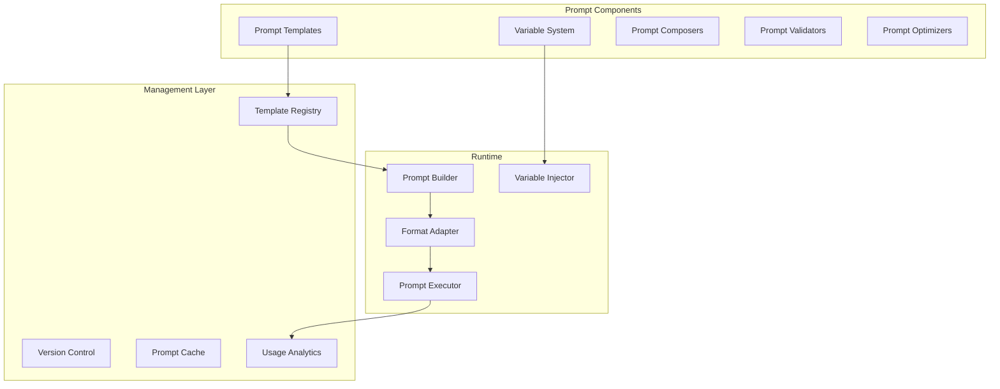

# Prompt Management System

## Purpose
This document defines the comprehensive prompt engineering infrastructure for Patinox, including templating, versioning, composition, optimization, and dynamic prompt generation strategies.

## Classification
- **Domain:** Technical Architecture
- **Stability:** Semi-stable
- **Abstraction:** Structural
- **Confidence:** Evolving

## Content

### Prompt Management Overview

The Patinox prompt management system provides a robust infrastructure for creating, managing, and optimizing prompts across different LLM providers and use cases.



### Core Prompt Traits

```rust
use async_trait::async_trait;

/// Base trait for all prompts
pub trait Prompt: Send + Sync {
    /// Get the prompt content
    fn content(&self) -> &str;
    
    /// Get prompt metadata
    fn metadata(&self) -> &PromptMetadata;
    
    /// Validate the prompt
    fn validate(&self) -> Result<()>;
    
    /// Get required variables
    fn required_variables(&self) -> Vec<Variable>;
    
    /// Get token count estimate
    fn estimate_tokens(&self, model: &ModelId) -> Result<usize>;
}

/// Prompt metadata
#[derive(Clone, Debug)]
pub struct PromptMetadata {
    pub id: PromptId,
    pub name: String,
    pub version: Version,
    pub description: String,
    pub author: String,
    pub tags: Vec<String>,
    pub model_compatibility: Vec<ModelId>,
    pub created_at: DateTime<Utc>,
    pub updated_at: DateTime<Utc>,
    pub usage_stats: UsageStats,
}

/// Variable in a prompt template
#[derive(Clone, Debug)]
pub struct Variable {
    pub name: String,
    pub type_hint: VariableType,
    pub required: bool,
    pub default_value: Option<Value>,
    pub validator: Option<Box<dyn VariableValidator>>,
    pub description: String,
}

#[derive(Clone, Debug)]
pub enum VariableType {
    String,
    Number,
    Boolean,
    Array(Box<VariableType>),
    Object(HashMap<String, VariableType>),
    Any,
}
```

### Prompt Templates

Templates provide reusable prompt structures with variable substitution.

```rust
/// Prompt template with variable substitution
pub struct PromptTemplate {
    /// Template ID
    id: TemplateId,
    /// Raw template content
    template: String,
    /// Template engine
    engine: TemplateEngine,
    /// Variables defined in template
    variables: Vec<Variable>,
    /// Template metadata
    metadata: TemplateMetadata,
    /// Validation rules
    validators: Vec<Box<dyn TemplateValidator>>,
}

/// Template engine for rendering
pub enum TemplateEngine {
    /// Handlebars-style templates
    Handlebars,
    /// Jinja2-style templates
    Jinja2,
    /// Liquid templates
    Liquid,
    /// Custom Rust template engine
    Custom(Box<dyn CustomEngine>),
}

impl PromptTemplate {
    /// Create a new template
    pub fn new(template: impl Into<String>) -> TemplateBuilder {
        TemplateBuilder::new(template.into())
    }
    
    /// Render template with variables
    pub fn render(&self, variables: Variables) -> Result<String> {
        // Validate all required variables are present
        for var in &self.variables {
            if var.required && !variables.contains(&var.name) {
                return Err(Error::MissingVariable(var.name.clone()));
            }
        }
        
        // Validate variable values
        for var in &self.variables {
            if let Some(value) = variables.get(&var.name) {
                if let Some(validator) = &var.validator {
                    validator.validate(value)?;
                }
            }
        }
        
        // Render using appropriate engine
        let rendered = match &self.engine {
            TemplateEngine::Handlebars => self.render_handlebars(variables)?,
            TemplateEngine::Jinja2 => self.render_jinja2(variables)?,
            TemplateEngine::Liquid => self.render_liquid(variables)?,
            TemplateEngine::Custom(engine) => engine.render(&self.template, variables)?,
        };
        
        // Validate rendered output
        for validator in &self.validators {
            validator.validate(&rendered)?;
        }
        
        Ok(rendered)
    }
    
    /// Create a partial application with some variables
    pub fn partial(&self, variables: Variables) -> PartialTemplate {
        PartialTemplate {
            template: self.clone(),
            applied_variables: variables,
        }
    }
}

/// Builder for creating templates
pub struct TemplateBuilder {
    template: String,
    engine: TemplateEngine,
    variables: Vec<Variable>,
    validators: Vec<Box<dyn TemplateValidator>>,
}

impl TemplateBuilder {
    pub fn variable(mut self, var: Variable) -> Self {
        self.variables.push(var);
        self
    }
    
    pub fn required(mut self, name: impl Into<String>, type_hint: VariableType) -> Self {
        self.variables.push(Variable {
            name: name.into(),
            type_hint,
            required: true,
            default_value: None,
            validator: None,
            description: String::new(),
        });
        self
    }
    
    pub fn optional(mut self, name: impl Into<String>, default: Value) -> Self {
        self.variables.push(Variable {
            name: name.into(),
            type_hint: VariableType::Any,
            required: false,
            default_value: Some(default),
            validator: None,
            description: String::new(),
        });
        self
    }
    
    pub fn validator(mut self, validator: impl TemplateValidator + 'static) -> Self {
        self.validators.push(Box::new(validator));
        self
    }
    
    pub fn build(self) -> PromptTemplate {
        PromptTemplate {
            id: TemplateId::generate(),
            template: self.template,
            engine: self.engine,
            variables: self.variables,
            metadata: TemplateMetadata::default(),
            validators: self.validators,
        }
    }
}
```

### Prompt Composition

Compose complex prompts from smaller components.

```rust
/// Prompt composer for building complex prompts
pub struct PromptComposer {
    /// Component registry
    components: HashMap<ComponentId, PromptComponent>,
    /// Composition strategies
    strategies: Vec<Box<dyn CompositionStrategy>>,
    /// Layout engine
    layout_engine: LayoutEngine,
}

/// Component that can be composed into prompts
#[derive(Clone)]
pub struct PromptComponent {
    pub id: ComponentId,
    pub name: String,
    pub content: ComponentContent,
    pub role: ComponentRole,
    pub optional: bool,
    pub order_hint: i32,
}

#[derive(Clone)]
pub enum ComponentContent {
    Static(String),
    Template(PromptTemplate),
    Dynamic(Box<dyn DynamicComponent>),
}

#[derive(Clone, Debug)]
pub enum ComponentRole {
    SystemMessage,
    Context,
    Instructions,
    Examples,
    Input,
    Output,
    Constraints,
    Custom(String),
}

impl PromptComposer {
    /// Compose a prompt from components
    pub fn compose(&self, spec: CompositionSpec) -> Result<ComposedPrompt> {
        let mut components = Vec::new();
        
        // Collect required components
        for component_id in &spec.components {
            let component = self.components.get(component_id)
                .ok_or(Error::ComponentNotFound(component_id.clone()))?;
            components.push(component.clone());
        }
        
        // Apply composition strategy
        let strategy = self.select_strategy(&spec)?;
        let arranged = strategy.arrange(components, &spec)?;
        
        // Layout components
        let layout = self.layout_engine.layout(arranged, spec.format)?;
        
        Ok(ComposedPrompt {
            content: layout.render()?,
            components: layout.component_map(),
            metadata: self.generate_metadata(&spec),
        })
    }
    
    /// Create a chat-style prompt
    pub fn compose_chat(&self, messages: Vec<ChatMessage>) -> Result<ComposedPrompt> {
        let spec = CompositionSpec {
            components: messages.iter()
                .map(|m| m.component_id.clone())
                .collect(),
            format: PromptFormat::Chat,
            strategy: CompositionStrategy::Sequential,
            variables: Variables::new(),
        };
        
        self.compose(spec)
    }
    
    /// Create a few-shot prompt
    pub fn compose_few_shot(
        &self,
        instruction: ComponentId,
        examples: Vec<Example>,
        query: ComponentId,
    ) -> Result<ComposedPrompt> {
        let mut components = vec![instruction];
        
        for example in examples {
            components.push(example.input_component);
            components.push(example.output_component);
        }
        
        components.push(query);
        
        let spec = CompositionSpec {
            components,
            format: PromptFormat::FewShot,
            strategy: CompositionStrategy::FewShot,
            variables: Variables::new(),
        };
        
        self.compose(spec)
    }
}

/// Layout engine for formatting composed prompts
pub struct LayoutEngine {
    formatters: HashMap<PromptFormat, Box<dyn PromptFormatter>>,
}

impl LayoutEngine {
    pub fn layout(
        &self,
        components: Vec<PromptComponent>,
        format: PromptFormat,
    ) -> Result<PromptLayout> {
        let formatter = self.formatters.get(&format)
            .ok_or(Error::UnsupportedFormat(format))?;
        
        formatter.format(components)
    }
}
```

### Prompt Versioning

Version control for prompt templates and compositions.

```rust
/// Versioned prompt registry
pub struct PromptRegistry {
    /// Storage backend
    storage: Box<dyn PromptStorage>,
    /// Version control
    version_control: VersionControl,
    /// Change tracking
    change_tracker: ChangeTracker,
}

/// Version control for prompts
pub struct VersionControl {
    /// Version history
    history: HashMap<PromptId, VersionHistory>,
    /// Branching support
    branches: HashMap<BranchId, Branch>,
    /// Merge strategies
    merge_strategies: HashMap<MergeStrategy, Box<dyn MergeExecutor>>,
}

/// Version history for a prompt
#[derive(Clone)]
pub struct VersionHistory {
    pub prompt_id: PromptId,
    pub versions: BTreeMap<Version, VersionedPrompt>,
    pub current_version: Version,
    pub tags: HashMap<String, Version>,
}

/// Versioned prompt
#[derive(Clone)]
pub struct VersionedPrompt {
    pub version: Version,
    pub content: String,
    pub metadata: PromptMetadata,
    pub parent_version: Option<Version>,
    pub change_log: ChangeLog,
    pub performance_metrics: PerformanceMetrics,
}

impl PromptRegistry {
    /// Register a new prompt
    pub async fn register(&self, prompt: PromptTemplate) -> Result<PromptId> {
        let id = prompt.id.clone();
        
        // Create initial version
        let version = Version::new(1, 0, 0);
        let versioned = VersionedPrompt {
            version: version.clone(),
            content: prompt.template.clone(),
            metadata: prompt.metadata.clone(),
            parent_version: None,
            change_log: ChangeLog::initial(),
            performance_metrics: PerformanceMetrics::new(),
        };
        
        // Store in backend
        self.storage.store(id.clone(), versioned.clone()).await?;
        
        // Initialize version history
        let mut history = VersionHistory {
            prompt_id: id.clone(),
            versions: BTreeMap::new(),
            current_version: version.clone(),
            tags: HashMap::new(),
        };
        history.versions.insert(version, versioned);
        
        self.version_control.history.insert(id.clone(), history);
        
        Ok(id)
    }
    
    /// Update a prompt (creates new version)
    pub async fn update(&self, id: PromptId, changes: PromptChanges) -> Result<Version> {
        let history = self.version_control.history.get(&id)
            .ok_or(Error::PromptNotFound(id.clone()))?;
        
        let current = history.versions.get(&history.current_version)
            .ok_or(Error::VersionNotFound(history.current_version.clone()))?;
        
        // Create new version
        let new_version = history.current_version.increment_minor();
        
        let versioned = VersionedPrompt {
            version: new_version.clone(),
            content: changes.apply_to(&current.content)?,
            metadata: changes.update_metadata(current.metadata.clone()),
            parent_version: Some(history.current_version.clone()),
            change_log: changes.into_changelog(),
            performance_metrics: PerformanceMetrics::new(),
        };
        
        // Store new version
        self.storage.store(id.clone(), versioned.clone()).await?;
        
        // Update history
        self.version_control.update_history(id, new_version.clone(), versioned)?;
        
        // Track changes
        self.change_tracker.track(id, new_version.clone(), changes).await?;
        
        Ok(new_version)
    }
    
    /// Get specific version of prompt
    pub async fn get_version(&self, id: PromptId, version: Version) -> Result<VersionedPrompt> {
        self.storage.get_version(id, version).await
    }
    
    /// Compare two versions
    pub async fn compare(
        &self,
        id: PromptId,
        version1: Version,
        version2: Version,
    ) -> Result<PromptDiff> {
        let v1 = self.get_version(id.clone(), version1).await?;
        let v2 = self.get_version(id, version2).await?;
        
        Ok(PromptDiff::compute(v1, v2))
    }
}
```

### Prompt Optimization

Optimize prompts for better performance and efficiency.

```rust
/// Prompt optimizer
pub struct PromptOptimizer {
    /// Optimization strategies
    strategies: Vec<Box<dyn OptimizationStrategy>>,
    /// Performance evaluator
    evaluator: PerformanceEvaluator,
    /// A/B testing framework
    ab_tester: ABTester,
    /// Token optimizer
    token_optimizer: TokenOptimizer,
}

#[async_trait]
pub trait OptimizationStrategy: Send + Sync {
    /// Optimize a prompt
    async fn optimize(&self, prompt: &str, context: OptimizationContext) -> Result<String>;
    
    /// Estimate improvement
    async fn estimate_improvement(&self, prompt: &str) -> f32;
}

/// Token optimization for cost reduction
pub struct TokenOptimizer {
    /// Compression techniques
    compressors: Vec<Box<dyn TokenCompressor>>,
    /// Token counter
    counter: TokenCounter,
    /// Model-specific limits
    model_limits: HashMap<ModelId, TokenLimit>,
}

impl TokenOptimizer {
    /// Optimize token usage
    pub async fn optimize(&self, prompt: &str, model: &ModelId) -> Result<OptimizedPrompt> {
        let original_tokens = self.counter.count(prompt, model)?;
        let limit = self.model_limits.get(model)
            .ok_or(Error::UnknownModel(model.clone()))?;
        
        if original_tokens <= limit.optimal {
            return Ok(OptimizedPrompt {
                content: prompt.to_string(),
                original_tokens,
                optimized_tokens: original_tokens,
                compression_ratio: 1.0,
            });
        }
        
        // Apply compression techniques
        let mut best_result = prompt.to_string();
        let mut best_tokens = original_tokens;
        
        for compressor in &self.compressors {
            let compressed = compressor.compress(prompt).await?;
            let tokens = self.counter.count(&compressed, model)?;
            
            if tokens < best_tokens && self.preserves_meaning(&compressed, prompt).await? {
                best_result = compressed;
                best_tokens = tokens;
            }
            
            if best_tokens <= limit.optimal {
                break;
            }
        }
        
        Ok(OptimizedPrompt {
            content: best_result,
            original_tokens,
            optimized_tokens: best_tokens,
            compression_ratio: best_tokens as f32 / original_tokens as f32,
        })
    }
    
    /// Remove redundant content
    pub async fn remove_redundancy(&self, prompt: &str) -> Result<String> {
        // Identify repeated information
        let sections = self.parse_sections(prompt)?;
        let mut unique_sections = Vec::new();
        let mut seen_content = HashSet::new();
        
        for section in sections {
            let hash = self.semantic_hash(&section)?;
            if seen_content.insert(hash) {
                unique_sections.push(section);
            }
        }
        
        Ok(unique_sections.join("\n\n"))
    }
}

/// A/B testing for prompt variations
pub struct ABTester {
    /// Test configurations
    tests: HashMap<TestId, ABTest>,
    /// Result collector
    collector: ResultCollector,
    /// Statistical analyzer
    analyzer: StatisticalAnalyzer,
}

impl ABTester {
    /// Create a new A/B test
    pub async fn create_test(&self, config: ABTestConfig) -> Result<TestId> {
        let test = ABTest {
            id: TestId::generate(),
            name: config.name,
            variants: config.variants,
            metrics: config.metrics,
            sample_size: config.sample_size,
            confidence_level: config.confidence_level,
            status: TestStatus::Running,
            results: TestResults::new(),
        };
        
        let id = test.id.clone();
        self.tests.insert(id.clone(), test);
        
        Ok(id)
    }
    
    /// Select variant for execution
    pub async fn select_variant(&self, test_id: TestId) -> Result<PromptVariant> {
        let test = self.tests.get(&test_id)
            .ok_or(Error::TestNotFound(test_id))?;
        
        // Use epsilon-greedy or Thompson sampling
        test.select_variant()
    }
    
    /// Record test result
    pub async fn record_result(&self, test_id: TestId, variant_id: VariantId, result: ExecutionResult) -> Result<()> {
        self.collector.record(test_id, variant_id, result).await?;
        
        // Check if test is complete
        if self.should_conclude_test(test_id).await? {
            self.conclude_test(test_id).await?;
        }
        
        Ok(())
    }
    
    /// Analyze test results
    pub async fn analyze_test(&self, test_id: TestId) -> Result<TestAnalysis> {
        let test = self.tests.get(&test_id)
            .ok_or(Error::TestNotFound(test_id))?;
        
        let results = self.collector.get_results(test_id).await?;
        
        self.analyzer.analyze(test, results).await
    }
}
```

### Dynamic Prompt Generation

Generate prompts dynamically based on context and requirements.

```rust
/// Dynamic prompt generator
pub struct DynamicPromptGenerator {
    /// LLM for meta-prompting
    llm: Box<dyn LLMProvider>,
    /// Template library
    templates: TemplateLibrary,
    /// Context analyzer
    context_analyzer: ContextAnalyzer,
    /// Prompt synthesizer
    synthesizer: PromptSynthesizer,
}

impl DynamicPromptGenerator {
    /// Generate prompt from requirements
    pub async fn generate_from_requirements(
        &self,
        requirements: PromptRequirements,
    ) -> Result<GeneratedPrompt> {
        // Analyze requirements
        let analysis = self.context_analyzer.analyze(&requirements).await?;
        
        // Select base template
        let template = self.templates.select_best_match(&analysis)?;
        
        // Generate customizations
        let customizations = self.generate_customizations(&requirements, &template).await?;
        
        // Synthesize final prompt
        let prompt = self.synthesizer.synthesize(template, customizations).await?;
        
        Ok(GeneratedPrompt {
            content: prompt,
            metadata: self.generate_metadata(&requirements),
            confidence: analysis.confidence,
        })
    }
    
    /// Meta-prompting: use LLM to generate prompts
    pub async fn meta_prompt(&self, task_description: &str) -> Result<String> {
        let meta_prompt = r#"
        You are an expert prompt engineer. Generate an effective prompt for the following task:
        
        Task: {task_description}
        
        Requirements:
        - Clear and specific instructions
        - Appropriate examples if needed
        - Output format specification
        - Edge case handling
        
        Generated prompt:
        "#;
        
        let response = self.llm.complete(
            &meta_prompt.replace("{task_description}", task_description)
        ).await?;
        
        self.validate_generated_prompt(&response)?;
        
        Ok(response)
    }
    
    /// Adapt prompt to specific model
    pub async fn adapt_to_model(
        &self,
        prompt: &str,
        source_model: &ModelId,
        target_model: &ModelId,
    ) -> Result<String> {
        if source_model == target_model {
            return Ok(prompt.to_string());
        }
        
        let adapter = self.get_adapter(source_model, target_model)?;
        adapter.adapt(prompt).await
    }
}

/// Prompt synthesizer for combining elements
pub struct PromptSynthesizer {
    /// Synthesis strategies
    strategies: Vec<Box<dyn SynthesisStrategy>>,
    /// Quality checker
    quality_checker: QualityChecker,
}

impl PromptSynthesizer {
    pub async fn synthesize(
        &self,
        template: PromptTemplate,
        customizations: Customizations,
    ) -> Result<String> {
        // Apply customizations to template
        let mut prompt = template.render(customizations.variables)?;
        
        // Add custom sections
        for section in customizations.sections {
            prompt = self.insert_section(prompt, section)?;
        }
        
        // Apply synthesis strategies
        for strategy in &self.strategies {
            prompt = strategy.apply(prompt).await?;
        }
        
        // Check quality
        self.quality_checker.check(&prompt)?;
        
        Ok(prompt)
    }
}
```

### Prompt Caching

Cache rendered prompts for performance.

```rust
/// Prompt cache for rendered prompts
pub struct PromptCache {
    /// Cache storage
    storage: Arc<RwLock<LruCache<CacheKey, CachedPrompt>>>,
    /// Cache statistics
    stats: CacheStats,
    /// Invalidation strategy
    invalidator: CacheInvalidator,
}

#[derive(Hash, Eq, PartialEq)]
pub struct CacheKey {
    template_id: TemplateId,
    variables_hash: u64,
    model_id: ModelId,
}

#[derive(Clone)]
pub struct CachedPrompt {
    content: String,
    metadata: PromptMetadata,
    cached_at: DateTime<Utc>,
    hit_count: AtomicU64,
    token_count: usize,
}

impl PromptCache {
    /// Get or compute prompt
    pub async fn get_or_compute<F, Fut>(
        &self,
        key: CacheKey,
        compute: F,
    ) -> Result<String>
    where
        F: FnOnce() -> Fut,
        Fut: Future<Output = Result<String>>,
    {
        // Try to get from cache
        {
            let cache = self.storage.read().await;
            if let Some(cached) = cache.get(&key) {
                cached.hit_count.fetch_add(1, Ordering::Relaxed);
                self.stats.record_hit();
                return Ok(cached.content.clone());
            }
        }
        
        self.stats.record_miss();
        
        // Compute if not in cache
        let content = compute().await?;
        
        // Store in cache
        {
            let mut cache = self.storage.write().await;
            cache.put(
                key,
                CachedPrompt {
                    content: content.clone(),
                    metadata: PromptMetadata::default(),
                    cached_at: Utc::now(),
                    hit_count: AtomicU64::new(0),
                    token_count: 0, // Will be computed asynchronously
                },
            );
        }
        
        Ok(content)
    }
    
    /// Invalidate cache entries
    pub async fn invalidate(&self, pattern: InvalidationPattern) -> Result<usize> {
        self.invalidator.invalidate(&self.storage, pattern).await
    }
}
```

### Prompt Analytics

Track and analyze prompt usage and performance.

```rust
/// Prompt analytics system
pub struct PromptAnalytics {
    /// Metrics collector
    metrics: MetricsCollector,
    /// Usage tracker
    usage_tracker: UsageTracker,
    /// Performance analyzer
    performance_analyzer: PerformanceAnalyzer,
    /// Cost calculator
    cost_calculator: CostCalculator,
}

impl PromptAnalytics {
    /// Record prompt execution
    pub async fn record_execution(&self, execution: PromptExecution) -> Result<()> {
        // Track usage
        self.usage_tracker.track(&execution).await?;
        
        // Record metrics
        self.metrics.record("prompt.executions", 1.0);
        self.metrics.record("prompt.tokens", execution.token_count as f64);
        self.metrics.record("prompt.latency_ms", execution.latency.as_millis() as f64);
        
        // Calculate cost
        let cost = self.cost_calculator.calculate(&execution)?;
        self.metrics.record("prompt.cost_usd", cost);
        
        // Analyze performance
        if execution.latency > Duration::from_secs(5) {
            self.performance_analyzer.analyze_slow_execution(&execution).await?;
        }
        
        Ok(())
    }
    
    /// Get prompt performance report
    pub async fn performance_report(&self, prompt_id: PromptId) -> Result<PerformanceReport> {
        let usage = self.usage_tracker.get_usage(prompt_id.clone()).await?;
        let metrics = self.metrics.get_metrics(prompt_id.clone()).await?;
        let analysis = self.performance_analyzer.analyze(prompt_id).await?;
        
        Ok(PerformanceReport {
            prompt_id,
            total_executions: usage.total_executions,
            avg_latency: metrics.avg_latency,
            p95_latency: metrics.p95_latency,
            total_tokens: usage.total_tokens,
            total_cost: usage.total_cost,
            success_rate: metrics.success_rate,
            recommendations: analysis.recommendations,
        })
    }
}
```

### Integration Example

```rust
/// Example of using the prompt management system
pub async fn example_usage() -> Result<()> {
    // Create a prompt template
    let template = PromptTemplate::new("Analyze the following {{category}}: {{input}}")
        .required("category", VariableType::String)
        .required("input", VariableType::String)
        .validator(MaxTokensValidator::new(1000))
        .build();
    
    // Register in registry
    let registry = PromptRegistry::new();
    let prompt_id = registry.register(template).await?;
    
    // Render with variables
    let variables = variables!{
        "category" => "code",
        "input" => "fn main() { println!(\"Hello\"); }"
    };
    
    let rendered = registry.render(prompt_id, variables).await?;
    
    // Optimize for token usage
    let optimizer = PromptOptimizer::new();
    let optimized = optimizer.optimize(&rendered, &ModelId::GPT4).await?;
    
    // Track execution
    let analytics = PromptAnalytics::new();
    analytics.record_execution(PromptExecution {
        prompt_id,
        content: optimized.content,
        token_count: optimized.optimized_tokens,
        latency: Duration::from_millis(250),
        success: true,
    }).await?;
    
    Ok(())
}
```

## Best Practices

1. **Version Control**: Always version prompts for rollback capability
2. **Testing**: A/B test prompt variations before production
3. **Caching**: Cache rendered prompts to reduce computation
4. **Monitoring**: Track prompt performance and costs
5. **Optimization**: Regularly optimize for token usage
6. **Documentation**: Document prompt purpose and variables
7. **Validation**: Validate prompts before execution

## Configuration Example

```toml
[prompt_management]
# Template engine configuration
default_engine = "handlebars"
max_template_size = 10000

# Caching configuration
[prompt_management.cache]
enabled = true
max_size = 1000
ttl = "1h"

# Optimization configuration
[prompt_management.optimization]
auto_optimize = true
token_limit_buffer = 0.9
compression_threshold = 0.8

# A/B testing configuration
[prompt_management.ab_testing]
enabled = true
min_sample_size = 100
confidence_level = 0.95

# Analytics configuration
[prompt_management.analytics]
track_usage = true
track_costs = true
retention_days = 90
```

## Relationships
- **Parent Nodes:** [elements/architecture_overview.md]
- **Child Nodes:** None
- **Related Nodes:** 
  - [elements/memory_architecture.md] - uses - Prompts with memory context
  - [elements/model_provider_abstraction.md] - adapts - Prompts for different models
  - [elements/caching_strategy.md] - caches - Rendered prompts
  - [elements/configuration_strategy.md] - configures - Prompt settings

## Navigation Guidance
- **Access Context:** Reference when implementing prompt engineering features
- **Common Next Steps:** Review session management or caching strategy
- **Related Tasks:** Prompt creation, optimization, versioning
- **Update Patterns:** Update when adding new prompt features or optimizations

## Metadata
- **Created:** 2025-01-18
- **Last Updated:** 2025-01-18
- **Updated By:** Development Team

## Change History
- 2025-01-18: Initial prompt management system design