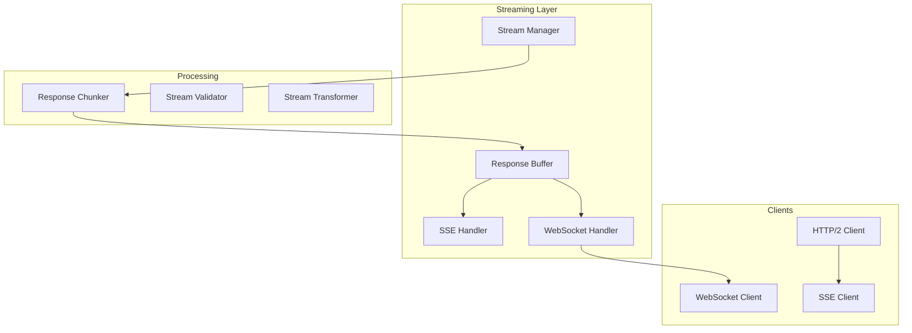

# Streaming and Real-time Architecture

## Purpose
This document defines the real-time capabilities for Patinox, including streaming responses, Server-Sent Events (SSE), WebSocket communication, and incremental response handling.

## Classification
- **Domain:** Technical Architecture
- **Stability:** Semi-stable
- **Abstraction:** Structural
- **Confidence:** Evolving

## Content

### Streaming Architecture Overview



### Core Streaming Types

```rust
use async_trait::async_trait;
use tokio::sync::mpsc;
use futures::stream::Stream;

/// Stream manager for handling real-time data
pub struct StreamManager {
    /// Active streams
    streams: Arc<RwLock<HashMap<StreamId, ActiveStream>>>,
    /// Buffer configuration
    buffer_config: BufferConfig,
    /// Backpressure handler
    backpressure: BackpressureHandler,
}

/// Active stream instance
pub struct ActiveStream {
    pub id: StreamId,
    pub stream_type: StreamType,
    pub sender: mpsc::Sender<StreamChunk>,
    pub receiver: mpsc::Receiver<StreamChunk>,
    pub metadata: StreamMetadata,
    pub state: StreamState,
}

#[derive(Clone, Debug)]
pub enum StreamType {
    SSE,
    WebSocket,
    HTTP2,
    GRPC,
}

/// Stream chunk for incremental responses
#[derive(Clone, Debug)]
pub struct StreamChunk {
    pub id: ChunkId,
    pub sequence: u64,
    pub data: ChunkData,
    pub timestamp: DateTime<Utc>,
    pub is_final: bool,
}

#[derive(Clone, Debug)]
pub enum ChunkData {
    Text(String),
    Json(Value),
    Binary(Vec<u8>),
    Error(StreamError),
}
```

### Server-Sent Events (SSE)

```rust
/// SSE handler for server-sent events
pub struct SSEHandler {
    /// Event broadcaster
    broadcaster: EventBroadcaster,
    /// Connection manager
    connections: ConnectionManager,
    /// Event formatter
    formatter: SSEFormatter,
}

impl SSEHandler {
    /// Create SSE stream for client
    pub async fn create_stream(&self, request: SSERequest) -> Result<impl Stream<Item = Event>> {
        let (tx, rx) = mpsc::channel(100);
        
        let connection = Connection {
            id: ConnectionId::generate(),
            sender: tx,
            metadata: request.metadata,
            created_at: Utc::now(),
        };
        
        self.connections.add(connection).await?;
        
        Ok(ReceiverStream::new(rx))
    }
    
    /// Send event to specific client
    pub async fn send_event(&self, connection_id: ConnectionId, event: Event) -> Result<()> {
        let connection = self.connections.get(connection_id).await?;
        
        let formatted = self.formatter.format(event)?;
        connection.sender.send(formatted).await?;
        
        Ok(())
    }
    
    /// Broadcast event to all clients
    pub async fn broadcast(&self, event: Event) -> Result<()> {
        self.broadcaster.broadcast(event).await
    }
}

/// SSE event formatter
pub struct SSEFormatter {
    pub retry_interval: Duration,
}

impl SSEFormatter {
    pub fn format(&self, event: Event) -> Result<String> {
        let mut output = String::new();
        
        if let Some(id) = &event.id {
            output.push_str(&format!("id: {}\n", id));
        }
        
        if let Some(event_type) = &event.event_type {
            output.push_str(&format!("event: {}\n", event_type));
        }
        
        output.push_str(&format!("data: {}\n", event.data));
        output.push_str(&format!("retry: {}\n\n", self.retry_interval.as_millis()));
        
        Ok(output)
    }
}
```

### WebSocket Streaming

```rust
/// WebSocket streaming handler
pub struct WebSocketHandler {
    /// Active connections
    connections: Arc<RwLock<HashMap<ConnectionId, WebSocketConnection>>>,
    /// Message router
    router: MessageRouter,
    /// Protocol handler
    protocol: ProtocolHandler,
}

/// WebSocket connection
pub struct WebSocketConnection {
    pub id: ConnectionId,
    pub socket: WebSocketStream,
    pub state: ConnectionState,
    pub metadata: ConnectionMetadata,
}

impl WebSocketHandler {
    /// Handle new WebSocket connection
    pub async fn handle_connection(&self, socket: WebSocketStream) -> Result<()> {
        let connection = WebSocketConnection {
            id: ConnectionId::generate(),
            socket: socket.clone(),
            state: ConnectionState::Connected,
            metadata: ConnectionMetadata::new(),
        };
        
        self.connections.write().await.insert(connection.id.clone(), connection);
        
        // Handle messages
        while let Some(message) = socket.next().await {
            match message {
                Ok(msg) => self.handle_message(connection.id.clone(), msg).await?,
                Err(e) => {
                    self.handle_error(connection.id.clone(), e).await?;
                    break;
                }
            }
        }
        
        self.connections.write().await.remove(&connection.id);
        
        Ok(())
    }
    
    /// Stream response to client
    pub async fn stream_response(
        &self,
        connection_id: ConnectionId,
        response_stream: impl Stream<Item = String>,
    ) -> Result<()> {
        let connection = self.connections.read().await
            .get(&connection_id)
            .cloned()
            .ok_or(Error::ConnectionNotFound)?;
        
        tokio::pin!(response_stream);
        
        while let Some(chunk) = response_stream.next().await {
            let message = Message::text(chunk);
            connection.socket.send(message).await?;
        }
        
        Ok(())
    }
}
```

### Incremental Response Handling

```rust
/// Handler for incremental LLM responses
pub struct IncrementalResponseHandler {
    /// Response assembler
    assembler: ResponseAssembler,
    /// Token processor
    token_processor: TokenProcessor,
    /// Stream validator
    validator: StreamValidator,
}

impl IncrementalResponseHandler {
    /// Process streaming LLM response
    pub async fn process_stream<S>(&self, stream: S) -> Result<ProcessedStream>
    where
        S: Stream<Item = Result<String>> + Send,
    {
        let (tx, rx) = mpsc::channel(100);
        
        let handler = self.clone();
        tokio::spawn(async move {
            tokio::pin!(stream);
            
            let mut buffer = String::new();
            let mut sequence = 0u64;
            
            while let Some(result) = stream.next().await {
                match result {
                    Ok(chunk) => {
                        // Process token
                        let processed = handler.token_processor.process(&chunk).await;
                        
                        // Validate chunk
                        if let Err(e) = handler.validator.validate(&processed) {
                            let _ = tx.send(StreamChunk {
                                id: ChunkId::generate(),
                                sequence,
                                data: ChunkData::Error(e.into()),
                                timestamp: Utc::now(),
                                is_final: true,
                            }).await;
                            break;
                        }
                        
                        // Assemble response
                        buffer.push_str(&processed);
                        
                        // Send chunk
                        let _ = tx.send(StreamChunk {
                            id: ChunkId::generate(),
                            sequence,
                            data: ChunkData::Text(processed),
                            timestamp: Utc::now(),
                            is_final: false,
                        }).await;
                        
                        sequence += 1;
                    }
                    Err(e) => {
                        let _ = tx.send(StreamChunk {
                            id: ChunkId::generate(),
                            sequence,
                            data: ChunkData::Error(e.into()),
                            timestamp: Utc::now(),
                            is_final: true,
                        }).await;
                        break;
                    }
                }
            }
            
            // Send final assembled response
            let final_response = handler.assembler.finalize(buffer).await;
            let _ = tx.send(StreamChunk {
                id: ChunkId::generate(),
                sequence,
                data: ChunkData::Text(final_response),
                timestamp: Utc::now(),
                is_final: true,
            }).await;
        });
        
        Ok(ProcessedStream { receiver: rx })
    }
}
```

### Response Buffering

```rust
/// Response buffer for managing stream data
pub struct ResponseBuffer {
    /// Buffer storage
    buffer: VecDeque<StreamChunk>,
    /// Maximum buffer size
    max_size: usize,
    /// Overflow strategy
    overflow_strategy: OverflowStrategy,
}

impl ResponseBuffer {
    /// Add chunk to buffer
    pub fn push(&mut self, chunk: StreamChunk) -> Result<()> {
        if self.buffer.len() >= self.max_size {
            match self.overflow_strategy {
                OverflowStrategy::DropOldest => {
                    self.buffer.pop_front();
                }
                OverflowStrategy::DropNewest => {
                    return Ok(());
                }
                OverflowStrategy::Block => {
                    return Err(Error::BufferFull);
                }
            }
        }
        
        self.buffer.push_back(chunk);
        Ok(())
    }
    
    /// Get buffered content
    pub fn get_content(&self) -> String {
        self.buffer.iter()
            .filter_map(|chunk| match &chunk.data {
                ChunkData::Text(text) => Some(text.clone()),
                _ => None,
            })
            .collect::<Vec<_>>()
            .join("")
    }
}
```

### Backpressure Handling

```rust
/// Backpressure handler for stream control
pub struct BackpressureHandler {
    /// Pressure threshold
    threshold: usize,
    /// Current pressure
    pressure: AtomicUsize,
    /// Strategy
    strategy: BackpressureStrategy,
}

impl BackpressureHandler {
    /// Check if should apply backpressure
    pub fn should_pause(&self) -> bool {
        self.pressure.load(Ordering::Relaxed) > self.threshold
    }
    
    /// Apply backpressure strategy
    pub async fn apply_backpressure(&self) -> Result<()> {
        match self.strategy {
            BackpressureStrategy::Pause => {
                tokio::time::sleep(Duration::from_millis(100)).await;
            }
            BackpressureStrategy::Drop => {
                // Drop incoming data
            }
            BackpressureStrategy::Buffer => {
                // Buffer with limit
            }
        }
        
        Ok(())
    }
}
```

### Stream Transformers

```rust
/// Transform streams between formats
pub struct StreamTransformer {
    transformers: HashMap<(Format, Format), Box<dyn Transformer>>,
}

impl StreamTransformer {
    /// Transform stream from one format to another
    pub fn transform<S>(
        &self,
        stream: S,
        from: Format,
        to: Format,
    ) -> Result<impl Stream<Item = Result<Vec<u8>>>>
    where
        S: Stream<Item = Result<Vec<u8>>> + Send,
    {
        let transformer = self.transformers
            .get(&(from, to))
            .ok_or(Error::NoTransformer)?;
        
        Ok(stream.map(move |item| {
            item.and_then(|data| transformer.transform(data))
        }))
    }
}
```

## Best Practices

1. **Buffer Management**: Implement appropriate buffering strategies
2. **Backpressure**: Handle backpressure to prevent overwhelming clients
3. **Error Recovery**: Gracefully handle stream errors and disconnections
4. **Resource Limits**: Set limits on concurrent streams and buffer sizes
5. **Heartbeats**: Implement keep-alive mechanisms for long connections
6. **Compression**: Use compression for large stream payloads
7. **Security**: Validate and sanitize streamed data

## Configuration Example

```toml
[streaming]
# Buffer configuration
buffer_size = 1000
overflow_strategy = "drop_oldest"

# SSE configuration
[streaming.sse]
retry_interval = "5s"
max_connections = 10000
heartbeat_interval = "30s"

# WebSocket configuration
[streaming.websocket]
max_frame_size = 65536
compression = true
ping_interval = "30s"

# Backpressure
[streaming.backpressure]
threshold = 100
strategy = "pause"
```

## Relationships
- **Parent Nodes:** [elements/architecture_overview.md]
- **Child Nodes:** None
- **Related Nodes:** 
  - [elements/websocket_hub_architecture.md] - implements - WebSocket infrastructure
  - [elements/session_conversation_management.md] - uses - For real-time sessions
  - [elements/distributed_conversation_coordination.md] - enables - Multi-agent streaming

## Navigation Guidance
- **Access Context:** Reference when implementing real-time features
- **Common Next Steps:** Review WebSocket hub or session management
- **Related Tasks:** Streaming implementation, real-time communication
- **Update Patterns:** Update when adding new streaming protocols

## Metadata
- **Created:** 2025-01-18
- **Last Updated:** 2025-01-18
- **Updated By:** Development Team

## Change History
- 2025-01-18: Initial streaming and real-time architecture design