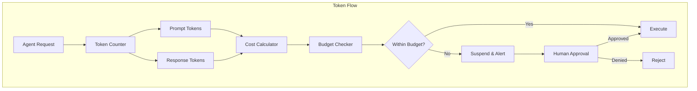

# Token Cost and Budget Management

## Purpose
This document extends the telemetry and rate limiting strategies to provide comprehensive token tracking, real-time cost calculation, budget enforcement, and human-in-the-loop approval for budget overruns.

## Classification
- **Domain:** Technical Architecture
- **Stability:** Proposed
- **Abstraction:** Detailed
- **Confidence:** High (based on production requirements)

## Content

### Core Problem
Agent systems can rapidly consume tokens and incur costs without visibility until after the fact. Teams need:
1. **Real-time visibility** into token usage and costs
2. **Budget enforcement** to prevent runaway spending
3. **Human approval** for operations exceeding budgets
4. **Cost attribution** to understand which operations are expensive

### Token Tracking Architecture



### Comprehensive Token Tracking

```rust
/// Token usage tracker with detailed attribution
pub struct TokenUsageTracker {
    /// Current session tracking
    session: Arc<RwLock<SessionUsage>>,
    /// Historical data store
    history: Box<dyn UsageHistoryStore>,
    /// Real-time cost calculator
    calculator: CostCalculator,
    /// Budget enforcer
    enforcer: BudgetEnforcer,
}

#[derive(Clone, Debug)]
pub struct TokenUsage {
    // Basic metrics
    pub prompt_tokens: u32,
    pub completion_tokens: u32,
    pub total_tokens: u32,
    
    // Attribution
    pub model: ModelIdentifier,
    pub operation: OperationType,
    pub agent_id: AgentId,
    pub user_id: UserId,
    pub session_id: SessionId,
    pub trace_id: TraceId,
    
    // Timing
    pub timestamp: SystemTime,
    pub latency_ms: u64,
    
    // Cost calculation
    pub estimated_cost: Money,
    pub actual_cost: Option<Money>,
    
    // Context
    pub purpose: String,
    pub tags: HashMap<String, String>,
}

impl TokenUsageTracker {
    /// Track token usage before execution
    pub async fn pre_execution_check(
        &self,
        request: &ExecutionRequest,
    ) -> Result<ExecutionPermit> {
        // Estimate tokens from prompt
        let estimated_prompt = self.estimate_tokens(&request.prompt)?;
        let estimated_completion = self.estimate_completion_tokens(request)?;
        let estimated_total = estimated_prompt + estimated_completion;
        
        // Calculate estimated cost
        let estimated_cost = self.calculator.calculate(
            request.model.clone(),
            estimated_prompt,
            estimated_completion,
        )?;
        
        // Check against budget
        let budget_check = self.enforcer.check_budget(
            &request.user_id,
            estimated_cost.clone(),
        ).await?;
        
        match budget_check {
            BudgetStatus::WithinBudget { remaining } => {
                Ok(ExecutionPermit {
                    permit_id: PermitId::generate(),
                    estimated_tokens: estimated_total,
                    estimated_cost,
                    remaining_budget: remaining,
                    expires_at: SystemTime::now() + Duration::from_secs(300),
                })
            }
            BudgetStatus::NearLimit { remaining, percentage } => {
                // Alert but allow
                self.send_budget_warning(&request.user_id, percentage).await?;
                Ok(ExecutionPermit {
                    permit_id: PermitId::generate(),
                    estimated_tokens: estimated_total,
                    estimated_cost,
                    remaining_budget: remaining,
                    expires_at: SystemTime::now() + Duration::from_secs(300),
                })
            }
            BudgetStatus::RequiresApproval { exceeded_by, current_budget } => {
                Err(Error::BudgetExceeded {
                    requested: estimated_cost,
                    available: current_budget,
                    approval_required: true,
                })
            }
            BudgetStatus::HardLimit => {
                Err(Error::BudgetExhausted {
                    message: "Budget completely exhausted, operation blocked".into(),
                })
            }
        }
    }
    
    /// Record actual usage after execution
    pub async fn record_usage(
        &self,
        permit: ExecutionPermit,
        actual: ActualUsage,
    ) -> Result<UsageRecord> {
        let usage = TokenUsage {
            prompt_tokens: actual.prompt_tokens,
            completion_tokens: actual.completion_tokens,
            total_tokens: actual.prompt_tokens + actual.completion_tokens,
            model: actual.model,
            operation: actual.operation,
            agent_id: actual.agent_id,
            user_id: actual.user_id,
            session_id: actual.session_id,
            trace_id: actual.trace_id,
            timestamp: SystemTime::now(),
            latency_ms: actual.latency_ms,
            estimated_cost: permit.estimated_cost,
            actual_cost: Some(self.calculator.calculate(
                actual.model.clone(),
                actual.prompt_tokens,
                actual.completion_tokens,
            )?),
            purpose: actual.purpose,
            tags: actual.tags,
        };
        
        // Update session totals
        {
            let mut session = self.session.write().await;
            session.total_tokens += usage.total_tokens;
            session.total_cost += usage.actual_cost.clone().unwrap();
            session.operations.push(usage.clone());
        }
        
        // Store in history
        self.history.store(usage.clone()).await?;
        
        // Update budget consumption
        self.enforcer.consume_budget(
            &usage.user_id,
            usage.actual_cost.clone().unwrap(),
        ).await?;
        
        Ok(UsageRecord {
            usage,
            session_totals: self.get_session_totals().await?,
        })
    }
}
```

### Budget Enforcement System

```rust
/// Budget enforcement with human-in-the-loop approval
pub struct BudgetEnforcer {
    /// Budget definitions
    budgets: Arc<RwLock<HashMap<UserId, Budget>>>,
    /// Approval queue
    approval_queue: Arc<RwLock<ApprovalQueue>>,
    /// Notification system
    notifier: Box<dyn BudgetNotifier>,
    /// Persistence layer
    store: Box<dyn BudgetStore>,
}

#[derive(Clone, Debug)]
pub struct Budget {
    pub user_id: UserId,
    pub limit_type: BudgetLimitType,
    pub limits: BudgetLimits,
    pub consumption: BudgetConsumption,
    pub approval_settings: ApprovalSettings,
    pub alert_thresholds: Vec<AlertThreshold>,
}

#[derive(Clone, Debug)]
pub enum BudgetLimitType {
    /// Hard limit - block when exceeded
    Hard,
    /// Soft limit - allow with approval
    Soft,
    /// Elastic - auto-scale with notification
    Elastic { max_scale: f64 },
}

#[derive(Clone, Debug)]
pub struct BudgetLimits {
    /// Token limits
    pub daily_tokens: Option<u64>,
    pub monthly_tokens: Option<u64>,
    
    /// Cost limits
    pub daily_cost: Option<Money>,
    pub monthly_cost: Option<Money>,
    pub per_operation_cost: Option<Money>,
    
    /// Concurrency limits
    pub max_concurrent_operations: Option<u32>,
    pub max_agents: Option<u32>,
}

#[derive(Clone, Debug)]
pub struct ApprovalSettings {
    /// Require approval above this threshold
    pub approval_threshold: f64,  // 0.0 to 1.0 (percentage of budget)
    
    /// Who can approve
    pub approvers: Vec<UserId>,
    
    /// Approval timeout
    pub timeout: Duration,
    
    /// Auto-approval rules
    pub auto_approve: AutoApprovalRules,
    
    /// Notification channels
    pub channels: Vec<NotificationChannel>,
}

impl BudgetEnforcer {
    /// Check budget and potentially request approval
    pub async fn check_budget(
        &self,
        user_id: &UserId,
        estimated_cost: Money,
    ) -> Result<BudgetStatus> {
        let budgets = self.budgets.read().await;
        let budget = budgets.get(user_id)
            .ok_or(Error::NoBudgetDefined)?;
        
        let remaining = self.calculate_remaining(budget)?;
        let would_exceed = estimated_cost > remaining;
        
        match (&budget.limit_type, would_exceed) {
            (BudgetLimitType::Hard, true) => {
                Ok(BudgetStatus::HardLimit)
            }
            (BudgetLimitType::Soft, true) => {
                // Create approval request
                let request = self.create_approval_request(
                    user_id.clone(),
                    estimated_cost,
                    remaining,
                ).await?;
                
                Ok(BudgetStatus::RequiresApproval {
                    exceeded_by: estimated_cost - remaining,
                    current_budget: remaining,
                })
            }
            (BudgetLimitType::Elastic { max_scale }, true) => {
                let scaled_limit = remaining * max_scale;
                if estimated_cost <= scaled_limit {
                    // Auto-scale and notify
                    self.auto_scale_budget(budget, estimated_cost).await?;
                    Ok(BudgetStatus::WithinBudget { remaining: scaled_limit - estimated_cost })
                } else {
                    Ok(BudgetStatus::RequiresApproval {
                        exceeded_by: estimated_cost - scaled_limit,
                        current_budget: scaled_limit,
                    })
                }
            }
            (_, false) => {
                // Check warning thresholds
                let usage_percentage = budget.consumption.percentage();
                
                if usage_percentage > 0.8 {
                    Ok(BudgetStatus::NearLimit {
                        remaining,
                        percentage: usage_percentage,
                    })
                } else {
                    Ok(BudgetStatus::WithinBudget { remaining })
                }
            }
        }
    }
    
    /// Create and queue approval request
    async fn create_approval_request(
        &self,
        user_id: UserId,
        requested_cost: Money,
        current_remaining: Money,
    ) -> Result<ApprovalRequest> {
        let request = ApprovalRequest {
            id: ApprovalId::generate(),
            user_id,
            requested_cost,
            current_remaining,
            reason: "Budget limit exceeded".into(),
            created_at: SystemTime::now(),
            expires_at: SystemTime::now() + Duration::from_secs(300),
            status: ApprovalStatus::Pending,
        };
        
        // Add to queue
        {
            let mut queue = self.approval_queue.write().await;
            queue.add(request.clone()).await?;
        }
        
        // Send notifications
        self.notifier.send_approval_request(&request).await?;
        
        Ok(request)
    }
}
```

### Human-in-the-Loop Approval

```rust
/// Human approval system for budget overruns
pub struct ApprovalSystem {
    /// Pending approvals
    pending: Arc<RwLock<HashMap<ApprovalId, PendingApproval>>>,
    /// Approval handlers
    handlers: Vec<Box<dyn ApprovalHandler>>,
    /// Audit log
    audit: Box<dyn AuditLog>,
}

#[derive(Clone, Debug)]
pub struct PendingApproval {
    pub request: ApprovalRequest,
    pub context: ApprovalContext,
    pub suspension_handle: SuspensionHandle,
}

#[derive(Clone, Debug)]
pub struct ApprovalContext {
    /// What operation is being requested
    pub operation: String,
    
    /// Historical usage for context
    pub recent_usage: Vec<TokenUsage>,
    
    /// Estimated impact
    pub estimated_tokens: u32,
    pub estimated_cost: Money,
    pub estimated_duration: Duration,
    
    /// Justification from agent
    pub justification: Option<String>,
    
    /// Alternative options
    pub alternatives: Vec<Alternative>,
}

#[derive(Clone, Debug)]
pub struct Alternative {
    pub description: String,
    pub estimated_cost: Money,
    pub trade_offs: Vec<String>,
}

impl ApprovalSystem {
    /// Suspend operation pending approval
    pub async fn suspend_for_approval(
        &self,
        request: ApprovalRequest,
        context: ApprovalContext,
    ) -> Result<SuspensionHandle> {
        let handle = SuspensionHandle::new();
        
        let pending = PendingApproval {
            request: request.clone(),
            context: context.clone(),
            suspension_handle: handle.clone(),
        };
        
        // Store pending approval
        {
            let mut pending_map = self.pending.write().await;
            pending_map.insert(request.id.clone(), pending);
        }
        
        // Trigger approval flow
        self.trigger_approval_flow(request, context).await?;
        
        Ok(handle)
    }
    
    /// Process approval decision
    pub async fn process_decision(
        &self,
        approval_id: ApprovalId,
        decision: ApprovalDecision,
        approver: UserId,
    ) -> Result<()> {
        let pending = {
            let mut pending_map = self.pending.write().await;
            pending_map.remove(&approval_id)
                .ok_or(Error::ApprovalNotFound)?
        };
        
        // Audit the decision
        self.audit.log_decision(
            &pending.request,
            &decision,
            &approver,
        ).await?;
        
        match decision {
            ApprovalDecision::Approved { new_limit, conditions } => {
                // Update budget if new limit specified
                if let Some(limit) = new_limit {
                    self.update_budget_limit(&pending.request.user_id, limit).await?;
                }
                
                // Resume operation
                pending.suspension_handle.resume(ResumeData::Approved {
                    conditions,
                }).await?;
            }
            ApprovalDecision::Denied { reason } => {
                // Cancel operation
                pending.suspension_handle.resume(ResumeData::Denied {
                    reason,
                }).await?;
            }
            ApprovalDecision::Deferred { until, instructions } => {
                // Re-queue for later
                self.defer_approval(pending, until, instructions).await?;
            }
        }
        
        Ok(())
    }
}
```

### Real-time Cost Dashboard

```rust
/// Real-time dashboard for cost monitoring
pub struct CostDashboard {
    /// Live metrics
    metrics: Arc<RwLock<DashboardMetrics>>,
    /// WebSocket broadcaster
    broadcaster: WebSocketBroadcaster,
    /// Aggregation engine
    aggregator: MetricsAggregator,
}

#[derive(Clone, Debug, Serialize)]
pub struct DashboardMetrics {
    /// Current session
    pub session: SessionMetrics,
    
    /// Real-time rates
    pub rates: RateMetrics,
    
    /// Budget status
    pub budget: BudgetMetrics,
    
    /// Cost breakdown
    pub costs: CostBreakdown,
    
    /// Predictions
    pub predictions: CostPredictions,
}

#[derive(Clone, Debug, Serialize)]
pub struct SessionMetrics {
    pub total_tokens: u64,
    pub total_cost: Money,
    pub operations_count: u32,
    pub average_cost_per_op: Money,
    pub session_duration: Duration,
}

#[derive(Clone, Debug, Serialize)]
pub struct RateMetrics {
    pub tokens_per_minute: f64,
    pub cost_per_minute: Money,
    pub operations_per_minute: f64,
}

#[derive(Clone, Debug, Serialize)]
pub struct CostPredictions {
    pub estimated_hour_cost: Money,
    pub estimated_day_cost: Money,
    pub estimated_month_cost: Money,
    pub budget_exhaustion_time: Option<SystemTime>,
}

impl CostDashboard {
    /// Update metrics in real-time
    pub async fn update(&self, usage: TokenUsage) -> Result<()> {
        let mut metrics = self.metrics.write().await;
        
        // Update session metrics
        metrics.session.total_tokens += usage.total_tokens as u64;
        metrics.session.total_cost += usage.actual_cost.unwrap_or(usage.estimated_cost);
        metrics.session.operations_count += 1;
        
        // Calculate rates
        let elapsed = metrics.session.session_duration.as_secs_f64() / 60.0;
        metrics.rates.tokens_per_minute = metrics.session.total_tokens as f64 / elapsed;
        metrics.rates.cost_per_minute = metrics.session.total_cost.clone() / elapsed;
        
        // Update predictions
        metrics.predictions = self.calculate_predictions(&metrics)?;
        
        // Broadcast update
        self.broadcaster.send(DashboardUpdate {
            metrics: metrics.clone(),
            timestamp: SystemTime::now(),
        }).await?;
        
        Ok(())
    }
    
    /// Generate cost report
    pub async fn generate_report(&self, period: ReportPeriod) -> Result<CostReport> {
        let data = self.aggregator.aggregate(period).await?;
        
        CostReport {
            period,
            total_cost: data.total_cost,
            total_tokens: data.total_tokens,
            by_model: data.group_by_model(),
            by_operation: data.group_by_operation(),
            by_agent: data.group_by_agent(),
            by_user: data.group_by_user(),
            top_expensive: data.top_expensive_operations(10),
            cost_trend: data.calculate_trend(),
            recommendations: self.generate_recommendations(&data)?,
        }
    }
}
```

### Configuration

```toml
[budget]
# Default budget settings
default_daily_cost = 100.00
default_monthly_cost = 2000.00
currency = "USD"

# Budget enforcement
[budget.enforcement]
type = "soft"  # hard, soft, elastic
approval_threshold = 0.9  # 90% of budget
auto_scale_max = 1.5  # For elastic budgets

# Alert thresholds
[budget.alerts]
thresholds = [0.5, 0.75, 0.9, 0.95]
channels = ["email", "slack", "webhook"]

# Token tracking
[tokens]
estimation_model = "tiktoken"  # or "simple"
track_by_operation = true
track_by_agent = true
track_by_user = true

# Cost models per provider
[costs.openai]
"gpt-4" = { input = 0.03, output = 0.06 }
"gpt-4-turbo" = { input = 0.01, output = 0.03 }
"gpt-3.5-turbo" = { input = 0.0005, output = 0.0015 }

[costs.anthropic]
"claude-3-opus" = { input = 0.015, output = 0.075 }
"claude-3-sonnet" = { input = 0.003, output = 0.015 }
"claude-3-haiku" = { input = 0.00025, output = 0.00125 }

# Approval settings
[approval]
timeout_seconds = 300
notification_channels = ["slack", "email"]
auto_approve_under = 10.00  # Auto-approve if under $10
require_justification = true

# Dashboard settings
[dashboard]
update_interval_ms = 1000
websocket_port = 8080
retention_days = 90
```

## Relationships
- **Parent Nodes:** [elements/progressive_telemetry_strategy.md], [elements/rate_limiting_quotas.md]
- **Child Nodes:** None
- **Related Nodes:** 
  - [elements/monitoring_strategy.md] - integrates - Cost metrics into monitoring
  - [elements/async_human_in_loop.md] - implements - Approval workflow
  - [decisions/telemetry_debugging_approach.md] - extends - With cost tracking

## Navigation Guidance
- **Access Context:** Reference when implementing cost controls and budgeting
- **Common Next Steps:** Implement approval UI, set up cost alerts
- **Related Tasks:** Budget configuration, cost optimization, usage analysis
- **Update Patterns:** Update when adding new models or changing pricing

## Metadata
- **Created:** 2025-01-18
- **Last Updated:** 2025-01-18
- **Updated By:** Development Team

## Change History
- 2025-01-18: Initial comprehensive token tracking and budget management system