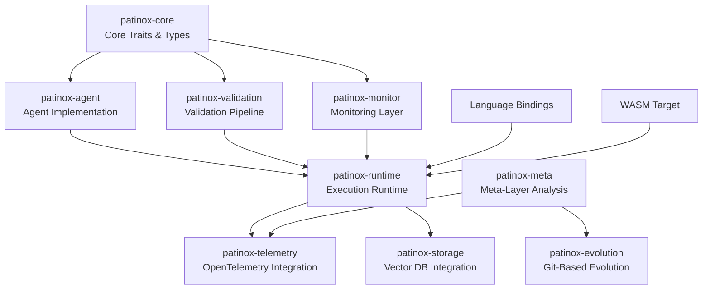
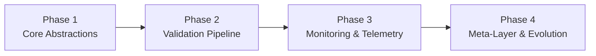

# Project Structure

## Purpose
This document provides an overview of the project structure, including key elements, their relationships, and the principles guiding their design.

## Classification
- **Domain:** Structure
- **Stability:** Semi-stable
- **Abstraction:** Structural
- **Confidence:** Established

## Content

### Structure Overview

Patinox follows a modular Rust workspace architecture with clear separation between core abstractions, monitoring layers, and integration points. The design emphasizes composability through traits and zero-cost abstractions through compile-time configuration.

### Key Elements

#### patinox-core
Defines the fundamental traits and types that all other crates build upon. Includes `Agent`, `Tool`, `Validator`, `Monitor` traits and core error types. No external dependencies except std.

#### patinox-agent
Concrete agent implementations using typestate patterns for compile-time state validation. Includes workflow orchestration, tool execution, and state management.

#### patinox-validation
Synchronous validation pipeline built on Tower middleware patterns. Includes anti-jailbreak, hallucination detection, rate limiting, and circuit breaker implementations.

#### patinox-monitor
Asynchronous monitoring layer for pattern analysis and telemetry collection. Runs alongside agent execution without blocking.

#### patinox-runtime
Tokio-based async runtime that orchestrates agent execution, validation, and monitoring. Handles concurrent agent communication through actor model.

#### patinox-telemetry
OpenTelemetry integration for distributed tracing, metrics, and logging. Provides structured observability across all layers.

#### patinox-storage
Integrations with vector databases (Qdrant, LanceDB) and memory management. Zero-copy operations where possible.

#### patinox-meta
Meta-layer that analyzes telemetry to identify patterns and propose improvements. Generates structured reports and improvement PRs.

#### patinox-evolution
Git integration for tracking agent behavior versions and managing evolution cycles. Handles PR generation and A/B testing.

### Element Interactions

**Core → All**: Every crate depends on core traits, ensuring consistent interfaces across the system.

**Agent → Validation**: Every agent action passes through the validation pipeline before execution.

**Runtime → Monitor**: Runtime spawns monitoring tasks that observe without blocking execution.

**Telemetry → Meta**: Telemetry data flows to meta-layer for pattern analysis and improvement generation.

**Meta → Evolution**: Identified improvements are converted to git commits and pull requests.

**Storage ↔ Runtime**: Bidirectional flow for memory persistence and retrieval during execution.

### Tools and Methods

| Area | Tools/Methods | Justification |
|-------|--------------|---------------|
| Async Runtime | Tokio | Industry standard, proven performance, ecosystem support |
| LLM Integration | async-openai, Rig | Mature libraries with streaming and function calling |
| Validation | Tower middleware | Composable layers, used in production HTTP services |
| Observability | OpenTelemetry, tracing | Standard observability with minimal overhead |
| Vector Storage | Qdrant, LanceDB | Rust-native for zero-copy operations |
| Serialization | serde, bincode | De facto standard, extensive format support |
| Testing | criterion, proptest | Statistical benchmarking and property-based testing |
| Documentation | rustdoc, mdbook | Native Rust tooling with tested examples |

### Success Criteria

#### Quality
Compile-time guarantees through Rust's type system. Invalid states are unrepresentable. Comprehensive test suite including unit, integration, and property-based tests. Documentation with compiled examples.

#### Scalability
Actor model enables horizontal scaling of agent instances. Async runtime handles thousands of concurrent agents. Vector database integration supports billion-scale embeddings. WebAssembly compilation enables edge deployment.

#### Security
Memory safety guaranteed by Rust. All LLM interactions pass through validation layer. No unsafe code in core abstractions. Rate limiting and circuit breakers prevent abuse. Sensitive data never logged.

#### Reliability
Circuit breakers prevent cascade failures. Typestate patterns ensure valid state transitions. Comprehensive error handling with recovery strategies. Telemetry enables proactive issue detection.

#### Maintainability
Modular crate structure with clear boundaries. Trait-based interfaces enable swappable implementations. Extensive documentation and examples. Git-based evolution provides traceable history.

### Implementation Approach

Phased implementation starting with core abstractions and gradually adding layers of functionality. Each phase produces a working system with increasing capabilities.

**Phase 1**: Define traits, implement basic agent with typestate patterns
**Phase 2**: Add Tower-based validation pipeline with synchronous validators
**Phase 3**: Integrate OpenTelemetry and asynchronous monitoring
**Phase 4**: Build meta-layer analysis and git-based evolution

### Future Evolution

- **Custom Validators**: Community-contributed validators for specific domains
- **Model Adapters**: Support for local models (Ollama, llama.cpp)
- **Distributed Execution**: Multi-node agent orchestration
- **Visual Debugging**: Runtime visualization of agent state and decisions
- **Performance Optimizations**: SIMD operations for vector similarity
- **Extended Language Support**: Go, Java, and Ruby bindings

## Relationships
- **Parent Nodes:** [foundation/project_definition.md] - implements - Structural implementation of project goals and objectives
- **Child Nodes:**
  - [elements/index.md] - contains - Overview of all structural elements
  - [connections/dependencies.md] - details - Dependencies between structural elements
  - [connections/interfaces.md] - specifies - Interfaces between structural elements
- **Related Nodes:**
  - [foundation/principles.md] - guides - Principles that guided structural decisions
  - [planning/roadmap.md] - supports - Structure enables roadmap implementation
  - [elements/architecture_overview.md] - details - Technical architecture implementation
  - [elements/technology_stack.md] - specifies - Technology choices supporting structure

## Navigation Guidance
- **Access Context:** Use this document when needing to understand the overall project structure and design
- **Common Next Steps:** After reviewing this structure, typically explore specific element structures or decision records
- **Related Tasks:** Project design, element development, integration planning
- **Update Patterns:** This document should be updated when there are significant changes to the project structure or methodology

## Metadata
- **Created:** 2025-01-17
- **Last Updated:** 2025-01-17
- **Updated By:** Development Team

## Change History
- 2025-01-17: Defined Rust workspace structure for Patinox framework
