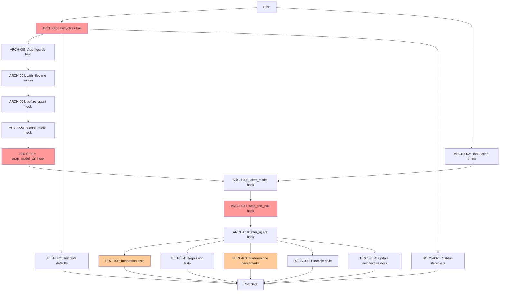

# Task Dependencies - Layer 2.5 Implementation

## Purpose
Visual and detailed representation of task dependencies for Layer 2.5 lifecycle hook implementation.

## Classification
- **Domain:** Project Planning
- **Stability:** Static
- **Abstraction**: Structural
- **Confidence:** High

---

## Dependency Graph



---

## Critical Path

**The longest dependency chain that determines minimum completion time:**

```
ARCH-001 (4h)
  → ARCH-003 (0.5h)
    → ARCH-004 (1h)
      → ARCH-005 (1.5h)
        → ARCH-006 (1.5h)
          → ARCH-007 (3.5h)
            → ARCH-008 (2h)
              → ARCH-009 (3.5h)
                → ARCH-010 (1.5h)
                  → TEST-003 (4.5h)
```

**Critical Path Total**: ~23.5 hours minimum (3 days if working 8h/day)

**Critical Path Tasks**: ARCH-001, ARCH-003, ARCH-004, ARCH-005, ARCH-006, ARCH-007, ARCH-008, ARCH-009, ARCH-010, TEST-003

**Any delay in critical path tasks delays project completion!**

---

## Parallel Work Opportunities

### Wave 1: Foundation (can start immediately)
- **ARCH-001**: lifecycle.rs trait (4h) - **CRITICAL PATH**
- **ARCH-002**: HookAction enum (1h) - parallel with ARCH-001

### Wave 2: After ARCH-001 completes
- **ARCH-003**: Add lifecycle field (0.5h) - **CRITICAL PATH**
- **TEST-002**: Unit tests for defaults (2h) - parallel with ARCH-003
- **DOCS-002**: Rustdoc for lifecycle.rs (1.5h) - parallel with ARCH-003

### Wave 3: After ARCH-003 completes
- **ARCH-004**: with_lifecycle builder (1h) - **CRITICAL PATH**

### Wave 4-10: Hook Integration (sequential on critical path)
- **ARCH-005**: before_agent (1.5h) - **CRITICAL PATH**
- **ARCH-006**: before_model (1.5h) - **CRITICAL PATH**
- **ARCH-007**: wrap_model_call (3.5h) - **CRITICAL PATH** (HIGH RISK)
- **ARCH-008**: after_model (2h) - **CRITICAL PATH** (requires ARCH-002)
- **ARCH-009**: wrap_tool_call (3.5h) - **CRITICAL PATH** (HIGH RISK)
- **ARCH-010**: after_agent (1.5h) - **CRITICAL PATH**

### Wave 11: After ARCH-010 completes (all can be parallel)
- **TEST-003**: Integration tests (4.5h) - **CRITICAL PATH**
- **TEST-004**: Regression tests (2h) - parallel with TEST-003
- **PERF-001**: Benchmarks (3h) - parallel with TEST-003
- **DOCS-003**: Example code (2.5h) - parallel with TEST-003
- **DOCS-004**: Architecture docs (1h) - parallel with TEST-003

**Maximum Parallelism**: Up to 5 tasks in final wave

---

## Dependency Details

### ARCH-001: lifecycle.rs trait
**Blocks**:
- ARCH-003 (needs trait to reference)
- TEST-002 (needs trait to test)
- DOCS-002 (needs trait to document)

**Blocked by**: None (foundation task)

**Why Critical**: Everything depends on trait definition

---

### ARCH-002: HookAction enum
**Blocks**:
- ARCH-008 (after_model returns HookAction)

**Blocked by**: None

**Why Not Critical Path**: Only ARCH-008 depends on it, can be done early in parallel

---

### ARCH-003: Add lifecycle field
**Blocks**:
- ARCH-004 (builder needs field to modify)

**Blocked by**:
- ARCH-001 (needs AgentLifecycle type)

**Why Critical**: Starts builder pattern integration

---

### ARCH-004: with_lifecycle builder
**Blocks**:
- ARCH-005 (hooks can't be added until registration works)

**Blocked by**:
- ARCH-003 (needs lifecycle field)

**Why Critical**: Enables hook registration, gates all hook integration

---

### ARCH-005 through ARCH-010: Hook Integration
**Why Sequential**: Each hook builds understanding for next, shared code patterns

**Recommended Order**:
1. ARCH-005 (before_agent) - simplest, establishes pattern
2. ARCH-006 (before_model) - similar to before_agent
3. ARCH-007 (wrap_model_call) - complex, needs new helper method
4. ARCH-008 (after_model) - uses HookAction, moderate complexity
5. ARCH-009 (wrap_tool_call) - reuses ARCH-007 patterns
6. ARCH-010 (after_agent) - similar to before_agent, final hook

**Could Parallelize**: Theoretically yes, but not recommended
- Risk of merge conflicts (all modify Agent::run())
- Learning from each hook improves next one
- Sequential development reduces bugs

---

### TEST-002: Unit tests for defaults
**Blocks**: None (documentation/validation only)

**Blocked by**:
- ARCH-001 (needs trait to test)

**Why Parallel**: Tests trait in isolation, doesn't depend on Agent integration

---

### TEST-003: Integration tests
**Blocks**: None (final validation)

**Blocked by**:
- ARCH-010 (all hooks must be integrated)

**Why Critical Path**: Longest test task, validates entire implementation

---

### TEST-004: Regression tests
**Blocks**: None

**Blocked by**:
- ARCH-010 (all hooks integrated)

**Why Not Critical**: Shorter than TEST-003, runs in parallel

---

### PERF-001: Performance benchmarks
**Blocks**: None

**Blocked by**:
- ARCH-010 (all hooks integrated)

**Why Not Critical**: Runs in parallel with tests

---

### DOCS-002: Rustdoc for lifecycle.rs
**Blocks**: None

**Blocked by**:
- ARCH-001 (needs trait to document)

**Why Not Critical**: Documentation, can be done early

---

### DOCS-003: Example code
**Blocks**: None

**Blocked by**:
- ARCH-010 (all hooks needed for good example)

**Why Not Critical**: Runs in parallel with tests

---

### DOCS-004: Update architecture docs
**Blocks**: None

**Blocked by**:
- ARCH-010 (all implementation complete)

**Why Not Critical**: Final documentation, shortest task

---

## Dependency Matrix

| Task | Blocks | Blocked By | Can Start After | Critical Path |
|------|--------|------------|-----------------|---------------|
| ARCH-001 | ARCH-003, TEST-002, DOCS-002 | None | Immediately | ✅ YES |
| ARCH-002 | ARCH-008 | None | Immediately | ❌ No |
| ARCH-003 | ARCH-004 | ARCH-001 | ARCH-001 (4h) | ✅ YES |
| ARCH-004 | ARCH-005 | ARCH-003 | ARCH-003 (0.5h) | ✅ YES |
| ARCH-005 | ARCH-006 | ARCH-004 | ARCH-004 (1h) | ✅ YES |
| ARCH-006 | ARCH-007 | ARCH-005 | ARCH-005 (1.5h) | ✅ YES |
| ARCH-007 | ARCH-008 | ARCH-006 | ARCH-006 (1.5h) | ✅ YES |
| ARCH-008 | ARCH-009 | ARCH-007, ARCH-002 | ARCH-007 (3.5h) | ✅ YES |
| ARCH-009 | ARCH-010 | ARCH-008 | ARCH-008 (2h) | ✅ YES |
| ARCH-010 | All TEST/DOCS | ARCH-009 | ARCH-009 (3.5h) | ✅ YES |
| TEST-002 | None | ARCH-001 | ARCH-001 (4h) | ❌ No |
| TEST-003 | None | ARCH-010 | ARCH-010 (1.5h) | ✅ YES |
| TEST-004 | None | ARCH-010 | ARCH-010 (1.5h) | ❌ No |
| PERF-001 | None | ARCH-010 | ARCH-010 (1.5h) | ❌ No |
| DOCS-002 | None | ARCH-001 | ARCH-001 (4h) | ❌ No |
| DOCS-003 | None | ARCH-010 | ARCH-010 (1.5h) | ❌ No |
| DOCS-004 | None | ARCH-010 | ARCH-010 (1.5h) | ❌ No |

---

## Optimized Schedule

### Single Developer Timeline

**Day 1** (8 hours):
- 0h-4h: ARCH-001 (4h) - **CRITICAL**
- 4h-4.5h: ARCH-003 (0.5h) - **CRITICAL**
- 4.5h-5.5h: ARCH-004 (1h) - **CRITICAL**
- 5.5h-7h: ARCH-005 (1.5h) - **CRITICAL**
- 7h-8h: ARCH-002 (1h) - parallel work

**Day 2** (8 hours):
- 0h-1.5h: ARCH-006 (1.5h) - **CRITICAL**
- 1.5h-5h: ARCH-007 (3.5h) - **CRITICAL** (complex)
- 5h-7h: ARCH-008 (2h) - **CRITICAL**
- 7h-8h: Break/buffer

**Day 3** (8 hours):
- 0h-3.5h: ARCH-009 (3.5h) - **CRITICAL** (complex)
- 3.5h-5h: ARCH-010 (1.5h) - **CRITICAL**
- 5h-8h: TEST-002 (2h) + DOCS-002 (1.5h) - catch-up

**Day 4** (8 hours):
- 0h-4.5h: TEST-003 (4.5h) - **CRITICAL**
- 4.5h-6.5h: TEST-004 (2h) - parallel
- 6.5h-8h: DOCS-003 start (1.5h)

**Day 5** (3 hours buffer):
- 0h-1h: DOCS-003 finish (1h)
- 1h-2h: DOCS-004 (1h)
- 2h-3h: PERF-001 start (if needed, or final review)

**Total**: 3.5-4 days with buffer

### Two Developer Timeline (if available)

**Day 1-2**: Developer A on critical path (ARCH-001 through ARCH-010)
**Day 1**: Developer B on ARCH-002, TEST-002, DOCS-002
**Day 2-3**: Developer B on tests/docs after ARCH-010 ready

**Total**: 2.5-3 days with parallelism

---

## Bottleneck Analysis

### Primary Bottlenecks

**1. ARCH-007 (wrap_model_call) - 3.5 hours**
- Why bottleneck: Complex hook chaining logic
- Mitigation: Prototype separately, study similar patterns
- Impact if delayed: Delays ARCH-008, ARCH-009, ARCH-010, all tests

**2. ARCH-009 (wrap_tool_call) - 3.5 hours**
- Why bottleneck: Similar complexity to ARCH-007
- Mitigation: Reuse ARCH-007 patterns, copy-paste-modify
- Impact if delayed: Delays ARCH-010, all tests

**3. TEST-003 (Integration tests) - 4.5 hours**
- Why bottleneck: Comprehensive testing needs
- Mitigation: Write tests in parallel with late hooks
- Impact if delayed: Delays project completion validation

### Secondary Bottlenecks

**ARCH-001 (4 hours)**: Blocks 3 other tasks, but straightforward

**No parallelism in ARCH-005 through ARCH-010**: 6 sequential tasks = 13.5 hours minimum

---

## Risk Mitigation

### If ARCH-007 or ARCH-009 Take Longer

**Plan A**: Allocate extra time (budget 4-5h instead of 3.5h)
**Plan B**: Simplify to single-hook-only (no chaining) initially
**Plan C**: Pair programming session to unblock

### If Testing Takes Longer

**Plan A**: Reduce TEST-003 scope, add tests iteratively
**Plan B**: Separate PR for tests (merge hooks first)
**Plan C**: Accept some tests as TODOs for later

### If Behind Schedule

**Priority**: Complete critical path (ARCH-001 through TEST-003)
**Defer**: PERF-001 can be separate PR
**Defer**: DOCS-003, DOCS-004 can follow after merge

---

## Dependency Validation

### Checklist Before Starting

- [ ] ARCH-001 has no dependencies (can start immediately)
- [ ] ARCH-002 has no dependencies (can start immediately)
- [ ] All other tasks have clear dependency chain
- [ ] Critical path identified and understood
- [ ] Parallel work opportunities identified
- [ ] Bottleneck mitigation planned

### Checklist During Implementation

- [ ] Don't start ARCH-003 until ARCH-001 complete
- [ ] Don't start ARCH-005 until ARCH-004 complete
- [ ] Don't start ARCH-008 until ARCH-002 complete
- [ ] Don't start TEST-003 until ARCH-010 complete
- [ ] Track actual time vs estimated to adjust schedule

---

## Metadata
- **Created**: 2025-10-16
- **Total Tasks**: 17
- **Critical Path Length**: ~23.5 hours
- **Minimum Duration**: 3 days (with 8h days)
- **Recommended Duration**: 4 days (with buffer)
- **Parallelism Factor**: Up to 5 tasks in final wave
