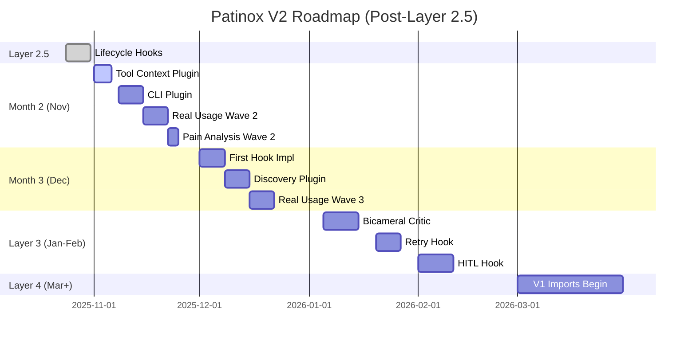

# Post-Layer 2.5 Roadmap & Backlog Plan

## Purpose
Define the roadmap and backlog for work following Layer 2.5 (Lifecycle Hook Architecture) completion, continuing the V2 minimal-first approach.

## Classification
- **Domain:** Strategic Planning
- **Stability:** Dynamic
- **Abstraction:** Strategic
- **Confidence:** Medium (validated by current progress, refined by future usage)

---

## Current State Summary (October 16, 2025)

### What's Complete ✅

**Layer 1: Minimal Agent** (Week 1 - Oct 12)
- Working agent core (~1,142 lines)
- Builder pattern API
- Tool system (closures as tools)
- Real LLM providers (OpenAI, Anthropic)
- CLI interface
- 16 tests passing

**Layer 2: Real Usage & Pain-Driven Plugins** (Weeks 2-3 - Oct 13-23)
- Real provider integration (OpenAI complete)
- 2 production agents built (file processor, doc generator)
- Pain point analysis complete (30+ pain points documented)
- V2-PLUGIN-001 designed (Tool Context Helper)

### What's In Progress 🔄

**Layer 2.5: Lifecycle Hook Architecture** (Week 4 - Oct 24-31)
- ⏳ Planning complete (7 documents, 97KB)
- ⏳ Ready for implementation
- ⏳ 17 tasks, 3-4 day estimate

### Current Branch
- `feat/v2-tool-context-plugin` (current work)
- Planning for `feat/layer-2.5-lifecycle-hooks` (next)

---

## Strategic Timeline (November 2025 - March 2026)



---

## Month 2 (November 2025): Plugin Completion

### Week 5 (Nov 1-7): Tool Context Plugin Implementation

**Goal**: Complete V2-PLUGIN-001 implementation

**Deliverables**:
- `src/plugin/mod.rs` - Plugin trait
- `src/plugin/tool_context.rs` - Tool context helper
- Integration with `.tool_fn()` builder
- Tests for tool context capture
- Examples showing before/after

**Success Criteria**:
- Eliminates closure boilerplate in both test agents
- Zero runtime overhead when not used
- Backward compatible (existing code works)

**Dependencies**: Layer 2.5 complete (hooks may inform plugin architecture)

**Estimated Effort**: 2-3 days

---

### Week 6 (Nov 8-14): CLI Plugin Implementation

**Goal**: Complete V2-PLUGIN-002 implementation

**Deliverables**:
- `src/plugin/cli.rs` - CLI argument plugin
- Integration with agent builder
- Automatic help text generation
- Support for typed arguments

**Success Criteria**:
- Reduces CLI boilerplate from 30 lines to ~5 lines
- Type-safe argument parsing
- Good error messages for invalid args

**Dependencies**: V2-PLUGIN-001 complete (establishes plugin patterns)

**Estimated Effort**: 3-4 days

---

### Week 7 (Nov 15-21): Real Usage Wave 2

**Goal**: Build 2-3 more production agents to validate plugins and find new pain

**Candidate Agents**:
1. **Git Helper** - Analyze repos, suggest improvements
   - Tools: git_status, git_diff, read_file, write_report
   - Pain expected: Command execution, output parsing

2. **Web Scraper** - Extract data from websites
   - Tools: fetch_url, parse_html, extract_data, save_json
   - Pain expected: HTTP requests, HTML parsing

3. **Code Refactoring Assistant** - Suggest refactorings
   - Tools: parse_ast, find_patterns, suggest_changes, apply_edits
   - Pain expected: AST manipulation, code generation

**Success Criteria**:
- At least 2 agents built and used for real work
- Pain points documented with frequency/severity
- Plugin architecture validated in practice
- New pain categories identified

**Estimated Effort**: 3-5 days

---

### Week 8 (Nov 22-30): Pain Analysis Wave 2 + Next Plugin

**Goal**: Analyze new pain points and design next plugin

**Activities**:
1. Analyze pain from Wave 2 agents
2. Update pain point matrix
3. Prioritize next plugin based on data
4. Design V2-PLUGIN-003 (likely Discovery or Process Execution)

**Deliverables**:
- Pain point analysis document
- Plugin prioritization matrix
- V2-PLUGIN-003 design (if pain validated)
- Decision: Continue Layer 2 or move to Layer 3?

**Estimated Effort**: 2-3 days

---

## Month 3 (December 2025): First Hook Implementations

### Week 9 (Dec 1-7): Retry Hook Implementation

**Goal**: Implement first concrete lifecycle hook (retry logic)

**Why First**: API reliability is common pain, retry pattern well-understood

**Deliverables**:
- `src/hooks/retry.rs` - Retry hook implementation
- Implements `wrap_model_call` and `wrap_tool_call`
- Configurable: max attempts, backoff strategy
- Example: agent with retry enabled

**Success Criteria**:
- Handles transient API failures (429, 503)
- Exponential backoff working
- Clear logging of retry attempts
- Zero overhead when not used

**Dependencies**: Layer 2.5 complete

**Estimated Effort**: 3-4 days

---

### Week 10 (Dec 8-14): Discovery Plugin OR Logging Hook

**Option A: Discovery Plugin (V2-PLUGIN-003)**
- If Wave 2 validated multi-file pain
- Glob patterns, directory traversal
- Batch processing support

**Option B: Logging Hook**
- If debugging pain emerged
- Comprehensive telemetry across all hooks
- Integration with tracing/log crates

**Decision Point**: Based on Week 8 pain analysis

**Estimated Effort**: 3-4 days

---

### Week 11 (Dec 15-21): Real Usage Wave 3

**Goal**: Build agents using new hooks and plugins

**Focus**:
- Use retry hook in production
- Test logging/discovery (whichever was built)
- Find edge cases and limitations
- Validate hook architecture in practice

**Success Criteria**:
- Hooks reduce boilerplate
- Hooks solve real problems
- No performance degradation
- API feels natural

**Estimated Effort**: 2-3 days

---

### Week 12 (Dec 22-31): Buffer & Holiday Break

**Activities**:
- Catch up on any delayed work
- Documentation improvements
- Bug fixes from real usage
- Plan Month 4 (Layer 3 transition)

**Optional**:
- Start bicameral mind hook design
- Research plan-execute patterns
- Review V1 code for import candidates

---

## Month 4-5 (January-February 2026): Layer 3 Reasoning Patterns

### Transition Criteria

Move to Layer 3 when:
- [ ] Layer 2 plugins stable (3+ plugins working)
- [ ] Core hooks proven (2+ hooks in production)
- [ ] Simple agents hit limitations (need multi-step reasoning)
- [ ] Pain validated for advanced patterns

### Layer 3 Priority 1: Bicameral Mind Pattern

**Goal**: Implement creator-critic separation for quality improvement

**Why First**: Validated production pattern with proven quality benefits

**Components**:
1. **Bicameral Critic Hook** (2 weeks)
   - Implements `after_model` hook
   - Separate critic model evaluates creator output
   - Continue/Reject/Modify actions

2. **Bicameral Refinement Loop** (2 weeks)
   - Implements `wrap_model_call` for iterative refinement
   - Creator → Critic → Refine loop
   - Configurable max rounds

**Success Criteria**:
- Measurably better output quality
- Works with any LLM provider
- Examples: code review, content writing, decision making

**Estimated Effort**: 3-4 weeks

---

### Layer 3 Priority 2: Retry + HITL Hooks

**Retry Hook** (1 week)
- Already implemented in Month 3
- Refinements based on usage

**HITL (Human-in-the-Loop) Hook** (2 weeks)
- Implements `after_model` hook
- Pause for human approval before actions
- Support for dangerous tool execution
- Integration with terminal UI

**Success Criteria**:
- Can approve/reject agent actions
- Clear presentation of proposed actions
- Fast approval workflow
- Fallback if human unavailable

**Estimated Effort**: 2-3 weeks

---

### Layer 3 Priority 3: Plan-Execute Pattern (if needed)

**Trigger**: When agents struggle with multi-step tasks

**Components**:
1. Planning phase (break down task)
2. Execution phase (execute plan)
3. Reflection phase (evaluate results)

**Implementation**:
- New agent orchestration pattern
- Uses existing hooks for monitoring
- Separate planner and executor agents

**Estimated Effort**: 3-4 weeks (if needed)

---

## Month 6+ (March 2026): Layer 4 Enterprise Features

### V1 Import Strategy

**What to Import**:
1. **Tower Middleware** → AgentLifecycle hooks
2. **MAPE-K Monitoring** → Comprehensive hook suite
3. **Validation Pipeline** → Hook chain for safety
4. **Testing Utilities** → Proven mock/test patterns

**How to Import**:
- One V1 component at a time
- Adapt to V2 minimal architecture
- Simplify during import (V1 was over-engineered)
- Document what changed and why

**Import Sequence**:
1. Testing utilities (Month 6)
2. Tower patterns as hooks (Month 7)
3. MAPE-K monitoring (Month 8)
4. Validation pipeline (Month 9)

---

## Backlog Grooming Plan

### Immediate Backlog (Ready After Layer 2.5)

**V2-ARCH-001: Lifecycle Hooks** - Ready now (planned)

**V2-PLUGIN-001: Tool Context Helper** - Ready Nov 1
- Design complete
- Pain validated (30/30 score)
- Implementation planned

**V2-PLUGIN-002: CLI Plugin** - Ready Nov 8
- Dependencies: V2-PLUGIN-001 complete
- Pain validated (30/30 score)
- Sequenced after first plugin

### Short-Term Backlog (Month 2)

**V2-HOOK-001: Retry Hook** - Ready Dec 1
- Dependencies: Layer 2.5 complete
- Use case: API reliability
- Priority: High

**V2-PLUGIN-003: Discovery Plugin** - Ready Dec 8 (conditional)
- Dependencies: Plugin patterns stable
- Trigger: Multi-file pain validated
- Priority: Medium

**V2-HOOK-002: Logging Hook** - Alternative to V2-PLUGIN-003
- Dependencies: Layer 2.5 complete
- Trigger: Debugging pain
- Priority: Medium

### Medium-Term Backlog (Month 3-4)

**V2-PATTERN-001: Bicameral Critic** - Ready Jan 5
- Dependencies: Layer 2.5 complete, hooks proven
- Validated: External production experience
- Priority: Critical (quality improvement)

**V2-HOOK-003: HITL Hook** - Ready Feb 1
- Dependencies: Bicameral pattern complete
- Use case: Safety-critical actions
- Priority: High

### Long-Term Backlog (Month 6+)

**V2-IMPORT-001: V1 Testing Utilities** - Ready Mar 1
- Dependencies: Layer 3 proven
- Source: V1 archive
- Priority: Medium

**V2-IMPORT-002: Tower Patterns** - Ready Apr 1
- Dependencies: V2-IMPORT-001 complete
- Source: V1 archive
- Priority: High

---

## Success Metrics

### Month 2 Success
- [ ] 3 plugins implemented (Tool Context, CLI, Discovery/Logging)
- [ ] 4-5 production agents built (cumulative)
- [ ] Plugin architecture stable
- [ ] Pain-driven approach validated

### Month 3 Success
- [ ] 2+ hooks implemented (Retry + Logging/Discovery)
- [ ] Hooks used in production agents
- [ ] No performance degradation
- [ ] Hook architecture validated

### Layer 3 Success (Months 4-5)
- [ ] Bicameral mind pattern working
- [ ] HITL approval functional
- [ ] Measurable quality improvement
- [ ] Advanced patterns optional (not forced)

### Layer 4 Success (Month 6+)
- [ ] V1 code successfully adapted
- [ ] Enterprise features available
- [ ] Simple → sophisticated path clear
- [ ] Both use cases supported

---

## Decision Points

### End of Month 2 (Nov 30)
**Question**: Continue Layer 2 plugins or move to Layer 3 hooks?

**Criteria**:
- If plugin pain still emerging → Continue Layer 2
- If hooks needed for production → Move to Layer 3
- If simple agents sufficient → Stay minimal

### End of Month 3 (Dec 31)
**Question**: Ready for Layer 3 reasoning patterns?

**Criteria**:
- Simple ReACT loop insufficient for tasks?
- Need multi-step orchestration?
- Quality improvement validated?

### End of Month 5 (Feb 28)
**Question**: Ready for Layer 4 V1 imports?

**Criteria**:
- Layer 1-3 stable and proven?
- Enterprise features validated?
- Team capacity for integration?

---

## Risk Management

### Risk: Sophistication Creep

**Likelihood**: Medium
**Impact**: High (violates minimal-first)

**Mitigation**:
- Strict pain validation before features
- Regular architecture reviews
- CLAUDE.md prevents AI drift
- Decision records for all additions

### Risk: Plugin/Hook Proliferation

**Likelihood**: Medium
**Impact**: Medium (maintenance burden)

**Mitigation**:
- High bar for new plugins (pain score > 20)
- Consolidate similar functionality
- Remove unused features
- Keep core minimal

### Risk: V1 Import Complexity

**Likelihood**: High
**Impact**: Medium (time cost)

**Mitigation**:
- Import one component at a time
- Simplify during import
- Comprehensive testing
- Document changes

### Risk: Schedule Delays

**Likelihood**: Medium
**Impact**: Low (no hard deadlines)

**Mitigation**:
- Buffer weeks allocated
- Scope reduction options
- Flexible priorities
- Focus on critical path

---

## Backlog Management

### Grooming Frequency
- **Weekly**: Review ready tasks, update estimates
- **Monthly**: Reprioritize based on usage
- **Quarterly**: Strategic roadmap review

### Task Flow

```
Real Usage
    ↓
Pain Point
    ↓
Analysis (Frequency × Severity)
    ↓
Design (if score > threshold)
    ↓
Task Created
    ↓
Sequenced (dependencies)
    ↓
Ready → In Progress → Complete
```

### Priority Thresholds
- **Critical** (30): Immediate (affects all agents)
- **High** (20-29): Next sprint (common pain)
- **Medium** (10-19): Backlog (occasional pain)
- **Low** (<10): Defer (rare pain)

---

## Monitoring & Adaptation

### Weekly Check-ins
- Progress vs plan
- Blockers identified
- Pain points emerging
- Scope adjustments needed?

### Monthly Retrospectives
- What shipped
- What learned
- What changed
- Next month priorities

### Quarterly Reviews
- Layer completion status
- Roadmap accuracy
- Strategic adjustments
- V1 import readiness

---

## Relationships
- **Follows**: [planning/layer-2.5-implementation/README.md](./layer-2.5-implementation/README.md)
- **Informs**: [backlog/by-status/ready.md](../backlog/by-status/ready.md)
- **Updates**: [planning/roadmap.md](./roadmap.md)
- **Validates**: [decisions/v2_strategic_reset.md](../decisions/v2_strategic_reset.md)

## Metadata
- **Created**: 2025-10-16
- **Scope**: November 2025 - March 2026 (5 months)
- **Status**: DRAFT - Awaiting Layer 2.5 completion
- **Next Review**: November 1, 2025 (post-Layer 2.5)
- **Updated By**: Strategic Planning Session

---

**Ready for Layer 2.5**: ✅ Yes - Clear path forward after completion
**Flexibility**: High - Pain-driven approach allows pivots
**Confidence**: Medium-High - Based on validated progress + external experience
