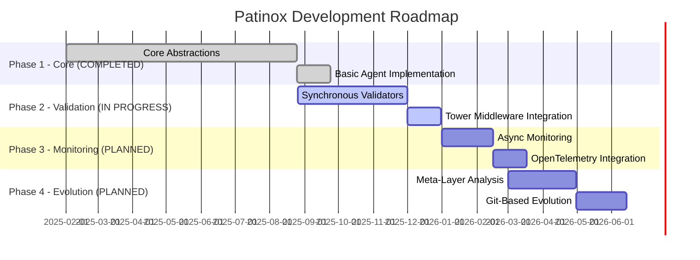

# Project Roadmap

## Purpose
This document outlines the planned development path for the project, including key milestones, features, and timelines.

## Classification
- **Domain:** Planning
- **Stability:** Dynamic
- **Abstraction:** Structural
- **Confidence:** Evolving

## Content

### Roadmap Overview

Patinox development follows a four-phase approach, building from core abstractions to a complete self-evolving agent framework. Each phase delivers working functionality while laying groundwork for subsequent phases.

### Current Phase

**Phase: V2 Layer 1 - Minimal Agent (COMPLETED)**
**Status: Transitioning to Layer 2 (Plugin Enhancements)**

**V2 Strategic Reset (October 12, 2025)**: Pivoted from sophisticated-first to minimal-first architecture. See [decisions/v2_strategic_reset.md](../decisions/v2_strategic_reset.md) for full rationale.

**V2 Layer 1 Achievements**:
- ✅ Working minimal agent core (~200 lines)
- ✅ Builder pattern API for agent creation
- ✅ Function-based tools (closures as tools)
- ✅ Mock provider for testing
- ✅ CLI interface with help/version support
- ✅ Working example (hello_agent) - compiles and runs

**Current focus**: Real LLM integration and building agents for actual tasks to identify pain points that drive Layer 2 plugin development.

**V1 Work Status**: Archived as research (branch: `archive/patinox-v1-sophisticated-first`, tag: `v1-research-phase`). V1 provider implementations, validation logic, and testing utilities available for import when validated through V2 usage.

### Upcoming Milestones

#### Core Trait Definitions
- **Target Date:** 2025-03-01
- **Status:** ✅ COMPLETED (August 2025)
- **Description:** Define and stabilize core traits for Agent, Tool, Validator, and Monitor
- **Key Deliverables:**
  - ✅ Published patinox-core crate with trait definitions
  - ✅ Comprehensive trait documentation with examples
  - ✅ Reference implementation demonstrating trait usage
  - ✅ 85 comprehensive tests covering all trait functionality
- **Actual Completion:** August 25, 2025

#### Validation Pipeline MVP
- **Target Date:** 2025-12-01
- **Status:** 🔄 IN PROGRESS
- **Description:** Implement synchronous validation pipeline using Tower middleware patterns
- **Key Deliverables:**
  - ✅ Basic validator traits and infrastructure
  - 🔄 Anti-jailbreak and hallucination detection validators
  - 🔄 Tower-based validation middleware integration
  - 🔄 Circuit breaker and rate limiting implementations
- **Progress:** Core validation infrastructure completed, specific validators in development

### Feature Timeline (V2 Layered Architecture)

#### Layer 1: Minimal Agent (COMPLETED ✅)
- **Timeline:** October 12, 2025 (Week 1) - COMPLETED
- **Theme:** Immediate Usability - working agent in ~200 lines
- **Features:**
  - ✅ **Agent Core**: Builder pattern API for agent creation
  - ✅ **Tool System**: Function closures as tools (FnTool wrapper)
  - ✅ **Provider Abstraction**: Mock provider for testing
  - ✅ **CLI Interface**: Arg parsing, help, version flags
  - ✅ **Error Handling**: Clean Result-based error propagation
  - ✅ **Working Example**: hello_agent compiles and runs

#### Layer 2: Plugin Enhancements (IN PROGRESS 🔄)
- **Timeline:** October 13-31, 2025 (Weeks 2-4) - CURRENT FOCUS
- **Theme:** Pain-Driven Features - add only what usage demands
- **Features:**
  - 🔄 **Real LLM Provider**: OpenAI/Anthropic integration (Week 2)
  - 🔄 **Real Usage Validation**: 2-3 production agents built (Week 2)
  - 📅 **First Plugin**: Based on pain analysis (Week 3)
  - 📅 **Memory Plugin**: If agents forget context (conditional)
  - 📅 **Discovery Plugin**: If exploration painful (conditional)
  - 📅 **Config Plugin**: If hardcoding frustrating (conditional)
  - 📅 **Resource Plugin**: If rate limits/costs painful (conditional)

**Note**: Layer 2 features are emergent based on actual usage pain points.

#### Layer 2.5: Lifecycle Hook Architecture (APPROVED 📅)
- **Timeline:** Week 4 (October 24-31, 2025)
- **Theme:** Future-Proof Architecture - enable middleware without premature implementation
- **Trigger:** External validated pain from production agent framework usage
- **Features:**
  - 📅 **AgentLifecycle Trait**: 6 hook points (before_agent, before_model, wrap_model_call, after_model, wrap_tool_call, after_agent)
  - 📅 **Hook Registration**: `.with_lifecycle()` builder method
  - 📅 **Hook Calling Infrastructure**: Integration in `Agent::run()` method
  - 📅 **Default Implementations**: Zero-cost passthrough when hooks unused
  - 📅 **Performance Benchmarks**: < 5% overhead target with 1 hook
  - 📅 **Documentation**: Rustdoc + examples for hook usage patterns

**Rationale**: Validated external experience shows need for intervention points at 6 locations in agent execution loop. Adding trait infrastructure now (cheap) prevents costly refactoring later. Concrete hook implementations deferred to Layer 3 (pain-driven).

**Decision**: See [decisions/lifecycle-hook-architecture.md](../decisions/lifecycle-hook-architecture.md)

**Import Path**: V1 Tower middleware and MAPE-K monitoring (Layer 4) will implement as AgentLifecycle hooks.

**Note**: Trait definition only - no concrete hook implementations until Layer 3+ pain validated.

#### Layer 3: Reasoning Patterns (PLANNED 📅)
- **Timeline:** November 2025+ (Month 2+)
- **Theme:** Advanced Orchestration - when simple agents prove insufficient
- **Features:**
  - **Plan-Execute Pattern**: Multi-step reasoning
  - **Reflexion Pattern**: Self-critique and improvement
  - **ReACT Loop**: Enhanced observation-action cycles
  - **Multi-Agent Coordination**: When one agent isn't enough
  - **Tool Composition**: Complex tool chains
  - **Concrete Lifecycle Hooks**: Retry logic, logging, HITL approval (using Layer 2.5 infrastructure)

**Trigger**: When simple ReACT loop insufficient for complex tasks

**Hook Implementations (Priority 1)**:
  - Retry wrapper for `wrap_model_call` and `wrap_tool_call` (if API failures common)
  - Logging/telemetry across all hooks (if debugging pain)
  - Input validation via `before_agent` (if bad inputs cause issues)
  - Context trimming via `before_model` (if hitting token limits)

#### Layer 4: Enterprise Features (PLANNED 📅)
- **Timeline:** Q1 2026+ (Month 3+)
- **Theme:** Import V1 Research - enterprise sophistication when validated
- **Features:**
  - **MAPE-K Monitoring**: Self-adaptive monitoring via lifecycle hooks (from V1)
  - **Tower Validation**: Composable validation as hook implementations (from V1)
  - **Typestate Patterns**: Compile-time safety guarantees (from V1)
  - **Git-Based Evolution**: Meta-layer analysis and improvement
  - **OpenTelemetry**: Distributed tracing via lifecycle hooks
  - **Language Bindings**: Python/TypeScript interop
  - **Advanced Hook Implementations**: HITL workflows, sophisticated retry/fallback, cost tracking

**Source**: V1 archive (`archive/src-v1-enterprise/`, `context-network/archive/v1-research/`)

**Import Strategy**: V1 Tower middleware maps cleanly to Layer 2.5 `AgentLifecycle` implementations

**Hook Implementations (Priority 3)**:
  - V1 async HITL imported as `after_model` hook
  - V1 MAPE-K monitoring as comprehensive lifecycle hook suite
  - Tower validation layers as `wrap_model_call` / `wrap_tool_call` chains

**Trigger**: When Layer 1-3 proven and enterprise features validated through usage

### Release Strategy

**Version Scheme**: Semantic versioning (MAJOR.MINOR.PATCH)
- Pre-1.0: Breaking changes allowed in minor versions
- Post-1.0: Strict semver with deprecation cycles

**Release Cadence**:
- Alpha releases: Every 2 weeks during active development
- Beta releases: Monthly after feature completion
- Stable releases: Quarterly after comprehensive testing

**Distribution**:
- crates.io for Rust crates
- PyPI for Python bindings
- npm for TypeScript bindings
- GitHub releases with precompiled binaries
- Docker images for containerized deployment

### Resource Allocation

**Core Team Focus**:
- 40% - Core framework development
- 25% - Validation and monitoring implementation
- 20% - Documentation and examples
- 15% - Community support and review

**Infrastructure**:
- GitHub for source control and CI/CD
- Discord/Matrix for community collaboration
- docs.rs for API documentation
- Benchmarking infrastructure for performance validation

### Risk Assessment

| Risk | Impact | Likelihood | Mitigation Strategy |
|------|--------|------------|---------------------|
| LLM API Changes | High | Medium | Abstract provider interfaces, support multiple providers |
| Performance Overhead | High | Low | Continuous benchmarking, zero-cost abstraction validation |
| Adoption Barriers | Medium | Medium | Comprehensive docs, migration guides, language bindings |
| Ecosystem Fragmentation | Medium | High | Focus on trait-based interfaces, maximize compatibility |
| Complexity Creep | High | Medium | Regular architecture reviews, simplicity as core principle |

### Roadmap Review Process

**Quarterly Reviews**: Full roadmap assessment with community input
- Evaluate milestone progress
- Adjust timelines based on velocity
- Incorporate user feedback and new requirements

**Monthly Check-ins**: Quick progress assessment
- Update milestone status
- Identify and address blockers
- Communicate changes to community

**RFC Process**: Major changes require Request for Comments
- Community discussion period (2 weeks minimum)
- Implementation plan before major work begins
- Documented decisions in context network

## Relationships
- **Parent Nodes:** [foundation/project_definition.md] - details - Specific implementation timeline and feature development plan
- **Child Nodes:** [planning/milestones.md] - schedules - Detailed milestone breakdown for roadmap phases
- **Related Nodes:**
  - [foundation/structure.md] - supports - Structure enables roadmap implementation
  - [foundation/principles.md] - guided-by - Roadmap development follows project principles
  - [processes/creation.md] - executes - Creation processes execute roadmap items
  - [elements/architecture_overview.md] - implements - Architecture phases align with roadmap phases
  - [planning/foundational_implementation_strategy.md] - details - Implementation strategy for roadmap execution

## Navigation Guidance
- **Access Context:** Use this document when planning work, prioritizing features, or communicating timelines
- **Common Next Steps:** After reviewing the roadmap, typically explore specific milestones or feature details
- **Related Tasks:** Sprint planning, resource allocation, stakeholder communication
- **Update Patterns:** This document should be updated quarterly or when significant changes to the plan occur

## Metadata
- **Created:** 2025-01-17
- **Last Updated:** 2025-10-16
- **Updated By:** Development Team

## Change History
- 2025-01-17: Created 4-phase roadmap for Patinox development
- 2025-09-18: Updated to reflect current project reality - Phase 1 completed, Phase 2 in progress
- 2025-10-12: V2 Strategic Reset - pivoted from sophisticated-first to minimal-first architecture
- 2025-10-13: Updated roadmap for V2 layered architecture (Layers 1-4 replacing Phases 1-4)
- 2025-10-16: Added Layer 2.5 (Lifecycle Hook Architecture) based on validated external experience and LangChain V1 middleware model
