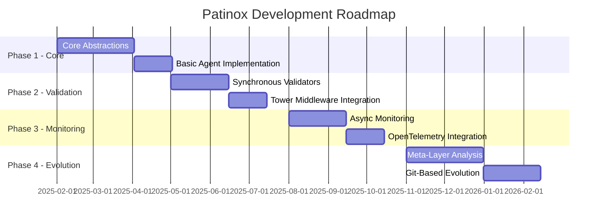

# Project Roadmap

## Purpose
This document outlines the planned development path for the project, including key milestones, features, and timelines.

## Classification
- **Domain:** Planning
- **Stability:** Dynamic
- **Abstraction:** Structural
- **Confidence:** Evolving

## Content

### Roadmap Overview

Patinox development follows a four-phase approach, building from core abstractions to a complete self-evolving agent framework. Each phase delivers working functionality while laying groundwork for subsequent phases.

### Current Phase

**Phase: Pre-Phase 1 - Research & Design**
**Status: In Progress**

Currently synthesizing research from 380+ sources to finalize architectural decisions. Establishing core trait definitions and validating approach with proof-of-concept implementations. Setting up development infrastructure and community engagement channels.

### Upcoming Milestones

#### Core Trait Definitions
- **Target Date:** 2025-03-01
- **Status:** Not Started
- **Description:** Define and stabilize core traits for Agent, Tool, Validator, and Monitor
- **Key Deliverables:**
  - Published patinox-core crate with trait definitions
  - Comprehensive trait documentation with examples
  - Reference implementation demonstrating trait usage
- **Dependencies:**
  - Finalized architectural decisions
  - Community feedback on RFC

#### Validation Pipeline MVP
- **Target Date:** 2025-06-01
- **Status:** Not Started
- **Description:** Implement synchronous validation pipeline using Tower middleware patterns
- **Key Deliverables:**
  - Tower-based validation middleware
  - Anti-jailbreak and hallucination detection validators
  - Circuit breaker and rate limiting implementations
- **Dependencies:**
  - Stable core traits
  - Basic agent implementation

### Feature Timeline

#### Phase 1: Core Abstractions & Basic Implementation
- **Timeline:** 2025-02-01 - 2025-04-30
- **Theme:** Foundation - establishing type-safe agent abstractions
- **Features:**
  - **Core Traits**: Agent, Tool, Validator, Monitor interfaces - Priority: High
  - **Typestate Patterns**: Compile-time state validation - Priority: High
  - **Basic Agent**: Simple working agent with tool execution - Priority: High
  - **Error Handling**: Comprehensive error types and recovery - Priority: Medium
  - **async-openai Integration**: LLM provider connectivity - Priority: High

#### Phase 2: Validation Pipeline
- **Timeline:** 2025-05-01 - 2025-07-31
- **Theme:** Safety - synchronous validation and quality gates
- **Features:**
  - **Tower Middleware**: Composable validation layers - Priority: High
  - **Anti-Jailbreak Validator**: LLM-based safety checks - Priority: High
  - **Hallucination Detection**: Response verification - Priority: High
  - **Circuit Breakers**: Failure prevention patterns - Priority: Medium
  - **Rate Limiting**: Resource usage controls - Priority: Medium

#### Phase 3: Monitoring & Observability
- **Timeline:** 2025-08-01 - 2025-10-31
- **Theme:** Observability - comprehensive monitoring without overhead
- **Features:**
  - **Async Monitors**: Non-blocking pattern analysis - Priority: High
  - **OpenTelemetry**: Distributed tracing and metrics - Priority: High
  - **Structured Logging**: Searchable event streams - Priority: Medium
  - **Vector DB Integration**: Qdrant/LanceDB for memory - Priority: High
  - **Performance Benchmarks**: Zero-cost validation - Priority: Medium

#### Phase 4: Meta-Layer & Evolution
- **Timeline:** 2025-11-01 - 2026-02-28
- **Theme:** Evolution - self-improvement through analysis
- **Features:**
  - **Telemetry Analysis**: Pattern identification from logs - Priority: High
  - **Improvement Generation**: Automated optimization proposals - Priority: High
  - **Git Integration**: Version-controlled behavior evolution - Priority: High
  - **A/B Testing**: Gradual rollout mechanisms - Priority: Medium
  - **Language Bindings**: Python/TypeScript interop - Priority: High

### Release Strategy

**Version Scheme**: Semantic versioning (MAJOR.MINOR.PATCH)
- Pre-1.0: Breaking changes allowed in minor versions
- Post-1.0: Strict semver with deprecation cycles

**Release Cadence**:
- Alpha releases: Every 2 weeks during active development
- Beta releases: Monthly after feature completion
- Stable releases: Quarterly after comprehensive testing

**Distribution**:
- crates.io for Rust crates
- PyPI for Python bindings
- npm for TypeScript bindings
- GitHub releases with precompiled binaries
- Docker images for containerized deployment

### Resource Allocation

**Core Team Focus**:
- 40% - Core framework development
- 25% - Validation and monitoring implementation
- 20% - Documentation and examples
- 15% - Community support and review

**Infrastructure**:
- GitHub for source control and CI/CD
- Discord/Matrix for community collaboration
- docs.rs for API documentation
- Benchmarking infrastructure for performance validation

### Risk Assessment

| Risk | Impact | Likelihood | Mitigation Strategy |
|------|--------|------------|---------------------|
| LLM API Changes | High | Medium | Abstract provider interfaces, support multiple providers |
| Performance Overhead | High | Low | Continuous benchmarking, zero-cost abstraction validation |
| Adoption Barriers | Medium | Medium | Comprehensive docs, migration guides, language bindings |
| Ecosystem Fragmentation | Medium | High | Focus on trait-based interfaces, maximize compatibility |
| Complexity Creep | High | Medium | Regular architecture reviews, simplicity as core principle |

### Roadmap Review Process

**Quarterly Reviews**: Full roadmap assessment with community input
- Evaluate milestone progress
- Adjust timelines based on velocity
- Incorporate user feedback and new requirements

**Monthly Check-ins**: Quick progress assessment
- Update milestone status
- Identify and address blockers
- Communicate changes to community

**RFC Process**: Major changes require Request for Comments
- Community discussion period (2 weeks minimum)
- Implementation plan before major work begins
- Documented decisions in context network

## Relationships
- **Parent Nodes:** [foundation/project_definition.md]
- **Child Nodes:** [planning/milestones.md]
- **Related Nodes:** 
  - [foundation/structure.md] - implements - Structure supports roadmap features
  - [processes/creation.md] - executes - Creation processes execute roadmap items

## Navigation Guidance
- **Access Context:** Use this document when planning work, prioritizing features, or communicating timelines
- **Common Next Steps:** After reviewing the roadmap, typically explore specific milestones or feature details
- **Related Tasks:** Sprint planning, resource allocation, stakeholder communication
- **Update Patterns:** This document should be updated quarterly or when significant changes to the plan occur

## Metadata
- **Created:** 2025-01-17
- **Last Updated:** 2025-01-17
- **Updated By:** Development Team

## Change History
- 2025-01-17: Created 4-phase roadmap for Patinox development
