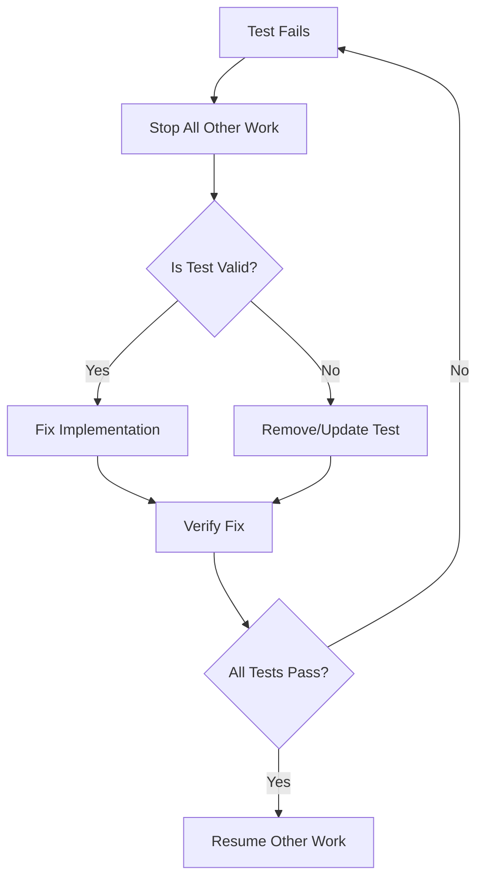

# Test-First Implementation Guide

## Purpose
Define the test-first development approach for Patinox, emphasizing that failing tests are always the top priority and establishing clear protocols for test management.

## Classification
- **Domain:** Development Process
- **Stability:** Semi-stable
- **Abstraction:** Operational
- **Confidence:** Established

## Content

### Core Test-First Principles

#### The Golden Rule: Failing Tests Are Priority #1
**Any failing test immediately becomes the highest priority work item, regardless of:**
- The reason for failure (regression, environment, flaky, outdated)
- The test type (unit, integration, e2e, benchmark)
- The development phase or milestone pressure
- Who wrote the test or when it was added

#### Test Failure Response Protocol



### Test-First Development Cycle

#### Red-Green-Refactor for Foundations

```rust
// 1. RED: Write failing test first
#[cfg(test)]
mod tests {
    use super::*;
    
    #[test]
    fn error_should_provide_recovery_strategy() {
        let error = PatinoxError::Network(NetworkError::Timeout);
        assert_eq!(error.recovery_strategy(), RecoveryStrategy::Retry);
    }
}

// 2. GREEN: Minimal implementation to pass
pub enum PatinoxError {
    Network(NetworkError),
}

impl PatinoxError {
    pub fn recovery_strategy(&self) -> RecoveryStrategy {
        match self {
            Self::Network(_) => RecoveryStrategy::Retry,
        }
    }
}

// 3. REFACTOR: Improve without breaking tests
// Add documentation, optimize, extract functions, etc.
```

#### Foundation-First Testing Strategy

**Phase 1: Core Utilities Testing**
```rust
// Start with the most basic utilities
mod error_types {
    #[test] fn error_implements_debug() { }
    #[test] fn error_implements_display() { }
    #[test] fn error_chain_preserves_context() { }
    #[test] fn recovery_strategy_never_panics() { }
}

mod core_traits {
    #[test] fn agent_trait_object_safe() { }
    #[test] fn tool_trait_async_execution() { }
    #[test] fn validator_trait_composable() { }
}

mod type_safety {
    #[test] fn typestate_prevents_invalid_transitions() { }
    #[test] fn builder_enforces_required_fields() { }
}
```

**Phase 2: Abstraction Layer Testing**
```rust
mod provider_abstraction {
    #[test] fn provider_trait_uniform_interface() { }
    #[test] fn provider_fallback_mechanism() { }
    #[test] fn provider_circuit_breaker_triggers() { }
}

mod configuration_system {
    #[test] fn cascading_config_resolution() { }
    #[test] fn environment_variable_override() { }
    #[test] fn config_validation_catches_errors() { }
}
```

### Testing Framework Selection

Based on the comprehensive testing strategy document, these tools are confirmed:

#### Unit Testing
- **Built-in `cargo test`**: Core test runner
- **`proptest`**: Property-based testing for edge cases
- **`mockall`**: Mock generation for traits
- **`once_cell`**: Test fixtures and lazy statics

#### Integration Testing  
- **`testcontainers`**: Integration with real services (Qdrant, etc.)
- **`wiremock`**: HTTP service mocking
- **`tempfile`**: Temporary file management

#### Performance Testing
- **`criterion`**: Statistical benchmarking
- **`divan`**: Alternative benchmark framework

#### Specialized Testing
- **`tokio-test`**: Async testing utilities
- **`rstest`**: Parameterized test cases
- **`cucumber`**: BDD-style scenario testing

### Test Management Protocols

#### Daily Test Protocol
1. **Start of day**: Run full test suite before any coding
2. **Before each commit**: Verify all tests pass
3. **End of day**: Clean test suite with no skipped/ignored tests

#### Test Failure Investigation Process

```bash
# 1. Immediate response to test failure
cargo test --failed-fast  # Stop at first failure

# 2. Investigate the failure
cargo test failing_test_name -- --nocapture --exact

# 3. Determine classification
# - Regression: Fix the implementation
# - Flaky: Identify root cause, don't just re-run
# - Outdated: Update test to match new requirements
# - Invalid: Remove test with documented reason

# 4. Fix and verify
cargo test  # Full suite must pass
```

#### Test Removal Criteria

A test may only be removed if it meets ALL criteria:
- [ ] **No longer relevant**: Requirements have fundamentally changed
- [ ] **Not a regression**: Implementation wasn't broken, test was wrong
- [ ] **Documented decision**: Reason recorded in commit message and context network
- [ ] **Team consensus**: Not a unilateral decision

**Example Valid Removal**:
```rust
// REMOVED: Test for deprecated synchronous API
// Rationale: Migrated to async-only interface in v0.2
// Decision: context-network/decisions/async_migration.md
// Date: 2025-01-18

// #[test]
// fn sync_agent_execution() { ... }
```

### Foundational Testing Patterns

#### Error Type Testing Template
```rust
#[cfg(test)]
mod error_tests {
    use super::*;
    use std::error::Error;
    
    #[test]
    fn error_implements_standard_traits() {
        let error = PatinoxError::Validation(ValidationError::InvalidInput);
        
        // Must implement standard error traits
        assert!(error.source().is_some());
        assert!(!format!("{}", error).is_empty());
        assert!(!format!("{:?}", error).is_empty());
    }
    
    #[test]
    fn error_chain_preservation() {
        let inner = std::io::Error::new(std::io::ErrorKind::NotFound, "file not found");
        let wrapped = PatinoxError::Configuration(ConfigError::FileNotFound(inner));
        
        // Error chain should be preserved
        assert!(wrapped.source().is_some());
        assert!(wrapped.source().unwrap().source().is_some());
    }
    
    #[test]
    fn recovery_strategy_exhaustive() {
        // Every error variant must have a recovery strategy
        let errors = vec![
            PatinoxError::Validation(ValidationError::InvalidInput),
            PatinoxError::Network(NetworkError::Timeout),
            // Add all error variants here
        ];
        
        for error in errors {
            // Should never panic
            let strategy = error.recovery_strategy();
            assert!(matches!(strategy, RecoveryStrategy::Retry | 
                                      RecoveryStrategy::Fallback | 
                                      RecoveryStrategy::CircuitBreak | 
                                      RecoveryStrategy::Fail));
        }
    }
}
```

#### Trait Testing Template
```rust
#[cfg(test)]
mod trait_tests {
    use super::*;
    use std::sync::Arc;
    
    #[test]
    fn agent_trait_object_safety() {
        // Trait must be object-safe for dynamic dispatch
        fn requires_object_safe(_: Box<dyn Agent>) {}
        fn requires_arc_safe(_: Arc<dyn Agent>) {}
        
        // This test compiles only if Agent is object-safe
    }
    
    #[tokio::test]
    async fn agent_trait_basic_contract() {
        let mut mock_agent = MockAgent::new();
        
        mock_agent
            .expect_execute()
            .returning(|_| Ok(ExecutionResult::Success));
            
        let result = mock_agent.execute("test").await;
        assert!(result.is_ok());
    }
}
```

#### Property-Based Testing Template
```rust
#[cfg(test)]
mod property_tests {
    use super::*;
    use proptest::prelude::*;
    
    proptest! {
        #[test]
        fn error_recovery_never_panics(
            error_variant in any::<PatinoxError>()
        ) {
            // Recovery strategy calculation should never panic
            let _ = error_variant.recovery_strategy();
        }
        
        #[test]
        fn config_validation_deterministic(
            config in any::<Configuration>()
        ) {
            // Validation should be deterministic
            let result1 = config.validate();
            let result2 = config.validate();
            prop_assert_eq!(result1.is_ok(), result2.is_ok());
        }
    }
}
```

### Continuous Test Management

#### Pre-commit Hooks
```bash
#!/bin/sh
# .git/hooks/pre-commit

set -e

echo "Running test suite before commit..."

# Fast tests first
cargo test --lib --quiet

# Integration tests
cargo test --test '*' --quiet

# Linting and formatting
cargo clippy -- -D warnings
cargo fmt --check

echo "All tests passed. Committing..."
```

#### CI Test Pipeline Priority
```yaml
# .github/workflows/test-priority.yml
name: Test Priority Pipeline

on: [push, pull_request]

jobs:
  # Fastest feedback loop
  unit-tests:
    runs-on: ubuntu-latest
    steps:
      - name: Quick unit tests
        run: cargo test --lib --fail-fast
        
  # Fast integration tests
  integration-fast:
    needs: unit-tests
    runs-on: ubuntu-latest  
    steps:
      - name: Integration tests (fast subset)
        run: cargo test --test '*' --fail-fast -- --test-threads=1
        
  # Comprehensive suite
  full-suite:
    needs: integration-fast
    runs-on: ubuntu-latest
    steps:
      - name: Complete test suite
        run: cargo test --all-features
```

### Test-Driven Foundational Development

#### Week 1: Error System TDD
```bash
# Day 1: Write failing tests for error types
cargo test error_types -- --include-ignored

# Day 2-3: Implement minimal error system
cargo test error_types

# Day 4-5: Add recovery strategies and context
cargo test error_recovery

# All tests must pass before moving to next component
```

#### Week 2: Core Traits TDD
```bash
# Day 1: Write failing tests for Agent trait
cargo test agent_trait

# Day 2-3: Implement basic trait definitions
cargo test core_traits

# Continue pattern for Tool, Validator, Monitor traits
```

### Success Metrics

- **Zero failing tests** in main branch at all times
- **Sub-10ms** unit test execution time
- **>90% test coverage** for foundational components
- **All tests documented** with clear intent
- **Property tests** for all complex logic
- **Integration tests** for all external dependencies

### Test Quality Gates

Before any component is considered "complete":
- [ ] All tests pass consistently (no flaky tests)
- [ ] Tests cover happy path, error cases, and edge cases
- [ ] Property-based tests validate invariants
- [ ] Performance tests establish baselines
- [ ] Integration tests verify real-world usage
- [ ] Tests are documented and maintainable

## Relationships
- **Parent Nodes:** [planning/foundational_implementation_strategy.md]
- **Related Nodes:** 
  - [planning/unaddressed-questions/testing-strategy.md] - implements - Testing approach
  - [elements/technology_stack.md] - uses - Testing frameworks
  - [processes/validation.md] - guides - Quality processes

## Navigation Guidance
- **Access Context:** Use when starting any implementation work or when tests fail
- **Common Next Steps:** Write tests before implementing any component
- **Related Tasks:** Component development, debugging, quality assurance
- **Update Patterns:** Update when testing practices or tools change

## Metadata
- **Created:** 2025-01-18
- **Last Updated:** 2025-01-18
- **Updated By:** Development Team

## Change History
- 2025-01-18: Created test-first implementation guide with failure protocols and foundational testing patterns